# Page: Overview

# Overview

<details>
<summary>Relevant source files</summary>

The following files were used as context for generating this wiki page:

- [.checkignore](.checkignore)
- [.github/workflows/atspi_test.yml](.github/workflows/atspi_test.yml)
- [.readthedocs.yaml](.readthedocs.yaml)
- [README.md](README.md)
- [docs/HISTORY.txt](docs/HISTORY.txt)
- [docs/index.txt](docs/index.txt)
- [docs/requirements.txt](docs/requirements.txt)
- [examples/wireshark.py](examples/wireshark.py)
- [pywinauto/__init__.py](pywinauto/__init__.py)
- [pywinauto/sysinfo.py](pywinauto/sysinfo.py)
- [pywinauto/unittests/testall.py](pywinauto/unittests/testall.py)
- [setup.py](setup.py)

</details>


pywinauto is a set of Python modules to automate the Microsoft Windows GUI. At its simplest, it allows sending mouse and keyboard actions to windows dialogs and controls, but it has support for more complex actions like getting text data and automating complex control interactions.

The library provides a unified interface across multiple GUI automation technologies through a pluggable backend system. It supports Win32 API (`backend="win32"`) and MS UI Automation (`backend="uia"`) on Windows, with Linux support via AT-SPI under development.

## Key Features

* **Multi-backend Architecture**: Supports Win32 API, MS UI Automation, and AT-SPI backends
* **Cross-platform Input**: Mouse and keyboard simulation works on Windows and Linux
* **Application Management**: Launch applications or connect to running processes
* **Element Discovery**: Robust window and control identification with fuzzy matching
* **Control Abstractions**: High-level wrappers for buttons, edit fields, lists, and other controls

Sources: [README.md:13-21](), [pywinauto/__init__.py:33-35](), [setup.py:70-73]()

## Architecture Overview

pywinauto uses a layered architecture with clear separation between user interface, backend abstraction, control wrappers, and platform-specific implementations.

### System Architecture

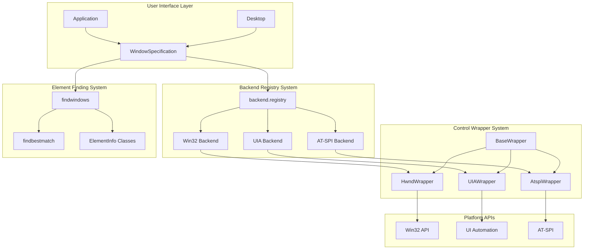

Sources: [pywinauto/__init__.py:98-111](), [pywinauto/__init__.py:113-174]()

### Core Components

pywinauto's architecture centers around key classes that handle different aspects of GUI automation:

| Component | Purpose | Key Methods |
|-----------|---------|-------------|
| `Application` | Main entry point for process management | `start()`, `connect()`, `kill()` |
| `Desktop` | Top-level window access independent of processes | `window()`, `windows()`, `from_point()` |
| `WindowSpecification` | Delayed window/control resolution with criteria | `wait()`, `exists()`, `wrapper_object()` |
| `BaseWrapper` | Base class for all control wrappers | `click_input()`, `type_keys()`, `window_text()` |
| Backend Registry | Manages different automation technologies | `register()`, `activate()`, `backends` |

Sources: [pywinauto/__init__.py:110-111](), [pywinauto/__init__.py:113-174]()

### Multi-Backend System

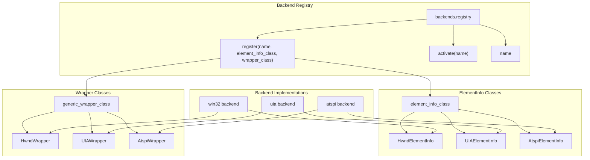

The backend system provides a pluggable architecture for different automation technologies:

| Backend | Element Info Class | Wrapper Class | Target Applications |
|---------|-------------------|---------------|-------------------|
| `win32` | `HwndElementInfo` | `HwndWrapper` | Traditional Windows apps |
| `uia` | `UIAElementInfo` | `UIAWrapper` | Modern Windows apps |
| `atspi` | `AtspiElementInfo` | `AtspiWrapper` | Linux GUI applications |

Sources: [pywinauto/__init__.py:106-107](), [pywinauto/__init__.py:118-123]()

## Control Wrapper Hierarchy

```mermaid
classDiagram
    class BaseWrapper {
        +element_info
        +window_text()
        +rectangle()
        +click_input()
        +type_keys()
        +wait()
        +exists()
    }
    
    class HwndWrapper {
        +handle
        +style()
        +class_name()
        +menu_select()
        +close()
        +minimize()
        +maximize()
    }
    
    class UIAWrapper {
        +element
        +automation_id
        +control_type
        +scroll()
        +set_focus()
        +legacy_properties()
    }
    
    class AtspiWrapper {
        +handle
        +get_states()
        +get_action()
        +set_focus()
    }
    
    BaseWrapper <|-- HwndWrapper
    BaseWrapper <|-- UIAWrapper
    BaseWrapper <|-- AtspiWrapper
    
    class ButtonWrapper {
        +click()
        +get_check_state()
        +is_checked()
        +check()
        +uncheck()
    }
    
    class EditWrapper {
        +text_block()
        +set_edit_text()
        +selection_indices()
        +line_count()
        +get_line()
    }
    
    class ListViewWrapper {
        +get_item()
        +item_count()
        +get_column()
        +select()
        +get_selected_count()
    }
    
    class TreeViewWrapper {
        +get_item()
        +item_count()
        +select()
        +expand()
        +collapse()
    }
    
    HwndWrapper <|-- ButtonWrapper
    HwndWrapper <|-- EditWrapper
    HwndWrapper <|-- ListViewWrapper
    HwndWrapper <|-- TreeViewWrapper
    
    UIAWrapper <|-- UIAButtonWrapper["UIAButtonWrapper"]
    UIAWrapper <|-- UIAEditWrapper["UIAEditWrapper"]
    UIAWrapper <|-- UIAListViewWrapper["UIAListViewWrapper"]
    UIAWrapper <|-- UIATreeViewWrapper["UIATreeViewWrapper"]
```

Control wrappers provide specialized functionality for different UI element types. Each backend implements its own wrapper classes that inherit from the backend-specific base wrapper (`HwndWrapper`, `UIAWrapper`, `AtspiWrapper`).

Sources: [pywinauto/__init__.py:113-174]()

## Element Discovery and Interaction Flow

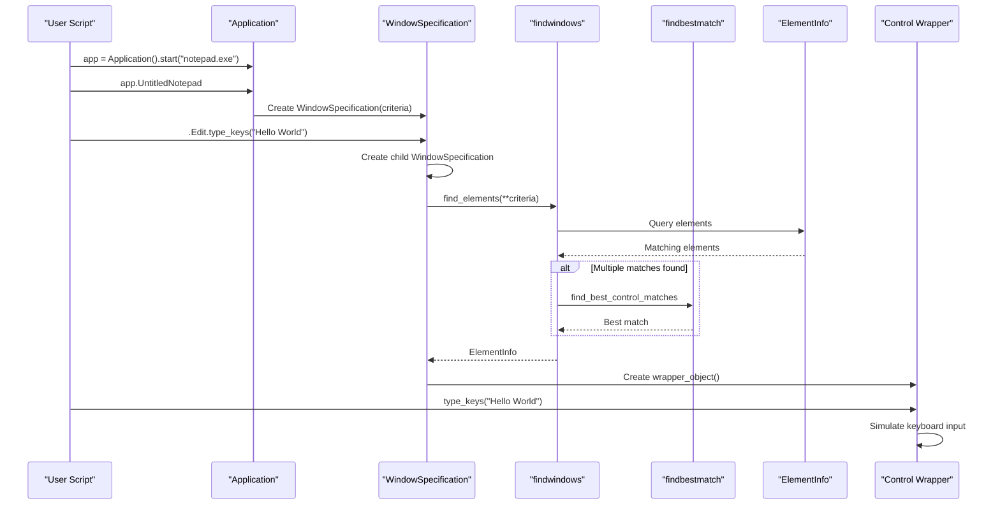

This sequence shows how pywinauto resolves element specifications into actual GUI interactions:

1. `WindowSpecification` objects store search criteria but don't immediately resolve
2. When accessed, `findwindows.find_elements()` locates matching elements
3. `findbestmatch` disambiguates when multiple matches exist
4. The appropriate wrapper class is instantiated around the `ElementInfo`
5. Method calls are forwarded to the wrapper for actual GUI interaction

Sources: [README.md:50-60](), [pywinauto/__init__.py:98-111]()

## Platform Support

pywinauto provides cross-platform GUI automation capabilities:

| Platform | Backends | Package Structure | Status |
|----------|----------|-------------------|--------|
| Windows  | `win32`, `uia` | `pywinauto.controls`, `pywinauto.windows` | Stable |
| Linux    | `atspi` | `pywinauto.linux`, `pywinauto.controls` | In development |
| macOS    | Planned | `pywinauto.controls` | Future |

The `mouse` and `keyboard` input simulation modules work on both Windows and Linux platforms.

Sources: [README.md:19-21](), [setup.py:61-68](), [.github/workflows/atspi_test.yml:1-91]()

## Dependencies

pywinauto has different dependencies based on the platform:

| Platform | Required Packages | Optional Packages |
|----------|-------------------|-------------------|
| Windows  | `pywin32`, `comtypes` | `Pillow` (screenshots) |
| Linux    | `python-xlib` | `Pillow` (screenshots) |
| Testing  | `coverage`, `mock`, `pytest` | - |

The library automatically detects UI Automation support through the `sysinfo._is_uia_support()` function.

Sources: [README.md:86-93](), [setup.py:114-127](), [pywinauto/sysinfo.py:40-66]()

## Example Usage

Here's a simple example that demonstrates using pywinauto to automate Notepad:

```python
from pywinauto.application import Application
app = Application().start("notepad.exe")

app.UntitledNotepad.menu_select("Help->About Notepad")
app.AboutNotepad.OK.click()
app.UntitledNotepad.Edit.type_keys("pywinauto Works!", with_spaces=True)
```

For MS UI Automation backend with Windows Explorer:

```python
from pywinauto import Desktop, Application

Application().start('explorer.exe "C:\\Program Files"')
app = Application(backend="uia").connect(path="explorer.exe", title="Program Files")

app.ProgramFiles.set_focus()
common_files = app.ProgramFiles.ItemsView.get_item('Common Files')
common_files.right_click_input()
app.ContextMenu.Properties.invoke()

Properties = Desktop(backend='uia').Common_Files_Properties
Properties.Cancel.click()
```

These examples demonstrate:
1. Basic application launching and window interaction
2. Menu navigation and button clicking
3. Text input with keyboard simulation
4. Cross-process window management with `Desktop` class

Sources: [README.md:53-60](), [README.md:62-84]()

## Licensing and Attribution

pywinauto is distributed under the BSD 3-clause license. It was originally created by Mark Mc Mahon and now developed by a community of contributors.

Sources: [README.md:104-114](), [pywinauto/__init__.py:1-31]()

---

# Page: Getting Started

# Getting Started

<details>
<summary>Relevant source files</summary>

The following files were used as context for generating this wiki page:

- [docs/HISTORY.txt](docs/HISTORY.txt)
- [docs/code/code.txt](docs/code/code.txt)
- [docs/code/pywinauto.txt](docs/code/pywinauto.txt)
- [docs/conf.py](docs/conf.py)
- [docs/credits.txt](docs/credits.txt)
- [docs/getting_started.txt](docs/getting_started.txt)
- [pywinauto/__init__.py](pywinauto/__init__.py)
- [pywinauto/unittests/testall.py](pywinauto/unittests/testall.py)
- [setup.py](setup.py)

</details>


This document provides a comprehensive guide to getting started with pywinauto, covering installation, basic concepts, and first steps with GUI automation. It introduces the core architecture and demonstrates how to begin automating Windows and Linux applications.

For detailed information about specific control wrappers and automation techniques, see [Control Wrappers](#5). For backend-specific implementation details, see [Backend System](#2.3).

## Installation and Setup

Pywinauto is a Python package that supports both Windows and Linux platforms with different backend requirements depending on your target platform.

### Windows Installation

For Windows applications, pywinauto requires additional dependencies based on the Python version:

```bash
pip install pywinauto
```

The package automatically includes platform-specific dependencies as defined in [setup.py:115-127]():
- `comtypes` and `pywin32` for Windows UI Automation support
- Version-specific pinning for Python <= 3.6 compatibility

### Linux Installation

For Linux applications, additional dependencies are required:

```bash
pip install pywinauto[linux]
```

This installs the `python-xlib` dependency needed for Linux GUI automation via AT-SPI.

Sources: [setup.py:59-128](), [pywinauto/__init__.py:55-90]()

## Core Architecture Overview

Pywinauto uses a layered architecture that separates user interface from backend implementation details. Understanding these core components is essential for effective automation.

### Main Components Relationship

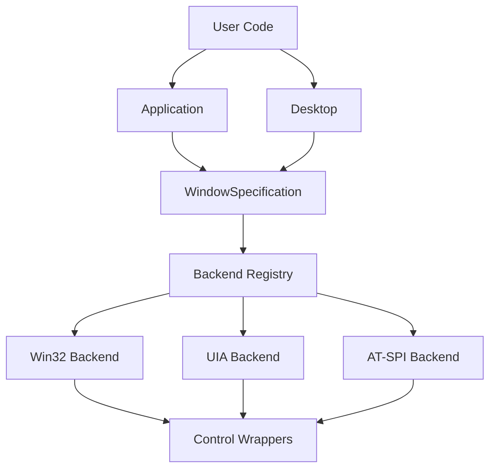

### Key Classes and Their Roles

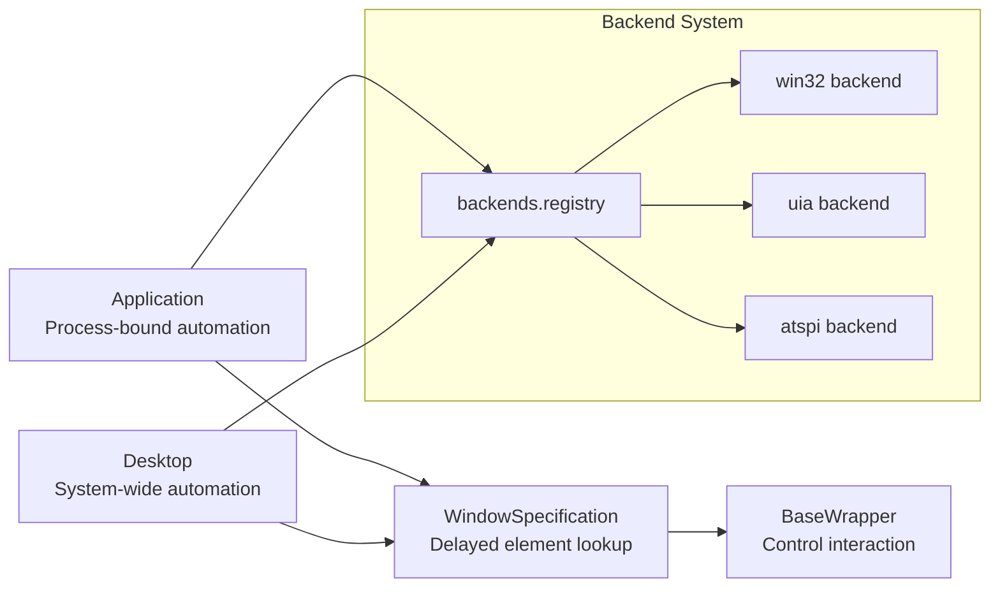

The `Application` class provides process-bounded automation, while `Desktop` enables system-wide control navigation. Both create `WindowSpecification` objects that use delayed lookup to find and interact with GUI elements through backend-specific wrappers.

Sources: [pywinauto/__init__.py:110-174](), [pywinauto/application.py]()

## First Steps

### Basic Application Automation

The most common entry point is the `Application` class for automating a specific process:

```python
from pywinauto import Application

# Start a new application
app = Application().start("notepad.exe")

# Connect to an existing application
app = Application().connect(title="Calculator")
```

### Desktop-wide Automation

For system-wide automation or cross-process navigation, use the `Desktop` class:

```python
from pywinauto import Desktop

# Create desktop object
desktop = Desktop()

# Access any window on the desktop
calculator = desktop.Calculator
```

### Window Specification and Element Finding

The `WindowSpecification` class provides delayed element lookup with flexible criteria:

```python
# Multiple ways to specify windows
window_spec = app.window(title="Untitled - Notepad")
window_spec = app.window(class_name="Notepad")
window_spec = app.window(title_re=".*Notepad.*")

# Access the actual wrapper
wrapper = window_spec.wrapper_object()

# Or use direct attribute access (Python magic)
app.UntitledNotepad.minimize()
```

### Backend Selection

Choose the appropriate backend based on your target application technology:

```python
# For classic Win32 applications (default)
app = Application(backend="win32")

# For modern Windows applications (WPF, WinForms, UWP)
app = Application(backend="uia")

# For Linux applications
app = Application(backend="atspi")
```

Sources: [pywinauto/__init__.py:113-174](), [docs/getting_started.txt:79-101]()

## Backend Architecture

Understanding the backend system is crucial for effective automation across different GUI technologies.

### Backend Registry System

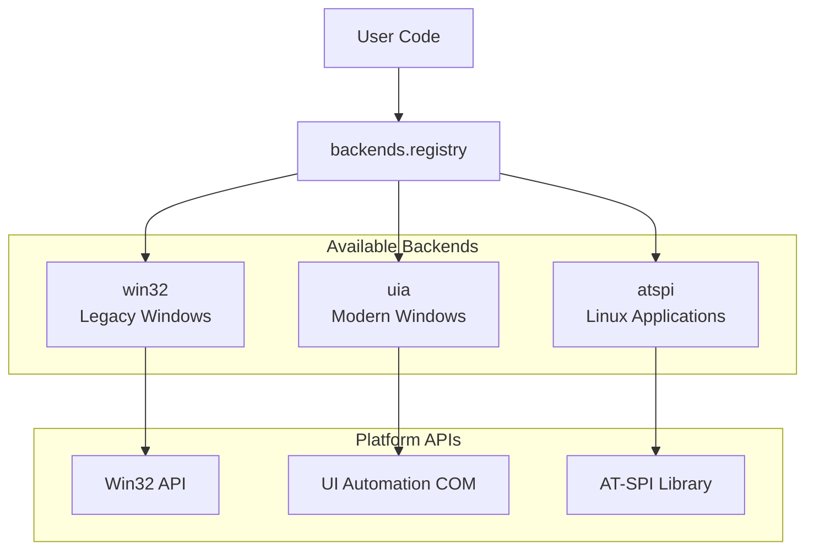

The backend registry system in [pywinauto/backend.py]() manages different GUI automation technologies. Each backend provides:
- Element information classes for discovering GUI elements
- Wrapper classes for interacting with controls
- Platform-specific API bindings

### Automatic Backend Detection

Pywinauto automatically selects the appropriate backend based on platform detection in [pywinauto/__init__.py:55-90]():

```python
if sys.platform == 'win32':
    # Windows platform setup
    import win32api
    import pythoncom
    # Set up COM threading mode
    sys.coinit_flags = _get_com_threading_mode(sys)
```

Sources: [pywinauto/__init__.py:55-90](), [pywinauto/backend.py]()

## Exception Handling

Pywinauto defines several exception types for different error conditions:

| Exception | Purpose | Usage |
|-----------|---------|--------|
| `WindowNotFoundError` | No window could be found | General window lookup failures |
| `ElementNotFoundError` | Specific element not found | Element-specific search failures |
| `ElementAmbiguousError` | Multiple elements match criteria | Ambiguous element specifications |
| `WindowAmbiguousError` | Multiple windows match criteria | Ambiguous window specifications |

These exceptions are defined in [pywinauto/__init__.py:93-103]() and imported from the `findwindows` module.

## Magic Attribute Resolution

Pywinauto provides convenient attribute-based access to GUI elements through "magic" attribute resolution:

```python
# These are equivalent
app.window(best_match="Calculator")
app.Calculator

# Unicode and special characters
app['Untitled - Notepad']
app.window(best_match='Untitled - Notepad')
```

This magic lookup can be disabled for stricter control:

```python
# Disable magic lookup for immediate AttributeError on invalid attributes
app = Application(allow_magic_lookup=False)
desktop = Desktop(allow_magic_lookup=False)
```

The magic lookup functionality is implemented in the `Desktop` class [pywinauto/__init__.py:150-158]() and propagates to `WindowSpecification` objects.

## Next Steps

After completing this getting started guide:

1. Explore specific control automation techniques in [Control Wrappers](#5)
2. Learn about window and element finding strategies in [Window and Control Identification](#2.2)
3. Understand backend-specific features in [Backend System](#2.3)
4. Review practical examples in [Examples and Tutorials](#8)

For immediate hands-on experience, try the included examples in the repository's examples directory, starting with basic Notepad automation.

Sources: [pywinauto/__init__.py:113-174](), [docs/getting_started.txt:1-498](), [setup.py:70-128]()

---

# Page: How To Guide

# How To Guide

<details>
<summary>Relevant source files</summary>

The following files were used as context for generating this wiki page:

- [docs/HowTo.txt](docs/HowTo.txt)
- [docs/controls_overview.txt](docs/controls_overview.txt)
- [docs/remote_execution.txt](docs/remote_execution.txt)
- [docs/wait_long_operations.txt](docs/wait_long_operations.txt)

</details>


This guide provides practical instructions for common pywinauto automation tasks and workflows. It covers essential patterns for connecting to applications, finding controls, handling different control types, and troubleshooting common issues.

For architectural details about the underlying systems, see [Core Architecture](#2). For specific control wrapper documentation, see [Control Wrappers](#5).

## Application Connection Patterns

### Basic Connection Workflow

The fundamental pattern for all pywinauto automation begins with establishing a connection to the target application through the `Application` class.

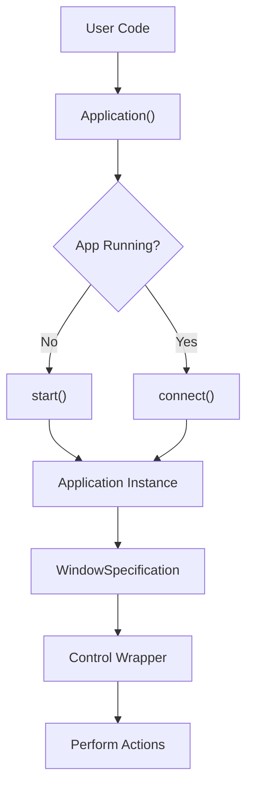

**Starting New Applications**

Use `Application.start()` when the target application is not running:

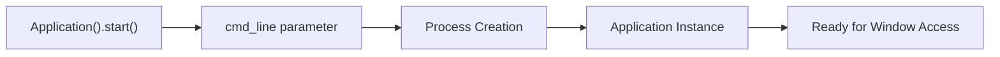

**Connecting to Existing Applications**

The `Application.connect()` method supports multiple connection strategies:

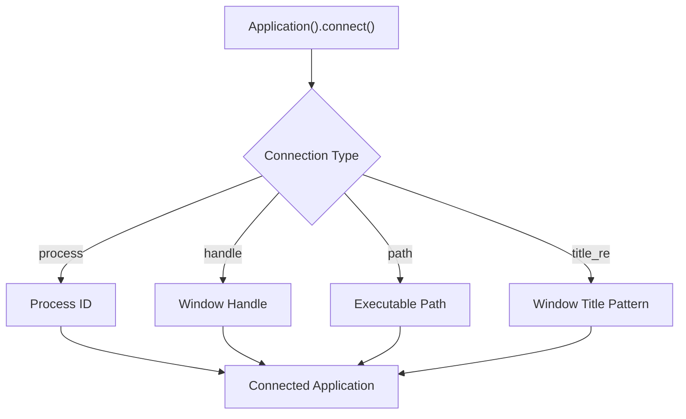

Sources: [docs/HowTo.txt:23-88]()

### Backend Selection

pywinauto automatically selects the appropriate backend based on the application type, but you can specify it explicitly:

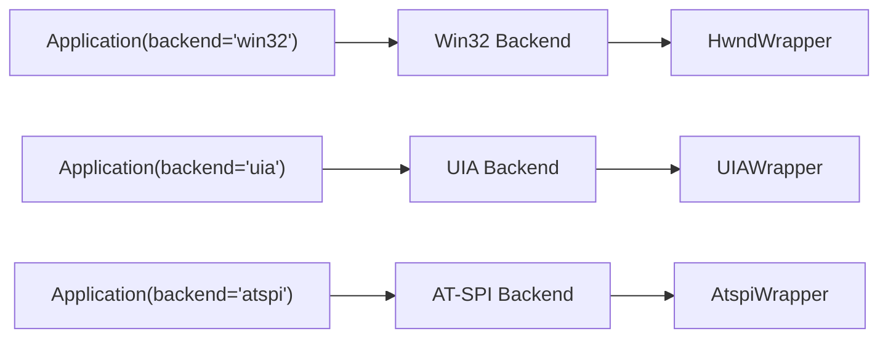

Sources: [docs/HowTo.txt:15-21]()

## Window and Control Discovery

### Window Specification Chain

The `WindowSpecification` system enables flexible, delayed control resolution:

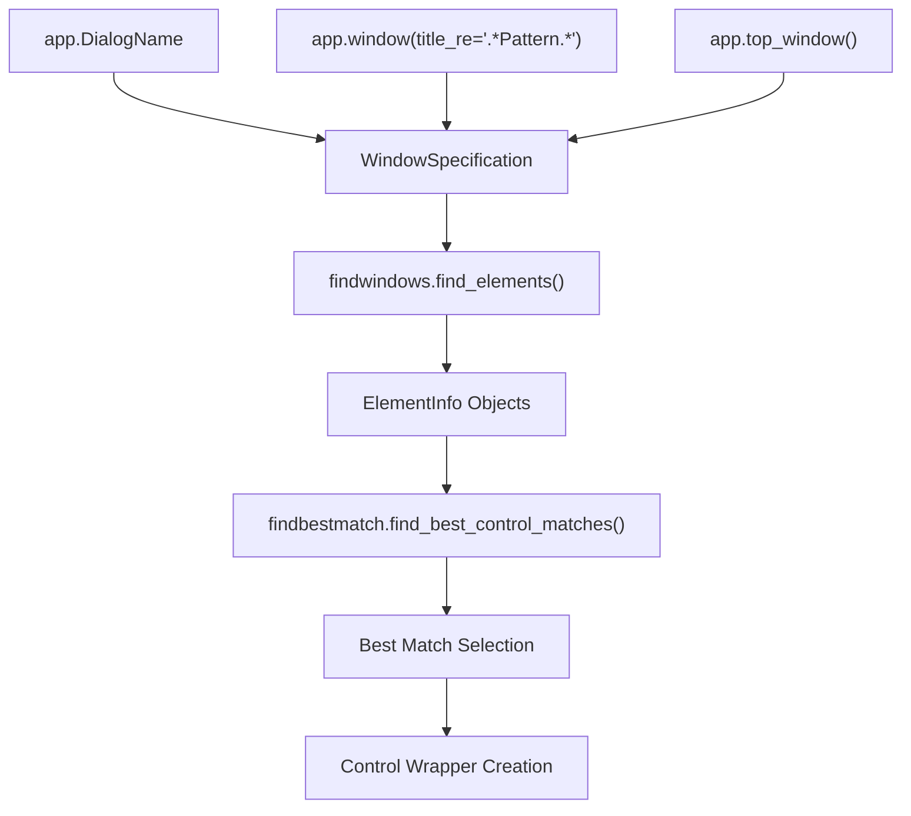

**Common Window Access Patterns**

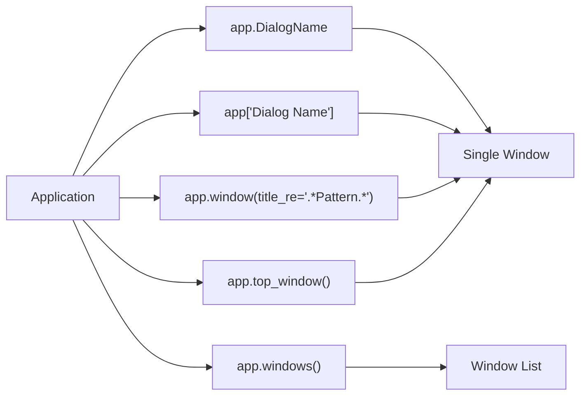

Sources: [docs/HowTo.txt:91-150]()

### Control Identification

Controls are identified using multiple strategies that are automatically disambiguated:

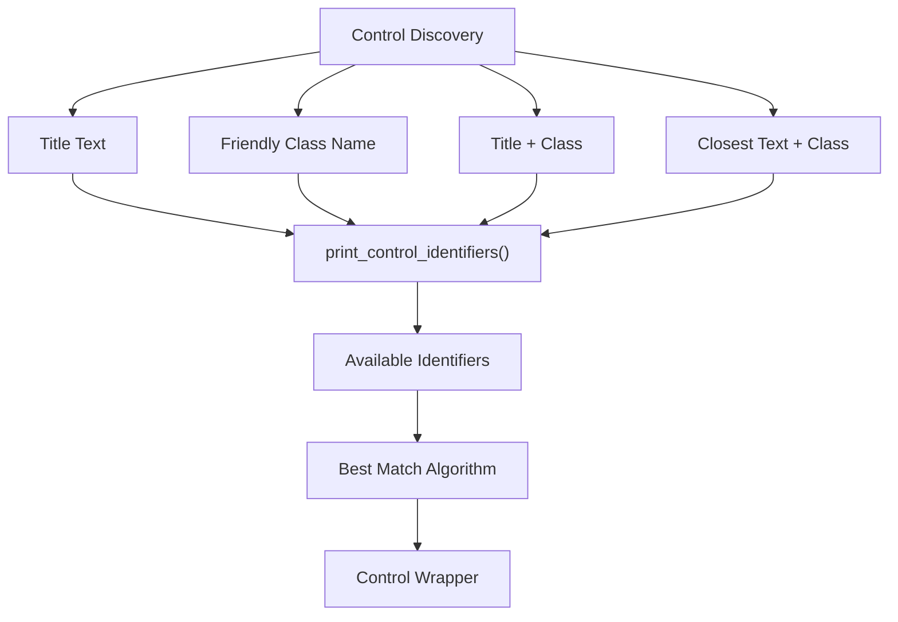

**Control Access Patterns**

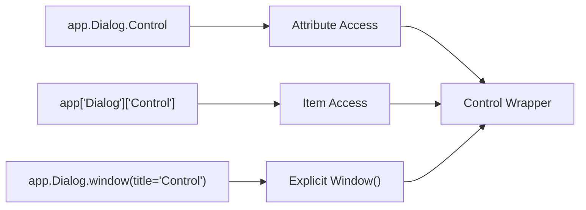

Sources: [docs/HowTo.txt:153-290]()

## Control Interaction Patterns

### Basic Control Actions

All control wrappers inherit from `BaseWrapper` and provide common interaction methods:

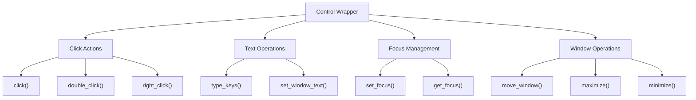

### Specialized Control Types

Different control types provide specific interaction methods:

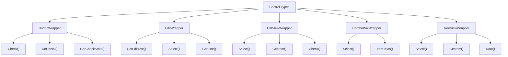

Sources: [docs/controls_overview.txt:8-453]()

## Timing and Synchronization

### Wait Strategies

pywinauto provides multiple waiting mechanisms for reliable automation:

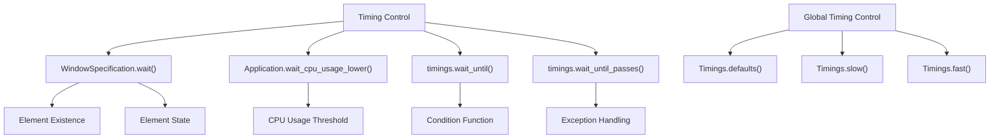

**Wait Method Usage Pattern**

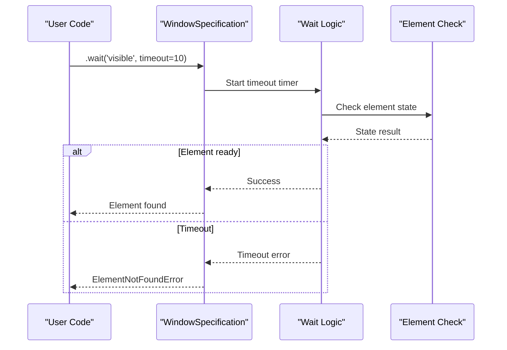

Sources: [docs/wait_long_operations.txt:1-105]()

## Backend-Specific Considerations

### Win32 Backend Features

The Win32 backend provides direct access to Windows API functionality:

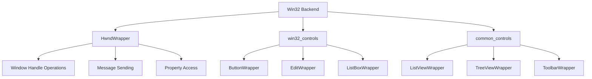

### UIA Backend Features

The UIA backend supports modern Windows applications:

```mermaid
graph TD
    A["UIA Backend"] --> B["UIAWrapper"]
    A --> C["uia_controls"]
    A --> D["UI Automation COM"]
    
    B --> E["Automation Elements"]
    B --> F["Pattern Support"]
    B --> G["Event Handling"]
    
    C --> H["Modern Control Types"]
    C --> I["Rich Text Support"]
    C --> J["Accessibility Features"]
```

Sources: [docs/HowTo.txt:15-21]()

## Error Handling and Troubleshooting

### Common Issues and Solutions

```mermaid
graph TD
    A["Common Issues"] --> B["Control Not Found"]
    A --> C["Timing Problems"]
    A --> D["Owner-Drawn Controls"]
    A --> E["Non-English Applications"]
    
    B --> F["print_control_identifiers()"]
    B --> G["Use title_re patterns"]
    
    C --> H["Add wait() calls"]
    C --> I["Increase timeouts"]
    
    D --> J["Use type_keys()"]
    D --> K["Index-based selection"]
    
    E --> L["Use item access app['Dialog']"]
    E --> M["Explicit window() calls"]
```

### Owner-Drawn Control Workarounds

For controls that don't respond to standard methods:

```mermaid
graph LR
    A["Owner-Drawn Control"] --> B["Standard Methods Fail"]
    B --> C["Alternative Approaches"]
    C --> D["type_keys() with navigation"]
    C --> E["Index-based selection"]
    C --> F["Custom wrapper classes"]
    
    D --> G["send_keys('{HOME}{DOWN 2}{ENTER}')"]
    E --> H["select(1) instead of select('text')"]
```

Sources: [docs/HowTo.txt:320-380]()

## Remote Execution Considerations

### Remote Desktop Limitations

When running automation remotely, certain methods may not work:

```mermaid
graph TD
    A["Remote Execution"] --> B["Methods That Don't Work"]
    A --> C["Alternative Methods"]
    
    B --> D["click_input()"]
    B --> E["set_focus()"]
    B --> F["type_keys()"]
    B --> G["mouse/keyboard modules"]
    
    C --> H["send_chars()"]
    C --> I["send_keystrokes()"]
    C --> J["set_edit_text()"]
    
    K["RDP Considerations"] --> L["Keep window visible"]
    K --> M["Use VNC instead"]
    K --> N["Agent-based CI setup"]
```

### CI Integration Pattern

```mermaid
graph LR
    A["CI Server"] --> B["Jenkins Agent"]
    B --> C["Windows Machine"]
    C --> D["Auto-login Setup"]
    D --> E["Desktop Session"]
    E --> F["GUI Automation"]
    
    G["Scheduled Task"] --> H["Start Agent"]
    H --> I["Interactive Session"]
    I --> J["pywinauto Scripts"]
```

Sources: [docs/remote_execution.txt:1-224]()

## System Tray Automation

### System Tray Access Pattern

```mermaid
graph TD
    A["System Tray Access"] --> B["Explorer Connection"]
    B --> C["Shell_TrayWnd"]
    C --> D["NotificationAreaToolbar"]
    
    E["taskbar module"] --> F["SystemTrayIcons"]
    E --> G["ClickSystemTrayIcon()"]
    E --> H["RightClickSystemTrayIcon()"]
    
    I["Target Application"] --> J["Connect to app"]
    J --> K["Handle popup menus"]
```

**System Tray Interaction Flow**

```mermaid
sequenceDiagram
    participant Code as "User Code"
    participant Explorer as "Explorer App"
    participant SysTray as "System Tray"
    participant TargetApp as "Target Application"
    
    Code->>Explorer: Connect to explorer
    Explorer->>SysTray: Access NotificationAreaToolbar
    SysTray->>SysTray: Click system tray icon
    SysTray-->>TargetApp: Trigger popup menu
    Code->>TargetApp: Connect to target app
    TargetApp->>TargetApp: Handle popup menu
```

Sources: [docs/HowTo.txt:382-453]()

## COM Threading Model Configuration

### Threading Model Setup

```mermaid
graph LR
    A["Import Time"] --> B["Check sys.coinit_flags"]
    B --> C{Flags Set?}
    C -->|No| D["Set MTA (default)"]
    C -->|Yes| E["Use existing"]
    D --> F["COINIT_MULTITHREADED (0)"]
    E --> G["COINIT_APARTMENTTHREADED (2)"]
    F --> H["pywinauto initialization"]
    G --> H
```

**Explicit Threading Model Override**

```mermaid
graph TD
    A["Before Import"] --> B["sys.coinit_flags = 2"]
    B --> C["import pywinauto"]
    C --> D["STA Model Active"]
    
    E["Default Behavior"] --> F["MTA Model"]
    F --> G["Multi-threaded COM"]
    
    D --> H["Single-threaded COM"]
```

Sources: [docs/HowTo.txt:455-484]()

---

# Page: Core Architecture

# Core Architecture

<details>
<summary>Relevant source files</summary>

The following files were used as context for generating this wiki page:

- [pywinauto/application.py](pywinauto/application.py)
- [pywinauto/backend.py](pywinauto/backend.py)
- [pywinauto/controls/__init__.py](pywinauto/controls/__init__.py)
- [pywinauto/findbestmatch.py](pywinauto/findbestmatch.py)
- [pywinauto/findwindows.py](pywinauto/findwindows.py)
- [pywinauto/unittests/test_application.py](pywinauto/unittests/test_application.py)

</details>


This document provides an overview of pywinauto's core architectural components and design patterns. It covers the foundational systems that enable GUI automation across different platforms and backends, including the application interface, backend registry, element discovery, and control wrapper systems.

For detailed information about specific components, see [Application Interface](#2.1), [Window and Control Identification](#2.2), and [Backend System](#2.3).

## Architectural Overview

Pywinauto follows a layered architecture with clear separation of concerns, enabling cross-platform GUI automation through pluggable backends. The system is designed around four main architectural layers that work together to provide a unified API for different GUI automation technologies.

### High-Level System Architecture

```mermaid
graph TB
    subgraph "User Interface Layer"
        Application["Application"]
        Desktop["Desktop"]
        WindowSpecification["WindowSpecification"]
    end
    
    subgraph "Backend Registry"
        BackendsRegistry["BackendsRegistry"]
        BackEnd["BackEnd"]
    end
    
    subgraph "Element Discovery"
        findwindows["findwindows"]
        findbestmatch["findbestmatch"]
        ElementNotFoundError["ElementNotFoundError"]
    end
    
    subgraph "Control Wrapper System"
        BaseWrapper["BaseWrapper"]
        HwndWrapper["HwndWrapper"]
        UIAWrapper["UIAWrapper"]
        AtspiWrapper["AtspiWrapper"]
    end
    
    Application --> BackendsRegistry
    Desktop --> BackendsRegistry
    WindowSpecification --> findwindows
    findwindows --> findbestmatch
    BackendsRegistry --> BaseWrapper
    BaseWrapper --> HwndWrapper
    BaseWrapper --> UIAWrapper
    BaseWrapper --> AtspiWrapper
    
    style Application fill:#f9f9f9
    style BackendsRegistry fill:#f9f9f9
    style findwindows fill:#f9f9f9
    style BaseWrapper fill:#f9f9f9
```

**Sources:** [pywinauto/application.py:1-81](), [pywinauto/backend.py:53-121](), [pywinauto/findwindows.py:32-315](), [pywinauto/controls/__init__.py:31-53]()

## Core Design Patterns

### Registry Pattern for Backend Management

The backend system uses a registry pattern to manage different GUI automation technologies. The `BackendsRegistry` class maintains a collection of registered backends and provides a unified interface for switching between them.

```mermaid
graph LR
    subgraph "Backend Registry Implementation"
        registry["registry (BackendsRegistry)"]
        BackEnd1["BackEnd('win32')"]
        BackEnd2["BackEnd('uia')"]
        BackEnd3["BackEnd('atspi')"]
    end
    
    registry --> BackEnd1
    registry --> BackEnd2
    registry --> BackEnd3
    
    BackEnd1 --> HwndElementInfo["HwndElementInfo"]
    BackEnd1 --> HwndWrapper["HwndWrapper"]
    BackEnd2 --> UIAElementInfo["UIAElementInfo"]
    BackEnd2 --> UIAWrapper["UIAWrapper"]
    BackEnd3 --> AtspiElementInfo["AtspiElementInfo"]
    BackEnd3 --> AtspiWrapper["AtspiWrapper"]
```

Each backend encapsulates an `element_info_class` and `generic_wrapper_class` that provide platform-specific implementations while maintaining a common interface.

**Sources:** [pywinauto/backend.py:38-51](), [pywinauto/backend.py:53-76](), [pywinauto/backend.py:91-106]()

### Delayed Resolution Pattern

The `WindowSpecification` class implements a delayed resolution pattern, allowing users to specify search criteria without immediately executing the search. This enables flexible element lookup with automatic retry mechanisms.

```mermaid
sequenceDiagram
    participant User
    participant Application
    participant WindowSpecification
    participant findwindows
    participant BackendRegistry
    
    User->>Application: "app.DialogName"
    Application->>WindowSpecification: "create with criteria"
    Note over WindowSpecification: "Search criteria stored, not executed"
    User->>WindowSpecification: ".click()"
    WindowSpecification->>findwindows: "find_elements(**criteria)"
    findwindows->>BackendRegistry: "get active backend"
    BackendRegistry-->>findwindows: "backend_obj"
    findwindows-->>WindowSpecification: "element_info"
    WindowSpecification-->>User: "execute action"
```

**Sources:** [pywinauto/application.py:68-80](), [pywinauto/findwindows.py:125-149]()

## Element Discovery System

The element discovery system provides a two-tier approach for finding GUI elements: exact matching through `findwindows` and fuzzy matching through `findbestmatch`.

### Element Finding Flow

```mermaid
graph TD
    find_elements["find_elements(**kwargs)"]
    backend_selection["backend = registry.active_backend"]
    element_filtering["Filter by exact criteria"]
    best_match_check{"best_match specified?"}
    findbestmatch_call["findbestmatch.find_best_control_matches()"]
    return_elements["Return matched elements"]
    
    find_elements --> backend_selection
    backend_selection --> element_filtering
    element_filtering --> best_match_check
    best_match_check -->|Yes| findbestmatch_call
    best_match_check -->|No| return_elements
    findbestmatch_call --> return_elements
```

The system supports multiple search strategies:
- **Exact matching**: Direct property comparisons (`name`, `class_name`, `control_type`)
- **Regular expression matching**: Pattern-based searches (`name_re`, `class_name_re`)
- **Best match**: Fuzzy string matching using difflib algorithms
- **Predicate functions**: Custom filtering logic

**Sources:** [pywinauto/findwindows.py:125-292](), [pywinauto/findbestmatch.py:482-537]()

### Error Handling Architecture

The system defines specific exception types for different error conditions:

| Exception | Purpose | Raised By |
|-----------|---------|-----------|
| `ElementNotFoundError` | No elements match criteria | `find_element()` |
| `ElementAmbiguousError` | Multiple elements match | `find_element()` |
| `WindowNotFoundError` | Legacy Win32 window not found | `find_window()` |
| `MatchError` | Best match below threshold | `find_best_match()` |

**Sources:** [pywinauto/findwindows.py:48-73](), [pywinauto/findbestmatch.py:45-58]()

## Backend Abstraction Layer

The backend abstraction layer enables pywinauto to support multiple GUI automation technologies through a common interface. Each backend must provide implementations for element information and wrapper classes.

### Backend Interface Requirements

```mermaid
classDiagram
    class BackEnd {
        +name: str
        +element_info_class: Class
        +generic_wrapper_class: Class
        +__init__(name, element_info_class, generic_wrapper_class)
    }
    
    class ElementInfo {
        <<abstract>>
        +children()
        +descendants()
        +set_cache_strategy()
    }
    
    class BaseWrapper {
        <<abstract>>
        +click()
        +type_keys()
        +wait()
    }
    
    BackEnd --> ElementInfo : element_info_class
    BackEnd --> BaseWrapper : generic_wrapper_class
    
    ElementInfo <|-- HwndElementInfo
    ElementInfo <|-- UIAElementInfo
    ElementInfo <|-- AtspiElementInfo
    
    BaseWrapper <|-- HwndWrapper
    BaseWrapper <|-- UIAWrapper
    BaseWrapper <|-- AtspiWrapper
```

**Sources:** [pywinauto/backend.py:38-51](), [pywinauto/element_info.py](), [pywinauto/base_wrapper.py]()

## Platform-Specific Integration

The architecture supports cross-platform operation through conditional imports and platform-specific implementations.

### Platform Detection and Loading

```mermaid
graph TD
    import_check{"sys.platform == 'win32'?"}
    windows_imports["Import Windows backends"]
    linux_imports["Import Linux backends"]
    
    import_check -->|Yes| windows_imports
    import_check -->|No| linux_imports
    
    windows_imports --> win32_backend["win32_controls, hwndwrapper"]
    windows_imports --> uia_check{"UIA_support?"}
    uia_check -->|Yes| uia_backend["uia_controls, uiawrapper"]
    
    linux_imports --> atspi_backend["atspi_controls, atspiwrapper"]
```

The platform-specific loading occurs in the controls package initialization, ensuring only relevant backends are loaded for each platform.

**Sources:** [pywinauto/application.py:70-78](), [pywinauto/controls/__init__.py:33-50]()

## Control Wrapper Hierarchy

The control wrapper system provides object-oriented interfaces to GUI elements, with specialized classes for different control types while maintaining polymorphic behavior.

### Wrapper Class Relationships

```mermaid
graph TD
    BaseWrapper["BaseWrapper"]
    HwndWrapper["HwndWrapper"]
    UIAWrapper["UIAWrapper"]
    AtspiWrapper["AtspiWrapper"]
    
    BaseWrapper --> HwndWrapper
    BaseWrapper --> UIAWrapper
    BaseWrapper --> AtspiWrapper
    
    HwndWrapper --> ButtonWrapper["ButtonWrapper"]
    HwndWrapper --> EditWrapper["EditWrapper"]
    HwndWrapper --> ListViewWrapper["ListViewWrapper"]
    
    UIAWrapper --> UIAButtonWrapper["UIAButtonWrapper"]
    UIAWrapper --> UIAEditWrapper["UIAEditWrapper"]
    
    AtspiWrapper --> AtspiButtonWrapper["AtspiButtonWrapper"]
    AtspiWrapper --> AtspiEditWrapper["AtspiEditWrapper"]
```

Each wrapper class provides:
- **Common interface**: Methods like `click()`, `type_keys()`, `wait()` are available across all wrappers
- **Specialized behavior**: Control-specific methods for buttons, edit boxes, lists, etc.
- **Platform abstraction**: Same high-level methods work across Win32, UIA, and AT-SPI backends

**Sources:** [pywinauto/base_wrapper.py](), [pywinauto/controls/__init__.py:43-49]()

## Key Design Principles

1. **Separation of Concerns**: Each layer has distinct responsibilities - UI specification, backend management, element discovery, and control interaction
2. **Pluggable Architecture**: New backends can be registered without modifying core code
3. **Delayed Evaluation**: Search criteria are stored and executed only when needed
4. **Cross-Platform Compatibility**: Common interfaces abstract platform differences
5. **Fuzzy Matching**: Robust element identification through multiple matching strategies

This architecture enables pywinauto to provide a consistent, high-level API while supporting diverse GUI automation technologies across different operating systems.

---

# Page: Application Interface

# Application Interface

<details>
<summary>Relevant source files</summary>

The following files were used as context for generating this wiki page:

- [pywinauto/application.py](pywinauto/application.py)
- [pywinauto/findbestmatch.py](pywinauto/findbestmatch.py)
- [pywinauto/findwindows.py](pywinauto/findwindows.py)
- [pywinauto/unittests/test_application.py](pywinauto/unittests/test_application.py)

</details>


This document covers the Application Interface system, which provides the primary entry point for GUI automation in pywinauto. The Application class manages connections to target applications and provides the WindowSpecification system for delayed element lookup and interaction.

For information about the underlying element finding algorithms, see [Window and Control Identification](#2.2). For details about the multi-backend architecture that supports different GUI automation technologies, see [Backend System](#2.3).

## Overview and Architecture

The Application Interface consists of two main components: the `Application` class for managing target applications and the `WindowSpecification` class for creating flexible element selectors that resolve to actual GUI controls at runtime.

### Application Class Architecture

```mermaid
graph TB
    subgraph "Platform Abstraction Layer"
        A["pywinauto.application.py"] --> B{Platform Detection}
        B -->|Windows| C["windows.application.Application"]
        B -->|Linux| D["linux.application.Application"]
    end
    
    subgraph "Core Application Interface"
        C --> E["BaseApplication"]
        D --> E
        E --> F["WindowSpecification Factory"]
        E --> G["Process Management"]
        E --> H["Backend Registry Integration"]
    end
    
    subgraph "Element Resolution"
        F --> I["WindowSpecification"]
        I --> J["findwindows.find_elements"]
        I --> K["findbestmatch.find_best_control_matches"]
        J --> L["Backend-specific ElementInfo"]
        K --> L
    end
    
    subgraph "Control Wrappers"
        L --> M["Control Wrapper Classes"]
        M --> N["User Interaction Methods"]
    end
```

Sources: [pywinauto/application.py:32-81](), [pywinauto/unittests/test_application.py:265-350]()

The Application class serves as a platform-agnostic interface that automatically selects the appropriate backend implementation based on the operating system. On Windows, it provides access to both Win32 and UIA backends, while on Linux it uses the AT-SPI backend.

### Application Lifecycle and Connection Methods

```mermaid
graph LR
    subgraph "Application States"
        A["Application()"] --> B["Unconnected"]
        B --> C["Connected"]
        C --> D["Process Running"]
        D --> E["Process Terminated"]
    end
    
    subgraph "Connection Methods"
        F["start(cmd)"] --> C
        G["connect(pid=X)"] --> C
        H["connect(path=X)"] --> C
        I["connect(handle=X)"] --> C
        J["connect(name=X)"] --> C
    end
    
    subgraph "Process Management"
        K["kill()"] --> E
        L["is_process_running()"] --> D
        M["wait_for_process_exit()"] --> E
    end
```

Sources: [pywinauto/unittests/test_application.py:310-489](), [pywinauto/application.py:32-64]()

The Application class provides multiple connection methods to attach to target applications. The `start()` method launches a new process, while various `connect()` methods attach to existing processes using different identifiers like process ID, executable path, window handle, or window name.

## WindowSpecification System

The WindowSpecification system provides a powerful delayed-lookup mechanism for GUI elements. Instead of immediately searching for elements, it creates specification objects that resolve to actual controls when accessed.

### WindowSpecification Resolution Flow

```mermaid
sequenceDiagram
    participant U as "User Code"
    participant A as "Application"
    participant WS as "WindowSpecification"
    participant FW as "findwindows.find_elements"
    participant FB as "findbestmatch.find_best_control_matches"
    participant EI as "ElementInfo"
    participant W as "Control Wrapper"
    
    U->>A: "app.DialogName"
    A->>WS: "Create WindowSpecification"
    Note over WS: "Stores search criteria"
    
    U->>WS: "dlg.ControlName.click()"
    WS->>WS: "Create child WindowSpecification"
    WS->>FW: "find_elements(**criteria)"
    FW->>EI: "Query backend for elements"
    EI-->>FW: "Return matching elements"
    
    alt "Multiple matches found"
        FW->>FB: "find_best_control_matches()"
        FB-->>FW: "Return best match"
    end
    
    FW-->>WS: "Return ElementInfo"
    WS->>W: "Create control wrapper"
    W->>W: "Execute click()"
    W-->>U: "Return result"
```

Sources: [pywinauto/unittests/test_application.py:797-875](), [pywinauto/findwindows.py:76-118]()

### WindowSpecification Creation and Chaining

```mermaid
graph TB
    subgraph "WindowSpecification Factory Methods"
        A["Application.window()"] --> B["WindowSpecification"]
        C["Application.__getattr__()"] --> B
        D["Application.__getitem__()"] --> B
        E["Application.child_window()"] --> B
    end
    
    subgraph "WindowSpecification Chaining"
        B --> F["WindowSpecification.child_window()"]
        B --> G["WindowSpecification.__getattr__()"]
        B --> H["WindowSpecification.__getitem__()"]
        F --> I["Child WindowSpecification"]
        G --> I
        H --> I
    end
    
    subgraph "Resolution Methods"
        I --> J["find()"]
        I --> K["find_all()"]
        I --> L["exists()"]
        I --> M["wait()"]
        I --> N["wait_not()"]
    end
    
    subgraph "Control Access"
        J --> O["Control Wrapper Instance"]
        K --> P["List of Control Wrappers"]
    end
```

Sources: [pywinauto/unittests/test_application.py:639-695](), [pywinauto/unittests/test_application.py:858-895]()

WindowSpecification objects can be chained together to create hierarchical element selectors. Each specification stores search criteria and can create child specifications. The actual element lookup is deferred until a concrete operation is performed.

## Search Criteria and Element Matching

The WindowSpecification system supports multiple search criteria types that are passed to the underlying finding systems.

### Search Criteria Types

| Criteria Type | Description | Example |
|---------------|-------------|---------|
| `name` | Exact window name match | `app.window(name="Save As")` |
| `name_re` | Regular expression name match | `app.window(name_re="Save.*")` |
| `title` | Window title (alias for name) | `app.window(title="Open File")` |
| `title_re` | Regular expression title match | `app.window(title_re=".*Notepad")` |
| `class_name` | Window class name | `app.window(class_name="Notepad")` |
| `class_name_re` | Regex class name match | `app.window(class_name_re=".*Edit")` |
| `handle` | Window handle | `app.window(handle=0x12345)` |
| `best_match` | Fuzzy text matching | `app.window(best_match="Save")` |
| `found_index` | Index in found elements | `app.window(class_name="Button", found_index=1)` |

Sources: [pywinauto/findwindows.py:125-292](), [pywinauto/unittests/test_application.py:639-669]()

### Best Match Algorithm Integration

```mermaid
graph TB
    subgraph "Element Finding Pipeline"
        A["WindowSpecification.find()"] --> B["findwindows.find_elements()"]
        B --> C["Backend Element Query"]
        C --> D["Filter by Exact Criteria"]
        D --> E{best_match specified?}
        E -->|Yes| F["findbestmatch.find_best_control_matches()"]
        E -->|No| G["Return Filtered Elements"]
        F --> H["UniqueDict.find_best_matches()"]
        H --> I["Ratio Calculation"]
        I --> J["Return Best Match"]
    end
    
    subgraph "Control Name Generation"
        K["build_unique_dict()"] --> L["get_control_names()"]
        L --> M["Friendly Class Name"]
        L --> N["Window Text"]
        L --> O["get_non_text_control_name()"]
        O --> P["Nearest Text Control"]
    end
    
    F --> K
```

Sources: [pywinauto/findbestmatch.py:482-537](), [pywinauto/findbestmatch.py:290-336]()

## Magic Attribute Access

The Application Interface provides "magic" attribute access that automatically creates WindowSpecification objects for common GUI automation patterns.

### Magic Lookup Mechanism

```mermaid
graph LR
    subgraph "Magic Attribute Access"
        A["app.DialogName"] --> B["Application.__getattr__()"]
        B --> C["Create WindowSpecification"]
        C --> D["best_match='DialogName'"]
    end
    
    subgraph "Chained Access"
        E["app.Dialog.Button"] --> F["WindowSpecification.__getattr__()"]
        F --> G["Create Child WindowSpecification"]
        G --> H["best_match='Button'"]
    end
    
    subgraph "Non-Magic Mode"
        I["app.window(best_match='Dialog')"] --> J["WindowSpecification"]
        J --> K["dlg.by(best_match='Button')"]
        K --> L["Child WindowSpecification"]
    end
```

Sources: [pywinauto/unittests/test_application.py:696-724](), [pywinauto/unittests/test_application.py:774-796]()

The magic lookup system can be disabled by setting `allow_magic_lookup=False` during Application instantiation, requiring explicit use of `window()` and `by()` methods for element access.

## Wait and Timing Operations

WindowSpecification objects provide sophisticated waiting mechanisms for handling dynamic GUI states.

### Wait Operations

```mermaid
graph TB
    subgraph "Wait Methods"
        A["wait(criteria)"] --> B["Parse Criteria String"]
        B --> C["Check Element State"]
        C --> D{State Matches?}
        D -->|Yes| E["Return Element"]
        D -->|No| F["Retry with Timeout"]
        F --> C
    end
    
    subgraph "Wait Criteria"
        G["exists"] --> H["Element exists in GUI"]
        I["visible"] --> J["Element is visible"]
        K["enabled"] --> L["Element is enabled"]
        M["ready"] --> N["Element is ready for interaction"]
        O["active"] --> P["Element is active window"]
    end
    
    subgraph "Negative Wait"
        Q["wait_not(criteria)"] --> R["Wait for condition to be false"]
        R --> S["Timeout if condition remains true"]
    end
```

Sources: [pywinauto/unittests/test_application.py:955-1075](), [pywinauto/unittests/test_application.py:1031-1075]()

## Error Handling and Exceptions

The Application Interface defines specific exception types for different failure scenarios.

### Exception Hierarchy

| Exception | Description | Usage |
|-----------|-------------|--------|
| `AppNotConnected` | Application not connected | Raised when accessing unconnected app |
| `AppStartError` | Application start failed | Raised when `start()` fails |
| `ProcessNotFoundError` | Process not found | Raised when `connect()` fails |
| `ElementNotFoundError` | Element not found | Raised by finding system |
| `ElementAmbiguousError` | Multiple elements found | Raised when unique element expected |
| `TimeoutError` | Wait operation timeout | Raised by wait methods |

Sources: [pywinauto/unittests/test_application.py:299-309](), [pywinauto/unittests/test_application.py:306-515]()

## Cross-Platform Implementation

The Application Interface abstracts platform differences through a common API while delegating to platform-specific implementations.

### Platform Selection Logic

```mermaid
graph TB
    subgraph "Platform Detection"
        A["import pywinauto.application"] --> B{sys.platform}
        B -->|"win32"| C["Import windows.application"]
        B -->|"linux"| D["Import linux.application"]
    end
    
    subgraph "Windows Implementation"
        C --> E["Windows Application Class"]
        E --> F["Win32 Backend Support"]
        E --> G["UIA Backend Support"]
        E --> H["Process Management (Win32)"]
    end
    
    subgraph "Linux Implementation"
        D --> I["Linux Application Class"]
        I --> J["AT-SPI Backend Support"]
        I --> K["Process Management (Linux)"]
    end
    
    subgraph "Common Interface"
        L["BaseApplication"] --> M["WindowSpecification Factory"]
        L --> N["Backend Registry Integration"]
        E --> L
        I --> L
    end
```

Sources: [pywinauto/application.py:66-81](), [pywinauto/unittests/test_application.py:114-143]()

The platform-specific implementations handle differences in process management, window enumeration, and backend capabilities while maintaining a consistent public API.

---

# Page: Window and Control Identification

# Window and Control Identification

<details>
<summary>Relevant source files</summary>

The following files were used as context for generating this wiki page:

- [pywinauto/application.py](pywinauto/application.py)
- [pywinauto/findbestmatch.py](pywinauto/findbestmatch.py)
- [pywinauto/findwindows.py](pywinauto/findwindows.py)
- [pywinauto/unittests/test_application.py](pywinauto/unittests/test_application.py)

</details>


The window and control identification system in pywinauto is implemented through two primary modules: `findwindows` and `findbestmatch`. These modules provide the core functionality for locating GUI elements using various search criteria and matching algorithms.

For information on how the Application interface uses these systems, see [Application Interface](#2.1).

## Core Architecture

### findwindows Module Functions

The `findwindows` module provides the main search functions that form the foundation of element identification:

```mermaid
graph TD
    findwindows["`findwindows.py`"] --> find_elements["`find_elements()`"]
    findwindows --> find_element["`find_element()`"]
    findwindows --> find_window["`find_window()`"]
    findwindows --> find_windows["`find_windows()`"]
    
    find_elements --> ElementInfo["`ElementInfo objects`"]
    find_element --> single_element["`Single ElementInfo`"]
    find_window --> window_handle["`Window handle`"]
    find_windows --> handle_list["`List of handles`"]
    
    find_elements --> backend_registry["`backend.registry`"]
    find_elements --> findbestmatch["`findbestmatch.py`"]
    
    subgraph "Exception Classes"
        ElementNotFoundError["`ElementNotFoundError`"]
        ElementAmbiguousError["`ElementAmbiguousError`"]
        WindowNotFoundError["`WindowNotFoundError`"]
        WindowAmbiguousError["`WindowAmbiguousError`"]
    end
```

Sources: [pywinauto/findwindows.py:76-99](), [pywinauto/findwindows.py:103-118](), [pywinauto/findwindows.py:125-291](), [pywinauto/findwindows.py:295-307]()

### findbestmatch Module Functions

The `findbestmatch` module implements fuzzy matching algorithms when exact matches are not found:

```mermaid
graph TD
    findbestmatch["`findbestmatch.py`"] --> find_best_control_matches["`find_best_control_matches()`"]
    findbestmatch --> build_unique_dict["`build_unique_dict()`"]
    findbestmatch --> get_control_names["`get_control_names()`"]
    
    find_best_control_matches --> UniqueDict["`UniqueDict class`"]
    build_unique_dict --> UniqueDict
    get_control_names --> get_non_text_control_name["`get_non_text_control_name()`"]
    
    UniqueDict --> find_best_matches["`find_best_matches()`"]
    find_best_matches --> difflib_SequenceMatcher["`difflib.SequenceMatcher`"]
    
    subgraph "Algorithm Components"
        _get_match_ratios["`_get_match_ratios()`"]
        _cache["`_cache dictionary`"]
        find_best_control_match_cutoff["`find_best_control_match_cutoff`"]
    end
```

Sources: [pywinauto/findbestmatch.py:482-536](), [pywinauto/findbestmatch.py:457-478](), [pywinauto/findbestmatch.py:290-335](), [pywinauto/findbestmatch.py:339-366]()

## Element Search Process

### find_elements() Function Flow

The `find_elements()` function in `findwindows.py` is the core search function that handles element identification:

```mermaid
graph TD
    find_elements["`find_elements(**kwargs)`"] --> extract_params["`Extract parameters`"]
    extract_params --> backend_selection["`backend = registry.active_backend`"]
    backend_selection --> handle_check{"`handle is not None?`"}
    
    handle_check -->|"Yes"| return_handle["`Return [element_info_class(handle)]`"]
    handle_check -->|"No"| check_renamed["`Check renamed_props`"]
    
    check_renamed --> validate_props["`Validate search properties`"]
    validate_props --> parent_processing["`Process parent parameter`"]
    parent_processing --> top_level_check{"`top_level_only?`"}
    
    top_level_check -->|"Yes"| get_children["`element.children(**kwargs)`"]
    top_level_check -->|"No"| get_descendants["`parent.descendants(**kwargs)`"]
    
    get_children --> filter_elements["`Filter by search criteria`"]
    get_descendants --> filter_elements
    
    filter_elements --> best_match_check{"`best_match specified?`"}
    best_match_check -->|"Yes"| call_findbestmatch["`findbestmatch.find_best_control_matches()`"]
    best_match_check -->|"No"| return_elements["`Return filtered elements`"]
    
    call_findbestmatch --> return_elements
```

Sources: [pywinauto/findwindows.py:125-291](), [pywinauto/findwindows.py:152-170](), [pywinauto/findwindows.py:253-277]()

### Search Criteria Processing

The search criteria are processed through a specific order defined in the backend's `element_info_class`:

```mermaid
graph TD
    search_criteria["`Search Criteria (**kwargs)`"] --> backend_props["`backend_obj.element_info_class`"]
    backend_props --> search_order["`search_order property`"]
    backend_props --> re_props["`re_props property`"]
    backend_props --> exact_only_props["`exact_only_props property`"]
    
    search_order --> iterate_props["`Iterate through properties`"]
    iterate_props --> exact_search{"`exact_search_value?`"}
    iterate_props --> regex_search{"`re_search_value?`"}
    
    exact_search -->|"Yes"| exact_filter["`Filter by exact match`"]
    regex_search -->|"Yes"| regex_filter["`Filter by regex match`"]
    
    exact_filter --> elements_list["`Updated elements list`"]
    regex_filter --> elements_list
    
    elements_list --> active_only_check{"`active_only?`"}
    active_only_check -->|"Yes"| filter_active["`Filter by active element`"]
    active_only_check -->|"No"| final_elements["`Final elements list`"]
    
    filter_active --> final_elements
```

Sources: [pywinauto/findwindows.py:234-251](), [pywinauto/findwindows.py:172-179]()

## Search Parameters

The `find_elements()` function accepts multiple parameters that control the search behavior:

| Parameter | Type | Description | Processing Location |
|-----------|------|-------------|-------------------|
| `backend` | str | Backend name (win32, uia, atspi) | [findwindows.py:126-141]() |
| `parent` | ElementInfo/wrapper/int | Parent element | [findwindows.py:181-188]() |
| `handle` | int | Direct element handle | [findwindows.py:143-149]() |
| `top_level_only` | bool | Search only top-level windows | [findwindows.py:191-204]() |
| `depth` | int | Descendant search depth | [findwindows.py:206-218]() |
| `best_match` | str | Fuzzy matching text | [findwindows.py:253-277]() |
| `found_index` | int | Return specific index | [findwindows.py:286-289]() |
| `active_only` | bool | Filter active elements only | [findwindows.py:247-251]() |
| `predicate_func` | callable | Custom filter function | [findwindows.py:282-283]() |

### Backend-Specific Properties

Each backend defines its own set of searchable properties through the `element_info_class`:

```mermaid
graph TD
    element_info_class["`element_info_class`"] --> search_order["`search_order`"]
    element_info_class --> re_props["`re_props`"]  
    element_info_class --> exact_only_props["`exact_only_props`"]
    element_info_class --> renamed_props["`renamed_props`"]
    
    search_order --> prop_iteration["`Property iteration order`"]
    re_props --> regex_support["`Properties supporting _re suffix`"]
    exact_only_props --> exact_match["`Properties for exact matching only`"]
    renamed_props --> deprecation_warnings["`Backward compatibility warnings`"]
    
    subgraph "Property Validation"
        validate_key["`Validate search key`"]
        _raise_search_key_error["`_raise_search_key_error()`"]
    end
```

Sources: [pywinauto/findwindows.py:172-179](), [pywinauto/findwindows.py:120-121](), [pywinauto/findwindows.py:152-170]()

## Element Search Algorithm

### find_elements() Execution Flow

The element search follows a specific algorithm implemented in the `find_elements()` function:

```mermaid
flowchart TD
    start["`find_elements(**kwargs)`"] --> extract_kwargs["`Extract parameters from kwargs`"]
    extract_kwargs --> select_backend["`Select backend from registry`"]
    select_backend --> handle_shortcut{"`handle parameter?`"}
    
    handle_shortcut -->|"Yes"| return_handle_elem["`Return [element_info_class(handle)]`"]
    handle_shortcut -->|"No"| process_renamed["`Process renamed_props warnings`"]
    
    process_renamed --> validate_props["`Validate property keys against backend`"]
    validate_props --> process_parent["`Convert parent to ElementInfo`"]
    process_parent --> choose_search_strategy{"`top_level_only?`"}
    
    choose_search_strategy -->|"True"| get_top_level["`element.children() from desktop`"]
    choose_search_strategy -->|"False"| get_descendants["`parent.descendants() with depth`"]
    
    get_top_level --> filter_by_parent["`Filter by parent if specified`"]
    get_descendants --> apply_search_criteria["`Apply search criteria in order`"]
    filter_by_parent --> apply_search_criteria
    
    apply_search_criteria --> iterate_search_order["`Iterate through search_order properties`"]
    iterate_search_order --> apply_filters["`Apply exact/regex filters`"]
    apply_filters --> check_active["`Apply active_only filter`"]
    
    check_active --> best_match_decision{"`best_match specified?`"}
    best_match_decision -->|"Yes"| wrap_elements["`Wrap elements in control wrappers`"]
    best_match_decision -->|"No"| apply_predicate["`Apply predicate_func if specified`"]
    
    wrap_elements --> call_find_best["`findbestmatch.find_best_control_matches()`"]
    call_find_best --> unwrap_elements["`Convert back to ElementInfo`"]
    unwrap_elements --> apply_predicate
    
    apply_predicate --> apply_found_index["`Apply found_index if specified`"]
    apply_found_index --> return_results["`Return final elements list`"]
```

Sources: [pywinauto/findwindows.py:125-291](), [pywinauto/findwindows.py:253-277]()

### Exception Handling

The search functions raise specific exceptions based on search results:

```mermaid
graph TD
    search_results["`Search Results`"] --> check_empty{"`No elements found?`"}
    search_results --> check_multiple{"`Multiple elements found?`"}
    
    check_empty -->|"find_element()"| ElementNotFoundError["`ElementNotFoundError`"]
    check_empty -->|"find_window()"| WindowNotFoundError["`WindowNotFoundError`"]
    
    check_multiple -->|"find_element()"| ElementAmbiguousError["`ElementAmbiguousError`"]
    check_multiple -->|"find_window()"| WindowAmbiguousError["`WindowAmbiguousError`"]
    
    ElementAmbiguousError --> store_elements["`exception.elements = elements`"]
    
    subgraph "Exception Classes"
        ElementNotFoundError
        ElementAmbiguousError  
        WindowNotFoundError
        WindowAmbiguousError
    end
```

Sources: [pywinauto/findwindows.py:76-99](), [pywinauto/findwindows.py:103-118](), [pywinauto/findwindows.py:48-66]()

## Best Match Algorithm

### find_best_control_matches() Implementation

When `best_match` is specified, the system uses the `find_best_control_matches()` function from `findbestmatch.py`:

```mermaid
graph TD
    find_best_control_matches["`find_best_control_matches(search_text, controls)`"] --> build_unique_dict["`build_unique_dict(controls)`"]
    build_unique_dict --> get_text_ctrls["`Filter text controls for labeling`"]
    get_text_ctrls --> collect_names["`collect control names`"]
    
    collect_names --> get_control_names["`get_control_names(ctrl, controls, text_ctrls)`"]
    get_control_names --> friendly_class_name["`Add friendly_class_name`"]
    get_control_names --> window_text["`Add window_text if available`"]
    get_control_names --> get_non_text_names["`get_non_text_control_name() if needed`"]
    
    get_non_text_names --> calculate_distances["`Calculate distances to text controls`"]
    calculate_distances --> nearest_text["`Find nearest text control`"]
    nearest_text --> combine_names["`Combine text + class_name`"]
    
    combine_names --> name_control_map["`Create UniqueDict mapping`"]
    name_control_map --> find_best_matches["`UniqueDict.find_best_matches()`"]
    
    find_best_matches --> exact_match["`Exact match search`"]
    find_best_matches --> case_insensitive["`Case-insensitive search`"]
    find_best_matches --> clean_match["`Clean match (non-word chars removed)`"]
    find_best_matches --> clean_ci_match["`Clean + case-insensitive`"]
    
    exact_match --> compare_ratios["`Compare all ratios`"]
    case_insensitive --> compare_ratios
    clean_match --> compare_ratios
    clean_ci_match --> compare_ratios
    
    compare_ratios --> check_cutoff{"`best_ratio >= find_best_control_match_cutoff?`"}
    check_cutoff -->|"Yes"| return_matches["`Return matched controls`"]
    check_cutoff -->|"No"| MatchError["`Raise MatchError`"]
```

Sources: [pywinauto/findbestmatch.py:482-536](), [pywinauto/findbestmatch.py:457-478](), [pywinauto/findbestmatch.py:290-335]()

### UniqueDict and Similarity Calculation

The `UniqueDict` class handles name uniqueness and similarity calculation:

```mermaid
graph TD
    UniqueDict["`UniqueDict class`"] --> setitem["`__setitem__() method`"]
    setitem --> check_duplicate{"`Name already exists?`"}
    check_duplicate -->|"Yes"| make_unique["`Create unique name with counter`"]
    check_duplicate -->|"No"| store_direct["`Store name directly`"]
    
    make_unique --> add_numbered["`Add numbered variants (name0, name1, etc.)`"]
    add_numbered --> store_direct
    
    UniqueDict --> find_best_matches_method["`find_best_matches() method`"]
    find_best_matches_method --> SequenceMatcher["`difflib.SequenceMatcher`"]
    
    SequenceMatcher --> real_quick_ratio["`real_quick_ratio()`"]
    real_quick_ratio --> quick_ratio["`quick_ratio()`"]
    quick_ratio --> full_ratio["`ratio()`"]
    
    full_ratio --> cache_result["`Store in _cache dictionary`"]
    cache_result --> compare_best["`Update best_ratio and best_texts`"]
```

Sources: [pywinauto/findbestmatch.py:339-453](), [pywinauto/findbestmatch.py:65-105](), [pywinauto/findbestmatch.py:60]()

## Control Naming System

### get_control_names() Function

The `get_control_names()` function builds a comprehensive list of possible names for each control:

```mermaid
graph TD
    get_control_names["`get_control_names(control, allcontrols, textcontrols)`"] --> add_friendly_name["`Add friendly_class_name()`"]
    add_friendly_name --> check_window_text{"`Has window_text() and has_title?`"}
    
    check_window_text -->|"Yes"| add_window_text["`Add cleaned window text`"]
    check_window_text -->|"No"| get_non_text_names["`get_non_text_control_name()`"]
    
    add_window_text --> add_combined["`Add text + friendly_class_name`"]
    add_combined --> get_non_text_names
    
    get_non_text_names --> find_text_controls["`Find text controls with can_be_label=True`"]
    find_text_controls --> calculate_distances["`Calculate distances to text controls`"]
    calculate_distances --> distance_formula["`distance = abs(text_r.left - ctrl_r.left) + abs(text_r.bottom - ctrl_r.top)`"]
    
    distance_formula --> find_closest["`Find closest text control`"]
    find_closest --> combine_label["`Combine label text + control class name`"]
    combine_label --> clean_names["`Remove None and empty strings`"]
    
    clean_names --> return_set["`Return set of unique names`"]
```

Sources: [pywinauto/findbestmatch.py:290-335](), [pywinauto/findbestmatch.py:182-286]()

### Distance Calculation for Text Labels

The system uses a specific distance calculation to find the most appropriate text label for unlabeled controls:

```mermaid
graph TD
    text_control["`Text Control Rectangle`"] --> ctrl_rectangle["`Control Rectangle`"]
    ctrl_rectangle --> position_check["`Check relative positions`"]
    
    position_check --> skip_right{"`text_r.left >= ctrl_r.right?`"}
    position_check --> skip_below{"`text_r.top >= ctrl_r.bottom?`"}
    
    skip_right -->|"Yes"| skip_control["`Skip this text control`"]
    skip_below -->|"Yes"| skip_control
    
    skip_right -->|"No"| calculate_distance["`Calculate distance metrics`"]
    skip_below -->|"No"| calculate_distance
    
    calculate_distance --> distance1["`distance = abs(text_r.left - ctrl_r.left) + abs(text_r.bottom - ctrl_r.top)`"]
    calculate_distance --> distance2["`distance2 = abs(text_r.right - ctrl_r.left) + abs(text_r.top - ctrl_r.top)`"]
    
    distance1 --> min_distance["`distance = min(distance, distance2)`"]
    distance2 --> min_distance
    
    min_distance --> update_closest{"`distance < closest?`"}
    update_closest -->|"Yes"| set_best_name["`best_name = ctrl_text + ctrl_friendly_class_name`"]
    update_closest -->|"No"| continue_search["`Continue with next text control`"]
```

Sources: [pywinauto/findbestmatch.py:255-282](), [pywinauto/findbestmatch.py:220-226]()

## Integration with Application Interface

### WindowSpecification Integration

The `WindowSpecification` class in `base_application.py` integrates with the identification system:

```mermaid
graph TD
    WindowSpecification["`WindowSpecification`"] --> child_window["`child_window() method`"]
    WindowSpecification --> find_method["`find() method`"]
    WindowSpecification --> exists_method["`exists() method`"]
    
    child_window --> create_child_spec["`Create child WindowSpecification`"]
    find_method --> call_find_elements["`Call findwindows.find_elements()`"]
    exists_method --> call_find_elements
    
    call_find_elements --> backend_registry["`backend.registry`"]
    backend_registry --> element_info_class["`backend.element_info_class`"]
    element_info_class --> wrapper_class["`backend.generic_wrapper_class`"]
    
    subgraph "Search Parameters"
        search_criteria["`Search criteria from WindowSpecification`"]
        app_context["`Application context`"]
        parent_element["`Parent element`"]
    end
    
    search_criteria --> call_find_elements
    app_context --> call_find_elements
    parent_element --> call_find_elements
```

Sources: [pywinauto/base_application.py](), [pywinauto/findwindows.py:181-188]()

### Error Handling in Practice

The identification system provides comprehensive error handling with detailed information:

```mermaid
graph TD
    search_attempt["`Element Search Attempt`"] --> no_elements{"`No elements found?`"}
    search_attempt --> multiple_elements{"`Multiple elements found?`"}
    
    no_elements -->|"find_element()"| ElementNotFoundError["`ElementNotFoundError(kwargs)`"]
    no_elements -->|"find_window()"| WindowNotFoundError["`WindowNotFoundError`"]
    
    multiple_elements -->|"find_element()"| ElementAmbiguousError["`ElementAmbiguousError`"]
    multiple_elements -->|"find_window()"| WindowAmbiguousError["`WindowAmbiguousError`"]
    
    ElementAmbiguousError --> attach_elements["`exception.elements = elements`"]
    ElementAmbiguousError --> format_message["`Format error message with count`"]
    
    subgraph "MatchError from best_match"
        MatchError["`MatchError from findbestmatch`"]
        available_items["`exception.items = available names`"]
        search_target["`exception.tofind = search_text`"]
    end
    
    MatchError --> available_items
    MatchError --> search_target
```

Sources: [pywinauto/findwindows.py:85-97](), [pywinauto/findbestmatch.py:45-57]()

## Best Practices for Identification

To ensure reliable window and control identification:

1. **Be Specific**: Use multiple criteria when possible (title, class_name, etc.)
2. **Use Print Methods**: Utilize `print_control_identifiers()` to discover available identification options
3. **Handle Ambiguity**: When multiple elements match, use additional criteria or indexes
4. **Consider Backend**: Different backends (Win32, UIA, AT-SPI) may require different identification strategies
5. **Use Regular Expressions**: For dynamic window titles or elements with changing text

Example of printing control identifiers:
```python
app = Application().connect(title='Notepad')
app.Notepad.print_control_identifiers()
```

Sources: [pywinauto/application.py:32-64](), [pywinauto/findwindows.py:76-99]()

## Error Handling

When pywinauto can't find a window or control, it raises specific exceptions:

| Exception | Condition |
|-----------|-----------|
| `ElementNotFoundError` | No elements match the criteria |
| `ElementAmbiguousError` | Multiple elements match the criteria (when using `find_element()`) |
| `WindowNotFoundError` | No windows match the criteria (when using `find_window()`) |
| `WindowAmbiguousError` | Multiple windows match the criteria (when using `find_window()`) |

It's good practice to handle these exceptions in your scripts for more robust automation:

```python
try:
    dialog = app.window(title='Save As')
except WindowNotFoundError:
    print("Save dialog not found")
```

Sources: [pywinauto/findwindows.py:48-72](), [pywinauto/findwindows.py:85-97]()

---

# Page: Backend System

# Backend System

<details>
<summary>Relevant source files</summary>

The following files were used as context for generating this wiki page:

- [pywinauto/backend.py](pywinauto/backend.py)
- [pywinauto/controls/__init__.py](pywinauto/controls/__init__.py)

</details>


## Purpose and Scope

This document describes the backend system in pywinauto, which allows the framework to support multiple automation technologies across different platforms through a consistent interface. The backend system provides an abstraction layer that enables pywinauto to work with Win32 API, UI Automation (UIA) on Windows, and AT-SPI on Linux using the same programmatic patterns. For information about specific backend implementations, see [Element Info Architecture](#4.1), [UIA Element Information](#4.2), and [AT-SPI Element Information](#4.3).

## Backend Registry Architecture

The backend system is built around a registry pattern that manages different automation technologies through a centralized component.

Backend Registry Class Structure

```mermaid
classDiagram
    class BackEnd {
        +name: str
        +element_info_class: class
        +generic_wrapper_class: class
        +__init__(name, element_info_class, generic_wrapper_class)
    }
    
    class BackendsRegistry {
        +backends: dict
        +active_backend: BackEnd
        +name: property
        +element_class: property
        +wrapper_class: property
    }
    
    class registry {
        <<singleton instance>>
    }
    
    BackendsRegistry "1" --* "1" registry
    BackendsRegistry "1" --o "*" BackEnd
    
    note for BackEnd "Validates element_info_class inherits from ElementInfo\nValidates generic_wrapper_class inherits from BaseWrapper"
    
    class GlobalFunctions {
        +name(): str
        +element_class(): class
        +wrapper_class(): class
        +activate(name): void
        +register(name, element_info_class, generic_wrapper_class): void
    }
    
    GlobalFunctions --> registry: "delegates to"
```

### Core Components and Interfaces

1. **BackEnd Class**: Represents a specific backend implementation with its name and required base classes.
2. **BackendsRegistry Class**: Manages all registered backends and tracks the current active backend.
3. **Registry Functions**: Provide a simplified interface to register and activate backends.

Sources: [pywinauto/backend.py:38-50](), [pywinauto/backend.py:53-76](), [pywinauto/backend.py:79-106]()

## Available Backends

Pywinauto supports three main backends, each specialized for different platforms and automation technologies:

Backend Implementation Architecture

```mermaid
graph TD
    subgraph "Backend Registry (backend.py)"
        registry["registry: BackendsRegistry"]
        register_fn["register(name, element_info_class, generic_wrapper_class)"]
        activate_fn["activate(name)"]
        backends_dict["backends: dict"]
    end
    
    subgraph "Win32 Backend"
        win32_reg["register('win32', HwndElementInfo, HwndWrapper)"]
        HwndElementInfo["HwndElementInfo"]
        HwndWrapper["HwndWrapper"]
    end
    
    subgraph "UIA Backend"
        uia_reg["register('uia', UIAElementInfo, UIAWrapper)"]
        UIAElementInfo["UIAElementInfo"]
        UIAWrapper["UIAWrapper"]
    end
    
    subgraph "AT-SPI Backend"
        atspi_reg["register('atspi', AtspiElementInfo, AtspiWrapper)"]
        AtspiElementInfo["AtspiElementInfo"]
        AtspiWrapper["AtspiWrapper"]
    end
    
    subgraph "Base Classes"
        ElementInfo["ElementInfo (element_info.py)"]
        BaseWrapper["BaseWrapper (base_wrapper.py)"]
    end
    
    register_fn --> backends_dict
    activate_fn --> registry
    
    win32_reg --> register_fn
    uia_reg --> register_fn
    atspi_reg --> register_fn
    
    HwndElementInfo --> ElementInfo
    UIAElementInfo --> ElementInfo
    AtspiElementInfo --> ElementInfo
    
    HwndWrapper --> BaseWrapper
    UIAWrapper --> BaseWrapper
    AtspiWrapper --> BaseWrapper
```

### Backend Selection Logic

Platform-Specific Backend Registration

```mermaid
flowchart TD
    start["pywinauto.controls.__init__.py"]
    platform_check["sys.platform.startswith('linux')"]
    
    subgraph "Linux Path"
        linux_imports["from . import atspiwrapper\nfrom . import atspi_controls"]
        atspi_register["atspiwrapper registers 'atspi' backend"]
    end
    
    subgraph "Windows Path"
        uia_check["UIA_support from sysinfo"]
        uia_imports["from . import uiawrapper\nfrom . import uia_controls"]
        win32_imports["from . import common_controls\nfrom . import win32_controls"]
        uia_register["uiawrapper registers 'uia' backend"]
        win32_register["hwndwrapper registers 'win32' backend"]
    end
    
    start --> platform_check
    platform_check -->|"True"| linux_imports
    platform_check -->|"False"| uia_check
    
    linux_imports --> atspi_register
    
    uia_check -->|"True"| uia_imports
    uia_check --> win32_imports
    uia_imports --> uia_register
    win32_imports --> win32_register
```

The backend selection follows this logic:

1. **Platform Detection**: `sys.platform.startswith('linux')` determines the platform
2. **Linux**: Automatically imports and registers AT-SPI backend
3. **Windows**: Checks `UIA_support` to conditionally import UIA backend, always imports Win32 backend
4. **Runtime Selection**: User can activate any registered backend via `activate(name)`

Sources: [pywinauto/controls/__init__.py:31-52](), [pywinauto/backend.py:91-101]()

## Backend Registration

Each backend must be registered with the backend registry before it can be used. The registration process requires:

1. A unique backend name (e.g., "win32", "uia", "atspi")
2. An ElementInfo-derived class for accessing control properties
3. A BaseWrapper-derived class for interacting with controls

```python
register(name, element_info_class, generic_wrapper_class)
```

### Registration Flow

Backend Registration Sequence

```mermaid
sequenceDiagram
    participant App as "Application Code"
    participant ControlsInit as "controls.__init__.py"
    participant Registry as "backend.registry"
    participant HwndWrapper as "hwndwrapper.py"
    participant UIAWrapper as "uiawrapper.py"
    participant AtspiWrapper as "atspiwrapper.py"
    
    App->>ControlsInit: import pywinauto.controls
    ControlsInit->>ControlsInit: sys.platform.startswith('linux')?
    
    alt Linux Platform
        ControlsInit->>AtspiWrapper: from . import atspiwrapper
        AtspiWrapper->>Registry: register('atspi', AtspiElementInfo, AtspiWrapper)
    else Windows Platform
        ControlsInit->>ControlsInit: Check UIA_support
        alt UIA Available
            ControlsInit->>UIAWrapper: from . import uiawrapper
            UIAWrapper->>Registry: register('uia', UIAElementInfo, UIAWrapper)
        end
        ControlsInit->>HwndWrapper: from . import hwndwrapper
        HwndWrapper->>Registry: register('win32', HwndElementInfo, HwndWrapper)
    end
    
    App->>Registry: activate('win32')
    Registry->>Registry: Set active_backend
    App->>Registry: element_class()
    Registry->>App: Return active_backend.element_info_class
```

Sources: [pywinauto/backend.py:103-105](), [pywinauto/controls/__init__.py:34-51]()

## Backend Activation

Once backends are registered, one must be activated to become the current backend used for automation:

```python
activate(name)
```

When activated, the backend provides:
- Element information classes for identifying and exploring UI elements
- Wrapper classes for interacting with UI elements
- Platform-specific functionality

Sources: [pywinauto/backend.py:91-101]()

## Backend Integration with Application

Application Backend Integration Flow

```mermaid
graph TD
    subgraph "User Code"
        UserCode["app = Application(backend='uia')"]
    end
    
    subgraph "Application Class"
        AppInit["Application.__init__(backend='win32')"]
        Connect["connect(**kwargs)"]
        Start["start(cmd_line)"]
    end
    
    subgraph "Backend System (backend.py)"
        registry_obj["registry: BackendsRegistry"]
        activate_fn["activate(backend_name)"]
        element_class_fn["element_class()"]
        wrapper_class_fn["wrapper_class()"]
        active_backend["active_backend: BackEnd"]
    end
    
    subgraph "Element Discovery"
        findwindows["findwindows.find_windows()"]
        ElementInfo["element_info_class()"]
        BaseWrapper["generic_wrapper_class()"]
    end
    
    UserCode --> AppInit
    AppInit --> activate_fn
    activate_fn --> registry_obj
    registry_obj --> active_backend
    
    Connect --> findwindows
    Start --> Connect
    findwindows --> element_class_fn
    element_class_fn --> ElementInfo
    ElementInfo --> wrapper_class_fn
    wrapper_class_fn --> BaseWrapper
```

Sources: [pywinauto/backend.py:79-89]()

## Element Info and Wrapper Classes

Each backend provides two fundamental components:

### Element Info Classes
- Represent UI elements and their properties
- Provide a consistent interface to access element attributes
- Handle platform-specific discovery and hierarchy navigation

### Wrapper Classes
- Provide high-level interaction methods with controls
- Abstract away the complexities of different UI frameworks
- Implement operations like click, type_keys, etc. in platform-specific ways

| Backend | Element Info Class | Base Wrapper Class | Module Location |
|---------|-------------------|-------------------|-----------------|
| win32   | HwndElementInfo   | HwndWrapper       | controls.hwndwrapper |
| uia     | UIAElementInfo    | UIAWrapper        | controls.uiawrapper |
| atspi   | AtspiElementInfo  | AtspiWrapper      | controls.atspiwrapper |

Sources: [pywinauto/backend.py:44-50]()

## Best Practices for Backend Usage

1. **Explicit Backend Selection**: Always specify the backend when creating an Application object to ensure consistent behavior.
   ```python
   app = Application(backend="uia")
   ```

2. **Backend Compatibility**: Some applications work better with specific backends:
   - Modern Windows applications (Windows 10+): UIA backend
   - Legacy Windows applications: Win32 backend
   - Linux applications: AT-SPI backend

3. **Cross-Platform Development**: Abstract backend-specific code behind interfaces that work with any active backend.

Sources: [pywinauto/backend.py:91-101]()

## Technical Details

The backend system uses the Singleton pattern to ensure only one backend registry exists throughout the application lifetime. The active backend determines which implementation of `ElementInfo` and `BaseWrapper` is used for all operations.

Sources: [pywinauto/backend.py:108-120]()

---

# Page: Base Components

# Base Components

<details>
<summary>Relevant source files</summary>

The following files were used as context for generating this wiki page:

- [pywinauto/base_application.py](pywinauto/base_application.py)
- [pywinauto/base_wrapper.py](pywinauto/base_wrapper.py)
- [pywinauto/controls/hwndwrapper.py](pywinauto/controls/hwndwrapper.py)
- [pywinauto/linux/application.py](pywinauto/linux/application.py)
- [pywinauto/unittests/test_application_linux.py](pywinauto/unittests/test_application_linux.py)
- [pywinauto/unittests/test_hwndwrapper.py](pywinauto/unittests/test_hwndwrapper.py)
- [pywinauto/windows/application.py](pywinauto/windows/application.py)

</details>


This document covers the foundational classes and utilities that underpin the entire pywinauto framework. These base components provide the core abstractions, patterns, and infrastructure upon which all platform-specific implementations and specialized controls are built.

The base components include the universal wrapper system (`BaseWrapper`), the delayed element resolution system (`WindowSpecification`), the cross-platform application foundation (`BaseApplication`), and the backend registry architecture that enables multi-platform support.

For detailed information about the base wrapper hierarchy and specific wrapper implementations, see [Base Wrapper System](#3.1). For cross-platform application management capabilities, see [Cross-Platform Application](#3.2). For low-level Windows API utilities, see [Win32 Functions and Utilities](#3.3).

## Base Component Architecture

The base components form a layered architecture where each layer provides abstractions for the layer above:

```mermaid
graph TB
    subgraph "User Interface Layer"
        App[Application]
        WinSpec[WindowSpecification]
        Desktop[Desktop]
    end
    
    subgraph "Base Component Layer"
        BaseApp[BaseApplication]
        BaseWrapper[BaseWrapper]
        BaseMeta[BaseMeta]
        Registry[Backend Registry]
    end
    
    subgraph "Element Resolution Layer"
        ElemInfo[ElementInfo]
        FindWindows[findwindows]
        FindBestMatch[findbestmatch]
    end
    
    subgraph "Backend Layer"
        Win32Backend[Win32Backend]
        UIABackend[UIABackend]
        ATSPIBackend[ATSPIBackend]
    end
    
    App --> BaseApp
    WinSpec --> BaseWrapper
    Desktop --> BaseWrapper
    
    BaseApp --> Registry
    BaseWrapper --> BaseMeta
    BaseWrapper --> ElemInfo
    
    WinSpec --> FindWindows
    WinSpec --> FindBestMatch
    
    Registry --> Win32Backend
    Registry --> UIABackend
    Registry --> ATSPIBackend
    
    BaseWrapper --> Registry
```

Sources: [pywinauto/base_wrapper.py:94-99](), [pywinauto/base_application.py:123-135](), [pywinauto/base_application.py:41-42]()

## BaseWrapper: Universal Element Abstraction

The `BaseWrapper` class provides a unified interface for interacting with GUI elements across all supported platforms and backends. It uses a metaclass-based factory pattern to automatically select the appropriate specialized wrapper for each element type.

```mermaid
graph TB
    subgraph "Wrapper Factory System"
        BaseMeta[BaseMeta]
        FindWrapper["find_wrapper()"]
        CreateWrapper["_create_wrapper()"]
    end
    
    subgraph "Base Wrapper Interface"
        BaseWrapper[BaseWrapper]
        Properties["rectangle()<br/>is_visible()<br/>is_enabled()<br/>window_text()"]
        Actions["click_input()<br/>type_keys()<br/>wait_visible()"]
        Hierarchy["parent()<br/>children()<br/>descendants()"]
    end
    
    subgraph "Element Information"
        ElementInfo[ElementInfo]
        Handle[handle]
        Cache[_cache]
        ActionLogger[ActionLogger]
    end
    
    subgraph "Specialized Wrappers"
        HwndWrapper[HwndWrapper]
        UIAWrapper[UIAWrapper]
        AtspiWrapper[AtspiWrapper]
    end
    
    BaseMeta --> FindWrapper
    FindWrapper --> CreateWrapper
    CreateWrapper --> BaseWrapper
    
    BaseWrapper --> Properties
    BaseWrapper --> Actions  
    BaseWrapper --> Hierarchy
    BaseWrapper --> ElementInfo
    
    ElementInfo --> Handle
    ElementInfo --> Cache
    ElementInfo --> ActionLogger
    
    BaseWrapper --> HwndWrapper
    BaseWrapper --> UIAWrapper
    BaseWrapper --> AtspiWrapper
```

Sources: [pywinauto/base_wrapper.py:84-92](), [pywinauto/base_wrapper.py:94-154](), [pywinauto/base_wrapper.py:114-129]()

### Core BaseWrapper Methods

| Method Category | Key Methods | Purpose |
|-----------------|-------------|---------|
| Element Properties | `rectangle()`, `is_visible()`, `is_enabled()`, `window_text()` | Query element state and properties |
| Navigation | `parent()`, `children()`, `descendants()`, `top_level_parent()` | Navigate element hierarchy |
| Actions | `click_input()`, `type_keys()`, `set_focus()` | Perform user interactions |
| Synchronization | `wait_visible()`, `wait_enabled()`, `verify_actionable()` | Wait for element states |
| Utility | `capture_as_image()`, `draw_outline()`, `get_properties()` | Debugging and introspection |

Sources: [pywinauto/base_wrapper.py:313-329](), [pywinauto/base_wrapper.py:409-425](), [pywinauto/base_wrapper.py:661-692](), [pywinauto/base_wrapper.py:851-871]()

## WindowSpecification: Delayed Element Resolution

The `WindowSpecification` class implements a deferred resolution pattern that allows users to specify element search criteria without immediately searching for the element. This enables robust, retry-based element location with automatic backend selection.

```mermaid
graph TB
    subgraph "WindowSpecification System"
        WinSpec[WindowSpecification]
        Criteria[criteria]
        Backend[backend]
        App[app]
    end
    
    subgraph "Search Chain Building"
        By["by(**criteria)"]
        GetItem["__getitem__(key)"]
        GetAttr["__getattribute__(attr)"]
        MagicLookup["allow_magic_lookup"]
    end
    
    subgraph "Element Resolution"
        Find["find()"]
        FindAll["find_all()"]
        Exists["exists()"]
        WaitUntilPasses["wait_until_passes()"]
    end
    
    subgraph "Backend Integration"
        FindWindows["findwindows.find_element()"]
        FindBestMatch["findbestmatch"]
        GenericWrapper["backend.generic_wrapper_class()"]
    end
    
    WinSpec --> Criteria
    WinSpec --> Backend
    WinSpec --> App
    
    WinSpec --> By
    WinSpec --> GetItem
    WinSpec --> GetAttr
    GetAttr --> MagicLookup
    
    By --> Find
    Find --> FindAll
    Find --> Exists
    Find --> WaitUntilPasses
    
    Find --> FindWindows
    Find --> FindBestMatch
    FindWindows --> GenericWrapper
```

Sources: [pywinauto/base_application.py:148-167](), [pywinauto/base_application.py:262-297](), [pywinauto/base_application.py:465-481](), [pywinauto/base_application.py:523-588]()

### WindowSpecification Resolution Process

The `WindowSpecification` uses a multi-stage resolution process:

1. **Criteria Chain Building**: Each call to `by()`, `[]`, or attribute access adds criteria to the search chain
2. **Backend Selection**: Automatic backend selection based on criteria or explicit specification
3. **Element Search**: Robust search with retry logic and timeout handling
4. **Best Match**: Fuzzy matching for user-friendly element identification
5. **Wrapper Creation**: Automatic wrapper selection based on element type

Sources: [pywinauto/base_application.py:200-229](), [pywinauto/base_application.py:281-296]()

## BaseApplication: Cross-Platform Foundation

The `BaseApplication` class provides the foundation for platform-specific Application classes, defining the common interface and behavior for application lifecycle management.

```mermaid
graph TB
    subgraph "BaseApplication Interface"
        BaseApp[BaseApplication]
        WindowMethod["window(**criteria)"]
        ProcessMgmt["process<br/>kill()<br/>is_process_running()"]
        CPUMonitoring["cpu_usage()<br/>wait_cpu_usage_lower()"]
    end
    
    subgraph "Platform Implementations"
        WinApp["windows.Application"]
        LinuxApp["linux.Application"]
        StartMethod["start(cmd_line)"]
        ConnectMethod["connect(**kwargs)"]
    end
    
    subgraph "Window Management"
        Windows["windows()"]
        TopWindow["top_window()"]
        ActiveWindow["active()"]
        WindowSpec[WindowSpecification]
    end
    
    subgraph "Backend Integration"
        BackendRegistry["backend.registry"]
        ActiveBackend["active_backend"]
        GenericWrapper["generic_wrapper_class"]
    end
    
    BaseApp --> WindowMethod
    BaseApp --> ProcessMgmt
    BaseApp --> CPUMonitoring
    
    BaseApp --> WinApp
    BaseApp --> LinuxApp
    WinApp --> StartMethod
    WinApp --> ConnectMethod
    LinuxApp --> StartMethod
    LinuxApp --> ConnectMethod
    
    WindowMethod --> Windows
    WindowMethod --> TopWindow
    WindowMethod --> ActiveWindow
    WindowMethod --> WindowSpec
    
    BaseApp --> BackendRegistry
    BackendRegistry --> ActiveBackend
    BackendRegistry --> GenericWrapper
```

Sources: [pywinauto/base_application.py:100-118](), [pywinauto/windows/application.py:246-294](), [pywinauto/linux/application.py:45-65]()

## Backend Registry System

The backend registry enables pywinauto's multi-platform support by providing a pluggable architecture for different GUI automation technologies:

```mermaid
graph TB
    subgraph "Registry Architecture"
        Registry["backend.registry"]
        ActiveBackend["active_backend"]
        Backends["backends{}"]
        Register["register()"]
    end
    
    subgraph "Backend Interface"
        BackendName["name"]
        ElementInfoClass["element_info_class"]
        GenericWrapperClass["generic_wrapper_class"]
        DialogClass["dialog_class"]
    end
    
    subgraph "Registered Backends"
        Win32["win32"]
        UIA["uia"]
        ATSPI["atspi"]
    end
    
    subgraph "Backend Components"
        ElementInfo["Win32ElementInfo<br/>UIAElementInfo<br/>AtspiElementInfo"]
        Wrapper["HwndWrapper<br/>UIAWrapper<br/>AtspiWrapper"]
        Dialog["DialogWrapper<br/>UIADialog<br/>AtspiDialog"]
    end
    
    Registry --> ActiveBackend
    Registry --> Backends
    Registry --> Register
    
    ActiveBackend --> BackendName
    ActiveBackend --> ElementInfoClass
    ActiveBackend --> GenericWrapperClass
    ActiveBackend --> DialogClass
    
    Backends --> Win32
    Backends --> UIA
    Backends --> ATSPI
    
    ElementInfoClass --> ElementInfo
    GenericWrapperClass --> Wrapper
    DialogClass --> Dialog
```

Sources: [pywinauto/base_application.py:156-157](), [pywinauto/base_application.py:165](), [pywinauto/base_wrapper.py:138]()

## Exception Hierarchy

The base components define a comprehensive exception hierarchy for handling various error conditions:

```mermaid
graph TB
    subgraph "Application Exceptions"
        AppStartError[AppStartError]
        ProcessNotFoundError[ProcessNotFoundError] 
        AppNotConnected[AppNotConnected]
    end
    
    subgraph "Element Exceptions"
        InvalidElement[InvalidElement]
        ElementNotEnabled[ElementNotEnabled]
        ElementNotVisible[ElementNotVisible]
        ElementNotActive[ElementNotActive]
    end
    
    subgraph "Base Exceptions"
        RuntimeError[RuntimeError]
        TimeoutError[TimeoutError]
    end
    
    subgraph "Usage Context"
        StartConnect["start() / connect()"]
        ElementAccess["element access"]
        ActionVerification["action verification"]
    end
    
    RuntimeError --> AppStartError
    RuntimeError --> ProcessNotFoundError
    RuntimeError --> AppNotConnected
    RuntimeError --> InvalidElement
    RuntimeError --> ElementNotEnabled
    RuntimeError --> ElementNotVisible
    RuntimeError --> ElementNotActive
    
    AppStartError --> StartConnect
    ProcessNotFoundError --> StartConnect
    AppNotConnected --> StartConnect
    
    InvalidElement --> ElementAccess
    ElementNotEnabled --> ActionVerification
    ElementNotVisible --> ActionVerification
    ElementNotActive --> ActionVerification
```

Sources: [pywinauto/base_wrapper.py:60-82](), [pywinauto/base_application.py:100-118]()

## Element Information Abstraction

The base components define the `ElementInfo` abstraction that provides a unified interface to platform-specific element information:

| Property | Description | Usage |
|----------|-------------|-------|
| `handle` | Platform-specific element identifier | Element identification and comparison |
| `class_name` | Element class name | Element type identification |
| `control_id` | Control identifier | Unique element identification |
| `rectangle` | Element screen coordinates | Position and size queries |
| `visible` | Element visibility state | State checking |
| `enabled` | Element enabled state | Action verification |
| `rich_text` | Element text content | Text retrieval |

Sources: [pywinauto/base_wrapper.py:284-286](), [pywinauto/base_wrapper.py:300-310](), [pywinauto/base_wrapper.py:373-384]()

The base components provide the essential foundation that makes pywinauto's cross-platform, multi-backend architecture possible. They abstract platform differences while providing a consistent, powerful interface for GUI automation across Windows and Linux systems.

---

# Page: Base Wrapper System

# Base Wrapper System

<details>
<summary>Relevant source files</summary>

The following files were used as context for generating this wiki page:

- [pywinauto/base_wrapper.py](pywinauto/base_wrapper.py)
- [pywinauto/controls/hwndwrapper.py](pywinauto/controls/hwndwrapper.py)
- [pywinauto/unittests/test_hwndwrapper.py](pywinauto/unittests/test_hwndwrapper.py)

</details>


The Base Wrapper System provides the foundational abstraction layer for all GUI control wrappers in pywinauto. This system defines the common interface and behavior that all control wrappers must implement, regardless of the underlying GUI automation backend (Win32, UIA, AT-SPI). The system uses metaclasses and factory patterns to automatically select and instantiate the appropriate wrapper class for each GUI element.

For information about backend-specific wrapper implementations, see [UIA Controls](#5.2) and [AT-SPI Controls](#5.3). For details about the ElementInfo abstraction that wrappers consume, see [Element Info Architecture](#4.1).

## Core Components

The base wrapper system consists of several key components that work together to provide a unified interface for GUI automation:

### BaseWrapper Class Hierarchy

```mermaid
classDiagram
    class BaseMeta {
        <<metaclass>>
        +find_wrapper(element)
    }
    
    class BaseWrapper {
        <<abstract>>
        +__init__(element_info, active_backend)
        +friendly_class_name()
        +class_name()
        +window_text()
        +is_visible()
        +is_enabled()
        +click()
        +children()
        +parent()
    }
    
    class HwndMeta {
        <<metaclass>>
        +find_wrapper(element)
        +re_wrappers
        +str_wrappers
    }
    
    class HwndWrapper {
        +style()
        +send_message()
        +set_focus()
        +menu_select()
    }
    
    class DialogWrapper {
        +run_tests()
        +write_to_xml()
        +client_area_rect()
    }
    
    BaseMeta --> BaseWrapper : creates
    HwndMeta --> HwndWrapper : creates
    BaseWrapper <|-- HwndWrapper
    HwndWrapper <|-- DialogWrapper
```

Sources: [pywinauto/base_wrapper.py:84-111](), [pywinauto/controls/hwndwrapper.py:105-149](), [pywinauto/controls/hwndwrapper.py:152-177]()

### Exception System

The base wrapper system defines several exception classes to handle different element states:

| Exception Class | Purpose | Thrown When |
|----------------|---------|-------------|
| `InvalidElement` | Element handle is invalid | Element no longer exists |
| `ElementNotEnabled` | Element is disabled | Action attempted on disabled element |
| `ElementNotVisible` | Element is not visible | Action attempted on hidden element |
| `ElementNotActive` | Element is not active | Action attempted on inactive element |

Sources: [pywinauto/base_wrapper.py:60-81]()

## Wrapper Creation and Selection

The wrapper system uses a sophisticated factory pattern with metaclasses to automatically select the most appropriate wrapper class for each GUI element:

### Wrapper Selection Process

```mermaid
sequenceDiagram
    participant Client as "Client Code"
    participant Factory as "BaseWrapper.__new__"
    participant Meta as "BaseMeta/HwndMeta"
    participant Registry as "Wrapper Registry"
    participant ElementInfo as "ElementInfo"
    
    Client->>Factory: BaseWrapper(element_info)
    Factory->>Meta: find_wrapper(element_info)
    Meta->>ElementInfo: element_info.class_name
    ElementInfo-->>Meta: "Button"
    Meta->>Registry: lookup class_name
    Registry-->>Meta: ButtonWrapper
    Meta-->>Factory: ButtonWrapper
    Factory->>ButtonWrapper: __init__(element_info)
    ButtonWrapper-->>Client: wrapper_instance
```

Sources: [pywinauto/base_wrapper.py:110-129](), [pywinauto/controls/hwndwrapper.py:123-149]()

### Windows Wrapper Registration

The `HwndMeta` metaclass maintains two registries for Windows control wrappers:

- **`str_wrappers`** - Direct string-to-wrapper mappings for exact class name matches
- **`re_wrappers`** - Regular expression-to-wrapper mappings for pattern matches

```python
# Registration happens automatically when wrapper classes are defined
class ButtonWrapper(HwndWrapper):
    windowclasses = ["Button"]  # Registers "Button" -> ButtonWrapper
    
class EditWrapper(HwndWrapper):
    windowclasses = ["Edit", "RichEdit.*"]  # Supports regex patterns
```

Sources: [pywinauto/controls/hwndwrapper.py:108-121](), [pywinauto/controls/hwndwrapper.py:130-140]()

## Base Wrapper Interface

The `BaseWrapper` class defines the core interface that all wrappers must implement:

### Essential Properties and Methods

```mermaid
classDiagram
    class BaseWrapper {
        <<abstract>>
        +element_info: ElementInfo
        +handle: int
        +backend: Backend
        +friendly_class_name() str
        +class_name() str
        +window_text() str
        +control_id() int
        +is_visible() bool
        +is_enabled() bool
        +is_active() bool
        +rectangle() RECT
        +parent() BaseWrapper
        +children() List[BaseWrapper]
        +click() BaseWrapper
        +double_click() BaseWrapper
        +right_click() BaseWrapper
        +type_keys() BaseWrapper
        +set_focus() BaseWrapper
        +wait_visible() BaseWrapper
        +verify_actionable() void
    }
```

Sources: [pywinauto/base_wrapper.py:214-565]()

### Element Navigation and Hierarchy

The wrapper system provides methods to navigate the element hierarchy:

| Method | Purpose | Returns |
|--------|---------|---------|
| `parent()` | Get parent element | `BaseWrapper` or `None` |
| `children()` | Get child elements | `List[BaseWrapper]` |
| `descendants()` | Get all descendant elements | `List[BaseWrapper]` |
| `top_level_parent()` | Get top-level window | `BaseWrapper` |
| `by(**criteria)` | Create child search specification | `WindowSpecification` |

Sources: [pywinauto/base_wrapper.py:409-449](), [pywinauto/base_wrapper.py:468-509](), [pywinauto/base_wrapper.py:155-171]()

## Windows Implementation (HwndWrapper)

The `HwndWrapper` class extends `BaseWrapper` to provide Windows-specific functionality:

### Windows-Specific Features

```mermaid
graph TD
    BaseWrapper["BaseWrapper"] --> HwndWrapper["HwndWrapper"]
    HwndWrapper --> WindowsAPI["Windows API Integration"]
    HwndWrapper --> MessageSystem["Message System"]
    HwndWrapper --> FocusSystem["Focus Management"]
    HwndWrapper --> MenuSystem["Menu Operations"]
    
    WindowsAPI --> Style["style()"]
    WindowsAPI --> ExStyle["exstyle()"]
    WindowsAPI --> Font["font()"]
    
    MessageSystem --> SendMessage["send_message()"]
    MessageSystem --> PostMessage["post_message()"]
    MessageSystem --> SendMessageTimeout["send_message_timeout()"]
    
    FocusSystem --> SetFocus["set_focus()"]
    FocusSystem --> GetFocus["get_focus()"]
    FocusSystem --> HasFocus["has_focus()"]
    
    MenuSystem --> MenuSelect["menu_select()"]
    MenuSystem --> MenuItems["menu_items()"]
    MenuSystem --> MenuItem["menu_item()"]
```

Sources: [pywinauto/controls/hwndwrapper.py:220-411](), [pywinauto/controls/hwndwrapper.py:460-686](), [pywinauto/controls/hwndwrapper.py:1264-1327]()

### Window State Management

The `HwndWrapper` provides comprehensive window state management:

```python
# Window state methods
wrapper.maximize()     # Maximize window
wrapper.minimize()     # Minimize window  
wrapper.restore()      # Restore window
wrapper.close()        # Close window
wrapper.is_maximized() # Check if maximized
wrapper.is_minimized() # Check if minimized
wrapper.is_normal()    # Check if normal size
```

Sources: [pywinauto/controls/hwndwrapper.py:1174-1240]()

## Element Verification System

The wrapper system includes a comprehensive verification system to ensure elements are in the correct state before performing actions:

### Verification Methods

```mermaid
graph TD
    VerifyActionable["verify_actionable()"] --> VerifyVisible["verify_visible()"]
    VerifyActionable --> VerifyEnabled["verify_enabled()"]
    VerifyActionable --> WaitForIdle["wait_for_idle()"]
    
    VerifyVisible --> IsVisible["is_visible()"]
    VerifyEnabled --> IsEnabled["is_enabled()"]
    
    IsVisible --> ElementNotVisible["Raises ElementNotVisible"]
    IsEnabled --> ElementNotEnabled["Raises ElementNotEnabled"]
    
    WaitMethods["Wait Methods"] --> WaitVisible["wait_visible()"]
    WaitMethods --> WaitEnabled["wait_enabled()"]
    WaitMethods --> WaitActive["wait_active()"]
```

Sources: [pywinauto/base_wrapper.py:616-658](), [pywinauto/base_wrapper.py:851-978]()

## Integration with Backend System

The base wrapper system integrates tightly with the backend registry system:

### Backend Registration Pattern

```mermaid
sequenceDiagram
    participant Module as "Module Import"
    participant Registry as "backend.registry"
    participant Backend as "Backend Class"
    participant ElementInfo as "ElementInfo Class"
    participant Wrapper as "Wrapper Class"
    
    Module->>Registry: register('win32', HwndElementInfo, HwndWrapper)
    Registry->>Backend: create backend instance
    Backend->>ElementInfo: set element_info_class
    Backend->>Wrapper: set generic_wrapper_class
    Registry->>Backend: activate('win32')
```

Sources: [pywinauto/controls/hwndwrapper.py:1790-1792]()

### Cross-Backend Wrapper Creation

The wrapper system supports multiple backends through a unified interface:

```python
# Backend-agnostic wrapper creation
element_info = backend.element_info_class(handle)
wrapper = backend.generic_wrapper_class(element_info)

# Backend-specific optimizations
if backend.name == 'win32':
    wrapper.send_message(win32defines.WM_COMMAND, cmd_id)
elif backend.name == 'uia':
    wrapper.invoke_pattern.invoke()
```

Sources: [pywinauto/base_wrapper.py:132-154](), [pywinauto/base_wrapper.py:249-264]()

---

# Page: Cross-Platform Application

# Cross-Platform Application

<details>
<summary>Relevant source files</summary>

The following files were used as context for generating this wiki page:

- [pywinauto/base_application.py](pywinauto/base_application.py)
- [pywinauto/linux/application.py](pywinauto/linux/application.py)
- [pywinauto/unittests/test_application_linux.py](pywinauto/unittests/test_application_linux.py)
- [pywinauto/windows/application.py](pywinauto/windows/application.py)

</details>


This document covers the `BaseApplication` class and cross-platform application management capabilities that enable pywinauto to work across Windows and Linux platforms through a unified API. The `BaseApplication` class serves as the foundation for platform-specific implementations while `WindowSpecification` provides a cross-platform interface for locating and interacting with GUI elements.

For information about the backend system that enables cross-platform support, see [Backend System](#2.3). For details about window and control identification mechanisms, see [Window and Control Identification](#2.2).

## Architecture Overview

The cross-platform application architecture is built around the `BaseApplication` abstract base class, which defines the common interface that all platform-specific implementations must provide. This design allows the same high-level API to work across different operating systems while delegating platform-specific operations to concrete implementations.

### Cross-Platform Class Hierarchy

```mermaid
classDiagram
    class BaseApplication {
        +connect(**kwargs)
        +start(cmd_line, timeout, retry_interval, create_new_console, wait_for_idle, work_dir)
        +cpu_usage(interval)
        +wait_cpu_usage_lower(threshold, timeout, usage_interval)
        +top_window()
        +active()
        +windows(**kwargs)
        +window(**kwargs)
        +kill(soft)
        +is_process_running()
        +wait_for_process_exit(timeout, retry_interval)
        +process
        +backend
        +allow_magic_lookup
    }
    
    class WindowsApplication {
        +connect(**kwargs)
        +start(cmd_line, timeout, retry_interval, create_new_console, wait_for_idle, work_dir)
        +cpu_usage(interval)
        +is64bit()
        +kill(soft)
        +is_process_running()
        +WriteAppData(filename)
        +GetMatchHistoryItem(index)
        +match_history
        +use_history
        +actions
    }
    
    class LinuxApplication {
        +connect(**kwargs)
        +start(cmd_line, timeout, retry_interval, create_new_console, wait_for_idle, work_dir)
        +cpu_usage(interval)
        +kill(soft)
        +is_process_running()
        +xmlpath
        +_proc_descriptor
        +match_history
        +use_history
    }
    
    class WindowSpecification {
        +find(timeout, retry_interval)
        +find_all(timeout, retry_interval)
        +by(**criteria)
        +exists(timeout, retry_interval)
        +not_exists(timeout, retry_interval)
        +dump_tree(depth, max_width, filename)
        +criteria
        +app
        +backend
        +allow_magic_lookup
    }
    
    BaseApplication <|-- WindowsApplication
    BaseApplication <|-- LinuxApplication
    BaseApplication --> WindowSpecification : creates
    WindowSpecification --> BaseApplication : references
```

Sources: [pywinauto/base_application.py:822-1035](), [pywinauto/windows/application.py:246-620](), [pywinauto/linux/application.py:45-193]()

### Cross-Platform Integration Architecture

```mermaid
graph TB
    subgraph "Cross-Platform Layer"
        BA["BaseApplication"]
        WS["WindowSpecification"]
    end
    
    subgraph "Platform Implementations"
        WinApp["windows.application.Application"]
        LinApp["linux.application.Application"]
    end
    
    subgraph "Backend Registry"
        BR["backend.registry"]
        Win32["win32 backend"]
        UIA["uia backend"]
        ATSPI["atspi backend"]
    end
    
    subgraph "Platform APIs"
        WinAPI["Win32 API / UI Automation"]
        LinAPI["AT-SPI"]
    end
    
    BA --> WinApp
    BA --> LinApp
    WS --> BR
    WinApp --> Win32
    WinApp --> UIA
    LinApp --> ATSPI
    Win32 --> WinAPI
    UIA --> WinAPI
    ATSPI --> LinAPI
    
    WinApp --> WS
    LinApp --> WS
```

Sources: [pywinauto/base_application.py:93-94](), [pywinauto/windows/application.py:53](), [pywinauto/linux/application.py:40]()

## BaseApplication Class

The `BaseApplication` class provides the abstract interface that all platform-specific application implementations must follow. It defines the core application lifecycle methods and window management capabilities that work consistently across platforms.

### Core Interface Methods

The `BaseApplication` class defines several abstract methods that must be implemented by platform-specific subclasses:

| Method | Purpose | Parameters |
|--------|---------|------------|
| `connect()` | Connect to running process | `**kwargs` (pid, handle, path, timeout) |
| `start()` | Launch new application | `cmd_line`, `timeout`, `retry_interval`, `create_new_console`, `wait_for_idle`, `work_dir` |
| `cpu_usage()` | Monitor CPU usage | `interval` |
| `kill()` | Terminate application | `soft` (graceful shutdown flag) |
| `is_process_running()` | Check process status | None |

Sources: [pywinauto/base_application.py:832-1035]()

### Process Management

The `BaseApplication` class provides common process management functionality that works across platforms:

```mermaid
stateDiagram-v2
    [*] --> NotConnected
    NotConnected --> Connected : connect() or start()
    Connected --> Running : process launched
    Running --> Monitoring : cpu_usage()
    Monitoring --> Running : continue monitoring
    Running --> Terminated : kill()
    Terminated --> [*]
    
    state Connected {
        [*] --> HasProcess
        HasProcess --> WindowsAvailable : windows()
        WindowsAvailable --> TopWindow : top_window()
        WindowsAvailable --> ActiveWindow : active()
    }
```

The `wait_cpu_usage_lower()` method provides cross-platform CPU monitoring:

```python
def wait_cpu_usage_lower(self, threshold=2.5, timeout=None, usage_interval=None):
    """Wait until process CPU usage percentage is less than the specified threshold"""
    if usage_interval is None:
        usage_interval = Timings.cpu_usage_interval
    if timeout is None:
        timeout = Timings.cpu_usage_wait_timeout

    start_time = timings.timestamp()

    while self.cpu_usage(usage_interval) > threshold:
        if timings.timestamp() - start_time > timeout:
            raise RuntimeError('Waiting CPU load <= {}% timed out!'.format(threshold))

    return self
```

Sources: [pywinauto/base_application.py:866-879]()

### Window Management

The `BaseApplication` class provides window discovery and management methods that work through the backend system:

```mermaid
sequenceDiagram
    participant App as BaseApplication
    participant WS as WindowSpecification
    participant Backend as backend.registry
    participant FW as findwindows
    
    App->>+WS: window(**kwargs)
    WS->>WS: create criteria
    WS->>+Backend: get active backend
    Backend-->>-WS: backend instance
    WS->>+FW: find_element(**criteria)
    FW-->>-WS: element_info
    WS-->>-App: WindowSpecification
    
    App->>+WS: find()
    WS->>+Backend: generic_wrapper_class
    Backend-->>-WS: wrapper instance
    WS-->>-App: control wrapper
```

The `top_window()` method demonstrates cross-platform window discovery:

```python
def top_window(self):
    """Return WindowSpecification for a current top window of the application"""
    if not self.process:
        raise AppNotConnected("Please use start or connect before trying "
                              "anything else")

    timeout = Timings.window_find_timeout
    while timeout >= 0:
        windows = findwindows.find_elements(pid=self.process,
                                            backend=self.backend.name)
        if windows:
            break
        time.sleep(Timings.window_find_retry)
        timeout -= Timings.window_find_retry
    else:
        raise RuntimeError("No windows for that process could be found")

    criteria = {}
    criteria['backend'] = self.backend.name
    if windows[0].handle:
        criteria['handle'] = windows[0].handle
    else:
        criteria['name'] = windows[0].name

    return WindowSpecification(criteria, allow_magic_lookup=self.allow_magic_lookup)
```

Sources: [pywinauto/base_application.py:881-905]()

## WindowSpecification Class

The `WindowSpecification` class provides a unified, cross-platform interface for specifying and locating GUI elements. It implements delayed resolution, allowing criteria to be built up incrementally and resolved only when needed.

### Delayed Resolution Architecture

```mermaid
stateDiagram-v2
    [*] --> Specified
    Specified --> Chained : by(**criteria)
    Chained --> Chained : by(**criteria)
    Chained --> Resolved : find()
    Specified --> Resolved : find()
    Resolved --> Wrapper : create wrapper
    Wrapper --> [*]
    
    state Specified {
        [*] --> HasCriteria
        HasCriteria --> HasBackend : backend assigned
        HasBackend --> HasApp : app reference
    }
    
    state Resolved {
        [*] --> ElementFound
        ElementFound --> ControlWrapper : generic_wrapper_class
    }
```

### Criteria Management

The `WindowSpecification` class maintains a list of criteria that can be built up incrementally:

```python
def __init__(self, search_criteria, allow_magic_lookup=True):
    """
    Initialize the class

    :param search_criteria: the criteria to match a dialog
    :param allow_magic_lookup: whether attribute access must turn into child_window(best_match=...) search as fallback
    """
    # kwargs will contain however to find this window
    if 'backend' not in search_criteria:
        search_criteria['backend'] = backend.registry.active_backend.name
    if 'pid' in search_criteria and 'app' in search_criteria:
        raise KeyError('Keywords "pid" and "app" cannot be combined (ambiguous). ' \
            'Use one option at a time: Application object with keyword "app" or ' \
            'integer process ID with keyword "process".')
    self.app = search_criteria.get('app', None)
    self.criteria = [search_criteria, ]
    self.actions = ActionLogger()
    self.backend = backend.registry.backends[search_criteria['backend']]
    self.allow_magic_lookup = allow_magic_lookup
```

Sources: [pywinauto/base_application.py:148-166]()

### Cross-Platform Element Discovery

The `find()` method provides cross-platform element discovery through the backend system:

```mermaid
flowchart TD
    A["find()"] --> B["_get_updated_criteria()"]
    B --> C["Update criteria with app.process"]
    C --> D["findwindows.find_element(**criteria[0])"]
    D --> E{"len(criteria) > 1?"}
    E -->|Yes| F["Find parent element"]
    F --> G["Find child elements"]
    G --> H["backend.generic_wrapper_class()"]
    E -->|No| I["backend.generic_wrapper_class()"]
    H --> J["Return wrapper"]
    I --> J
```

The element discovery process handles both top-level windows and child controls:

```python
def __find_base(self, criteria_, timeout, retry_interval):
    time_left = timeout
    start = timestamp()
    criteria = self._get_updated_criteria(criteria_)
    dialog = self.backend.generic_wrapper_class(findwindows.find_element(**criteria[0]))
    if len(criteria) > 1:
        ctrls = []
        previous_parent = dialog.element_info
        for ctrl_criteria in criteria[1:]:
            ctrl_criteria["top_level_only"] = False
            if "parent" not in ctrl_criteria:
                ctrl_criteria["parent"] = previous_parent

            # resolve the control and return it
            if 'backend' not in ctrl_criteria:
                ctrl_criteria['backend'] = self.backend.name

            ctrl = self.backend.generic_wrapper_class(findwindows.find_element(**ctrl_criteria))
            previous_parent = ctrl.element_info
            ctrls.append(ctrl)
        return ctrls[-1]
    else:
        return dialog
```

Sources: [pywinauto/base_application.py:200-229]()

## Platform-Specific Implementations

### Windows Implementation

The Windows implementation in `pywinauto.windows.application.Application` provides Windows-specific functionality including Win32 API integration and UIA support:

```python
class Application(BaseApplication):
    def __init__(self, backend="win32", datafilename=None, allow_magic_lookup=True):
        """
        Initialize the Application object

        * **backend** is a name of used back-end (values: "win32", "uia").
        * **datafilename** is a file name for reading matching history.
        * **allow_magic_lookup** whether attribute access must turn into
                child_window(best_match=...) search as fallback
        """
        self.process = None
        self.xmlpath = ''

        self.match_history = []
        self.use_history = False
        self.actions = ActionLogger()
        if backend not in registry.backends:
            raise ValueError('Backend "{0}" is not registered!'.format(backend))
        self.backend = registry.backends[backend]
        self.allow_magic_lookup = allow_magic_lookup
```

Windows-specific features include:
- Process bitness detection with `is64bit()`
- Match history for test automation
- Win32 API integration for process management
- Support for both win32 and UIA backends

Sources: [pywinauto/windows/application.py:256-274]()

### Linux Implementation

The Linux implementation in `pywinauto.linux.application.Application` provides Linux-specific functionality using AT-SPI:

```python
class Application(BaseApplication):
    def __init__(self, backend="atspi", allow_magic_lookup=True):
        """
        Initialize the Application object

        * **backend** is a name of used back-end (values: "atspi").
        * **allow_magic_lookup** whether attribute access must turn into
            child_window(best_match=...) search as fallback
        """
        self.process = None
        self.xmlpath = ''

        self._proc_descriptor = None
        self.match_history = []
        self.use_history = False
        self.actions = None  # TODO Action logger for linux
        if backend not in registry.backends:
            raise ValueError('Backend "{0}" is not registered!'.format(backend))
        self.backend = registry.backends[backend]
        self.allow_magic_lookup = allow_magic_lookup
```

Linux-specific features include:
- Process management through `/proc` filesystem
- AT-SPI backend integration
- Subprocess-based process launching
- Linux-specific CPU monitoring

Sources: [pywinauto/linux/application.py:47-65]()

### Cross-Platform Process Management

Both implementations provide platform-specific process management while maintaining the same interface:

| Feature | Windows Implementation | Linux Implementation |
|---------|----------------------|---------------------|
| Process Launch | `win32process.CreateProcess()` | `subprocess.Popen()` |
| CPU Monitoring | `win32process.GetProcessTimes()` | `/proc/{pid}/stat` parsing |
| Process Termination | `win32api.TerminateProcess()` | `kill -9` command |
| Process Detection | `win32process.GetExitCodeProcess()` | `/proc/{pid}` existence check |

Sources: [pywinauto/windows/application.py:394-461](), [pywinauto/linux/application.py:67-80]()

## Exception Handling

The cross-platform application system defines common exception types that work across all platforms:

```mermaid
classDiagram
    class Exception {
        <<built-in>>
    }
    
    class AppStartError {
        +message: str
    }
    
    class ProcessNotFoundError {
        +message: str
    }
    
    class AppNotConnected {
        +message: str
    }
    
    Exception <|-- AppStartError
    Exception <|-- ProcessNotFoundError
    Exception <|-- AppNotConnected
```

These exceptions provide consistent error handling across platforms:
- `AppStartError`: Raised when application startup fails
- `ProcessNotFoundError`: Raised when target process cannot be found
- `AppNotConnected`: Raised when attempting operations on unconnected application

Sources: [pywinauto/base_application.py:100-118]()

---

# Page: Win32 Functions and Utilities

# Win32 Functions and Utilities

<details>
<summary>Relevant source files</summary>

The following files were used as context for generating this wiki page:

- [pywinauto/handleprops.py](pywinauto/handleprops.py)

</details>


## Purpose and Scope

This document covers the low-level Win32 API functions and window property utilities provided by the `handleprops` module. These functions form the foundation of Win32 window interaction in pywinauto, providing procedural access to window properties, states, and relationships. For higher-level wrapper functionality, see [Base Wrapper System](#3.1). For cross-platform application management, see [Cross-Platform Application](#3.2).

## Module Overview

The `handleprops` module implements a collection of utility functions that retrieve properties from window handles using direct Win32 API calls. These functions are designed to be lightweight and reusable across different parts of the pywinauto framework.

```mermaid
graph TD
    subgraph "handleprops Module"
        A[text] --> B["Win32 SendMessage API"]
        C[classname] --> D["Win32 GetClassName API"]
        E[rectangle] --> F["Win32 GetWindowRect API"]
        G[style] --> H["Win32 GetWindowLong API"]
        I[processid] --> J["Win32 GetWindowThreadProcessId API"]
        K[children] --> L["Win32 EnumChildWindows API"]
    end
    
    subgraph "Win32 API Layer"
        B --> M["User32.dll"]
        D --> M
        F --> M
        H --> M
        J --> M
        L --> M
    end
    
    subgraph "Higher Level Components"
        N["HwndWrapper"] --> A
        N --> C
        N --> E
        N --> G
        O["HwndElementInfo"] --> A
        O --> C
        O --> E
        P["findwindows"] --> A
        P --> C
        P --> G
    end
```

Sources: [pywinauto/handleprops.py:32-407]()

## Window Property Functions

The module provides core functions for retrieving basic window properties that are essential for window identification and manipulation.

### Text and Class Name Retrieval

The `text()` function retrieves window text using `WM_GETTEXT` messages with timeout protection to prevent hangs. The `classname()` function gets the window class name using `GetClassName`.

```mermaid
graph LR
    A["text(handle)"] --> B["SendMessageTimeout"]
    B --> C["WM_GETTEXTLENGTH"]
    B --> D["WM_GETTEXT"]
    C --> E["Handle Special Cases"]
    E --> F["Return Text String"]
    
    G["classname(handle)"] --> H["GetClassName"]
    H --> I["Unicode Buffer"]
    I --> J["Return Class Name"]
```

Sources: [pywinauto/handleprops.py:57-101](), [pywinauto/handleprops.py:105-111]()

### Window Hierarchy Functions

Functions for navigating window parent-child relationships and retrieving window identifiers.

| Function | Purpose | Win32 API Used |
|----------|---------|----------------|
| `parent(handle)` | Get parent window handle | `GetParent` |
| `controlid(handle)` | Get control ID | `GetWindowLong(GWL_ID)` |
| `userdata(handle)` | Get user data | `GetWindowLong(GWL_USERDATA)` |
| `contexthelpid(handle)` | Get context help ID | `GetWindowContextHelpId` |

Sources: [pywinauto/handleprops.py:115-147]()

## Window State Functions

These functions check various window states and properties using Win32 API calls.

```mermaid
graph TD
    A["Window State Checks"] --> B["iswindow(handle)"]
    A --> C["isvisible(handle)"]
    A --> D["isunicode(handle)"]
    A --> E["isenabled(handle)"]
    
    B --> F["IsWindow API"]
    C --> G["IsWindowVisible API"]
    D --> H["IsWindowUnicode API"]
    E --> I["IsWindowEnabled API"]
    
    F --> J["Boolean Result"]
    G --> J
    H --> J
    I --> J
```

Sources: [pywinauto/handleprops.py:151-171]()

## Process and Binary Utilities

The module includes utilities for process identification and binary architecture detection.

### Process Architecture Detection

The `is64bitprocess()` function determines if a process is running as 64-bit on x64 systems, while `is64bitbinary()` checks the architecture of executable files.

```mermaid
graph LR
    A["Process Analysis"] --> B["is64bitprocess(pid)"]
    A --> C["is64bitbinary(filename)"]
    
    B --> D["OpenProcess"]
    D --> E["IsWow64Process"]
    E --> F["Architecture Result"]
    
    C --> G["GetBinaryType"]
    G --> H["Binary Type Result"]
    
    I["has_enough_privileges(pid)"] --> J["PROCESS_QUERY_INFORMATION"]
    J --> K["Access Check Result"]
```

Sources: [pywinauto/handleprops.py:175-219]()

## Geometric Functions

Functions for retrieving window and client area dimensions and positions.

| Function | Description | Structure Returned |
|----------|-------------|-------------------|
| `rectangle(handle)` | Window rectangle in screen coordinates | `RECT` |
| `clientrect(handle)` | Client area rectangle | `RECT` |

```mermaid
graph LR
    A["Geometric Queries"] --> B["rectangle(handle)"]
    A --> C["clientrect(handle)"]
    
    B --> D["GetWindowRect"]
    C --> E["GetClientRect"]
    
    D --> F["RECT Structure"]
    E --> G["RECT Structure"]
    
    F --> H["Screen Coordinates"]
    G --> I["Client Coordinates"]
```

Sources: [pywinauto/handleprops.py:213-225]()

## Font and Text Utilities

The `font()` function retrieves font information with special handling for different window types and system fonts.

```mermaid
graph TD
    A["font(handle)"] --> B["SendMessage WM_GETFONT"]
    B --> C{"Font Handle Valid?"}
    C -->|No| D["GetStockObject DEFAULT_GUI_FONT"]
    C -->|Yes| E["GetObject LOGFONTW"]
    D --> F{"System Font Available?"}
    F -->|No| G["Handle Asian/Legacy Systems"]
    F -->|Yes| E
    G --> H["SYSTEM_FONT or ANSI_VAR_FONT"]
    H --> E
    E --> I{"Top Level Window?"}
    I -->|Yes| J["SystemParametersInfo SPI_GETNONCLIENTMETRICS"]
    I -->|No| K["Return Font Structure"]
    J --> L["Use Caption Font"]
    L --> K
```

Sources: [pywinauto/handleprops.py:229-297]()

## Child Window Enumeration

The `children()` function enumerates child windows using a callback mechanism with `EnumChildWindows`.

```mermaid
graph LR
    A["children(handle)"] --> B["Define enum_child_proc Callback"]
    B --> C["WINFUNCTYPE Declaration"]
    C --> D["EnumChildWindows API"]
    D --> E["Callback Execution"]
    E --> F["Child Handle Collection"]
    F --> G["Return Child List"]
```

Sources: [pywinauto/handleprops.py:323-349]()

## Style Checking Utilities

Utility functions for checking window styles and extended styles using bitwise operations.

```mermaid
graph TD
    A["Style Checking"] --> B["has_style(handle, tocheck)"]
    A --> C["has_exstyle(handle, tocheck)"]
    A --> D["is_toplevel_window(handle)"]
    
    B --> E["style(handle)"]
    C --> F["exstyle(handle)"]
    D --> G["style(handle)"]
    
    E --> H["Bitwise AND Check"]
    F --> I["Bitwise AND Check"]
    G --> J["WS_OVERLAPPED/WS_CAPTION Check"]
    
    H --> K["Boolean Result"]
    I --> K
    J --> L["Top Level Determination"]
```

Sources: [pywinauto/handleprops.py:353-378]()

## Window Dumping Functionality

The `dumpwindow()` function provides a comprehensive property dump by calling multiple property functions.

```mermaid
graph LR
    A["dumpwindow(handle)"] --> B["Property Collection"]
    B --> C["text"]
    B --> D["classname"]
    B --> E["rectangle"]
    B --> F["clientrect"]
    B --> G["style"]
    B --> H["exstyle"]
    B --> I["contexthelpid"]
    B --> J["controlid"]
    B --> K["userdata"]
    B --> L["font"]
    B --> M["parent"]
    B --> N["processid"]
    B --> O["isenabled"]
    B --> P["isunicode"]
    B --> Q["isvisible"]
    B --> R["children"]
    
    C --> S["Properties Dictionary"]
    D --> S
    E --> S
    F --> S
    G --> S
    H --> S
    I --> S
    J --> S
    K --> S
    L --> S
    M --> S
    N --> S
    O --> S
    P --> S
    Q --> S
    R --> S
```

Sources: [pywinauto/handleprops.py:382-406]()

## Integration with Framework Architecture

These utility functions serve as the foundation for higher-level components in the pywinauto architecture:

```mermaid
graph TB
    subgraph "Framework Integration"
        A["handleprops Functions"] --> B["HwndWrapper"]
        A --> C["HwndElementInfo"]
        A --> D["findwindows"]
        A --> E["Common Controls"]
        
        B --> F["Control Automation"]
        C --> G["Element Discovery"]
        D --> H["Window Search"]
        E --> I["Specialized Controls"]
    end
    
    subgraph "Core Functions"
        J["text()"]
        K["classname()"]
        L["rectangle()"]
        M["style()"]
        N["children()"]
        O["processid()"]
    end
    
    J --> A
    K --> A
    L --> A
    M --> A
    N --> A
    O --> A
```

Sources: [pywinauto/handleprops.py:32-407]()

---

# Page: Element Information

# Element Information

<details>
<summary>Relevant source files</summary>

The following files were used as context for generating this wiki page:

- [pywinauto/element_info.py](pywinauto/element_info.py)
- [pywinauto/unittests/test_backend.py](pywinauto/unittests/test_backend.py)
- [pywinauto/unittests/test_uia_element_info.py](pywinauto/unittests/test_uia_element_info.py)
- [pywinauto/windows/uia_defines.py](pywinauto/windows/uia_defines.py)
- [pywinauto/windows/uia_element_info.py](pywinauto/windows/uia_element_info.py)
- [pywinauto/windows/win32_element_info.py](pywinauto/windows/win32_element_info.py)

</details>


Element Information classes provide a foundational abstraction layer in pywinauto for representing GUI elements across different platforms and automation technologies. These classes encapsulate the properties and behaviors of UI elements regardless of the underlying implementation details, creating a consistent interface for the higher-level control wrapper classes.

For information about how ElementInfo classes work with control wrappers, see [Control Wrappers](#4).

## Overview

Element Information objects serve as the bridge between the raw platform-specific automation APIs and pywinauto's higher-level control abstractions. They provide a standardized way to access element properties, navigate element hierarchies, and perform searches across UI elements regardless of platform.

```mermaid
classDiagram
    class ElementInfo {
        +handle
        +name
        +rich_text
        +control_id
        +process_id
        +class_name
        +enabled
        +visible
        +parent
        +rectangle
        +children(**kwargs)
        +descendants(**kwargs)
        +iter_children(**kwargs)
        +iter_descendants(**kwargs)
        +dump_window()
        +set_cache_strategy(cached)
        +__hash__()
        +__eq__(other)
        +__ne__(other)
    }
    
    ElementInfo <|-- HwndElementInfo
    ElementInfo <|-- UIAElementInfo
    ElementInfo <|-- AtspiElementInfo
    
    class HwndElementInfo {
        -wm_get_ctrl_name
        -wm_get_ctrl_type
        +re_props[]
        +exact_only_props[]
        +search_order[]
        +renamed_props{}
        +auto_id
        +control_type
        +full_control_type
        +from_point(x, y)
        +top_from_point(x, y)
        +get_active()
    }
    
    class UIAElementInfo {
        -_element
        +re_props[]
        +exact_only_props[]
        +search_order[]
        +renamed_props{}
        +use_raw_view_walker
        +element
        +auto_id
        +control_type
        +value
        +framework_id
        +runtime_id
        +access_key
        +accelerator
        +legacy_action
        +legacy_descr
        +legacy_help
        +legacy_name
        +legacy_shortcut
        +legacy_value
        +set_cache_strategy(cached)
        +from_point(x, y)
        +top_from_point(x, y)
        +get_active()
    }
    
    class AtspiElementInfo {
        +handle
        +component
        +get_state_set()
        +get_action()
        +get_atspi_value_obj()
        +description()
        +framework_id()
        +framework_name()
        +atspi_version()
    }
```

Sources: [pywinauto/element_info.py:35-191](), [pywinauto/windows/win32_element_info.py:54-305](), [pywinauto/windows/uia_element_info.py:79-578]()

## ElementInfo Base Class

The `ElementInfo` class defines the abstract interface that all concrete implementations must support. It establishes the core properties and methods that allow pywinauto to work with UI elements consistently across different platforms and backend technologies.

### Key Properties and Methods

| Property/Method | Description |
|----------------|-------------|
| `handle` | Native handle or reference to the UI element |
| `name` | Text or title of the element |
| `rich_text` | Detailed text content of the element |
| `control_id` | ID of the control (if applicable) |
| `process_id` | ID of the process that owns the element |
| `class_name` | Class name of the element |
| `enabled` | Whether the element is enabled |
| `visible` | Whether the element is visible |
| `parent` | Parent element in the UI hierarchy |
| `rectangle` | Element's position and size coordinates |
| `children()` | Immediate child elements |
| `descendants()` | All descendant elements in the hierarchy |
| `iter_children()` | Generator for iterating over children |
| `iter_descendants()` | Generator for iterating over descendants |
| `top_level_parent` | Topmost parent window |
| `dump_window()` | Retrieve a collection of element properties |

Sources: [pywinauto/element_info.py:35-191]()

### Element Identification and Hierarchy

Element Information objects provide methods for navigating and searching through UI hierarchies. This allows pywinauto to locate elements based on various criteria like properties, position in the hierarchy, or spatial location.

```mermaid
graph TD
    A["ElementInfo"] --> B["parent()"]
    A --> C["children(**kwargs)"]
    A --> D["descendants(**kwargs)"]
    
    C --> E["Filter by: class_name"]
    C --> F["Filter by: name"]
    C --> G["Filter by: control_type"]
    C --> H["Filter by: process_id"]
    
    D --> I["Depth parameter"]
    D --> J["Same filters as children()"]
    
    A --> K["iter_children()"]
    A --> L["iter_descendants()"]
    
    A --> M["top_level_parent()"]
```

Sources: [pywinauto/element_info.py:118-183]()

## Platform-Specific Implementations

Pywinauto provides specialized ElementInfo implementations for different platforms and automation technologies.

### Windows UI Automation: UIAElementInfo

`UIAElementInfo` wraps Microsoft's UI Automation elements, providing access to UIA-specific properties and patterns. It's designed for modern Windows applications, particularly UWP/WinUI apps and applications that properly implement UI Automation.

Key features:
- Wraps a `IUIAutomationElement` COM object
- Provides access to UI Automation patterns
- Supports UIA property caching for performance
- Handles UIA-specific element search and navigation

```mermaid
graph TD
    A["UIAElementInfo"] --> B["IUIAutomationElement"]
    B --> C["UIA Properties"]
    B --> D["UIA Patterns"]
    
    C --> C1["CurrentName"]
    C --> C2["CurrentClassName"]
    C --> C3["CurrentControlType"]
    C --> C4["CurrentBoundingRectangle"]
    
    D --> D1["ValuePattern"]
    D --> D2["InvokePattern"]
    D --> D3["SelectionPattern"]
    D --> D4["TextPattern"]
    D --> D5["LegacyIAccessiblePattern"]
    
    A --> E["Retrieves element info"]
    E --> E1["name, class_name, control_type"]
    E --> E2["rectangle, handle, process_id"]
    E --> E3["visible, enabled, value"]
    
    A --> F["Navigation methods"]
    F --> F1["parent"]
    F --> F2["children(**kwargs)"]
    F --> F3["descendants(**kwargs)"]
```

Sources: [pywinauto/windows/uia_element_info.py:79-578]()

#### Property Classification and Search System

`UIAElementInfo` implements a sophisticated property classification system for element identification and searching:

| Property Class | Description | Example Properties |
|----------------|-------------|-------------------|
| `re_props` | Properties that support regular expression matching | `class_name`, `name`, `auto_id`, `control_type`, `value` |
| `exact_only_props` | Properties that only support exact matching | `handle`, `pid`, `control_id`, `enabled`, `visible`, `rectangle` |
| `search_order` | Priority order for element identification | `handle`, `control_type`, `class_name`, `pid`, `control_id` |
| `renamed_props` | Property name mappings for backward compatibility | `title` → `name`, `process` → `pid` |

```python
re_props = ["class_name", "name", "auto_id", "control_type", "full_control_type", 
            "access_key", "accelerator", "value", "legacy_action", "legacy_descr", 
            "legacy_help", "legacy_name", "legacy_shortcut", "legacy_value"]

exact_only_props = ["handle", "pid", "control_id", "enabled", "visible", 
                    "rectangle", "framework_id", "runtime_id"]

renamed_props = {
    "title": ("name", None),
    "process": ("pid", None),
    "visible_only": ("visible", {True: True, False: None}),
    "top_level_only": ("depth", {True: 1, False: None}),
}
```

Sources: [pywinauto/windows/uia_element_info.py:82-99]()

#### Caching Strategy

`UIAElementInfo` implements a caching strategy to improve performance for frequently accessed properties:

```python
def set_cache_strategy(self, cached=None):
    """Setup a cache strategy for frequently used attributes"""
    if cached is True:
        # Cache properties and use cached values
        # ...
    else:
        # Use live property access
        # ...
```

Sources: [pywinauto/windows/uia_element_info.py:208-233]()

### Windows Win32: HwndElementInfo

`HwndElementInfo` represents traditional Windows controls by wrapping window handles (HWNDs). It uses the Win32 API to interact with windows and controls.

Key features:
- Wraps a window handle (HWND)
- Uses Win32 API calls to retrieve element properties
- Provides access to window-specific properties like window styles
- Handles window enumeration for hierarchy traversal

```mermaid
graph TD
    A["HwndElementInfo"] --> B["Window Handle (HWND)"]
    
    B --> C["Win32 API calls"]
    C --> C1["GetWindowText"]
    C --> C2["GetClassName"]
    C --> C3["GetWindowRect"]
    C --> C4["IsWindowVisible"]
    C --> C5["IsWindowEnabled"]
    
    A --> D["Hierarchy traversal"]
    D --> D1["GetParent"]
    D --> D2["EnumChildWindows"]
    
    A --> E["Properties"]
    E --> E1["name (window text)"]
    E --> E2["class_name"]
    E --> E3["control_id"]
    E --> E4["process_id"]
    E --> E5["rectangle"]
    E --> E6["enabled/visible"]
```

Sources: [pywinauto/windows/win32_element_info.py:54-305]()

#### Property Classification and Win32 Message System

`HwndElementInfo` uses a streamlined property classification system optimized for Win32 window handles:

| Property Class | Description | Example Properties |
|----------------|-------------|-------------------|
| `re_props` | Properties supporting regex matching | `class_name`, `name`, `auto_id`, `control_type` |
| `exact_only_props` | Properties requiring exact matching | `handle`, `pid`, `control_id`, `enabled`, `visible` |
| `search_order` | Element identification priority | `handle`, `class_name`, `pid`, `control_id`, `visible` |

```python
wm_get_ctrl_name = _register_win_msg('WM_GETCONTROLNAME')
wm_get_ctrl_type = _register_win_msg('WM_GETCONTROLTYPE')

re_props = ["class_name", "name", "auto_id", "control_type", "full_control_type"]
exact_only_props = ["handle", "pid", "control_id", "enabled", "visible", "rectangle"]
search_order = ["handle", "class_name", "pid", "control_id", "visible", "enabled", 
                "name", "auto_id", "control_type", "full_control_type", "rectangle"]
```

Sources: [pywinauto/windows/win32_element_info.py:58-73]()

### Linux AT-SPI: AtspiElementInfo

`AtspiElementInfo` provides support for Linux applications by wrapping AT-SPI (Assistive Technology Service Provider Interface) accessibility objects.

Key features:
- Wraps AT-SPI accessible objects
- Uses the AT-SPI API to retrieve element properties
- Supports Linux-specific accessibility features
- Works with GTK, Qt, and other frameworks that implement AT-SPI

```mermaid
graph TD
    A["AtspiElementInfo"] --> B["AT-SPI Accessible"]
    
    B --> C["AT-SPI interfaces"]
    C --> C1["Component"]
    C --> C2["Text"]
    C --> C3["Action"]
    C --> C4["Value"]
    C --> C5["Document"]
    
    A --> D["Element properties"]
    D --> D1["name"]
    D --> D2["class_name/control_type"]
    D --> D3["process_id"]
    D --> D4["rectangle"]
    D --> D5["get_state_set()"]
    
    A --> E["Linux-specific"]
    E --> E1["framework_id()"]
    E --> E2["framework_name()"]
    E --> E3["atspi_version()"]
    E --> E4["description()"]
```

Sources: [pywinauto/linux/atspi_element_info.py:40-271]()

## Working with Element Hierarchies

Element Information objects allow navigation and search throughout UI hierarchies using a consistent interface across all platforms.

### Element Tree Navigation

```mermaid
graph TD
    Root["Root Element"] --> App1["Application 1"]
    Root --> App2["Application 2"]
    
    App1 --> Window1["Window 1"]
    App1 --> Window2["Window 2"]
    
    Window1 --> Panel1["Panel 1"]
    Window1 --> Panel2["Panel 2"]
    
    Panel1 --> Button1["Button 1"]
    Panel1 --> Edit1["Edit Control"]
    Panel2 --> List1["List Control"]
    
    subgraph "Navigation Methods"
        NavA["element.parent"] 
        NavB["element.children()"]
        NavC["element.descendants()"]
        NavD["element.top_level_parent"]
    end
    
    subgraph "Search Methods"
        SearchA["element.children(class_name='Button')"]
        SearchB["element.descendants(name='OK', control_type='Button')"]
        SearchC["element.descendants(process_id=1234)"]
    end
```

Sources: [pywinauto/element_info.py:118-146](), [pywinauto/element_info.py:168-182]()

### Search Options and Filtering

ElementInfo classes provide powerful search capabilities to locate elements based on their properties:

| Parameter | Description | Implementation Notes |
|-----------|-------------|---------------------|
| `class_name` | Class name of the element | Supports regex matching in `re_props` |
| `name` | Text/title of the element | Supports regex matching in `re_props` |
| `control_type` | Type of control (e.g., Button, Edit) | Supports regex matching in `re_props` |
| `process_id` | Process ID that owns the element | Exact matching only |
| `enabled` | Whether the element is enabled | Exact matching only |
| `visible` | Whether the element is visible | Exact matching only |
| `depth` | Level of depth for descendants search | Limits hierarchy traversal |
| `cache_enable` | Enable caching for returned elements | Performance optimization |

Search examples:
```python
# Find all button children
buttons = element_info.children(control_type="Button")

# Find all enabled edit controls within a specific depth
edits = element_info.descendants(control_type="Edit", enabled=True, depth=3)

# Find all elements with a specific name using caching
ok_buttons = element_info.descendants(name="OK", cache_enable=True)

# Use renamed properties for backward compatibility
buttons = element_info.children(title="OK")  # maps to name="OK"
```

Sources: [pywinauto/element_info.py:138-146](), [pywinauto/element_info.py:168-182](), [pywinauto/windows/uia_element_info.py:415-506]()

## Element Property Access and Locators

Each ElementInfo implementation provides specialized methods for accessing element properties in an efficient, platform-specific way.

### Common Properties Across Platforms

```mermaid
graph TD
    ElementInfo["ElementInfo"] --> P1["Basic Properties"]
    ElementInfo --> P2["Hierarchy Properties"]
    ElementInfo --> P3["State Properties"]
    ElementInfo --> P4["Geometric Properties"]
    
    P1 --> P1A["name/text"]
    P1 --> P1B["class_name"]
    P1 --> P1C["control_id"]
    P1 --> P1D["process_id"]
    
    P2 --> P2A["parent"]
    P2 --> P2B["children()"]
    P2 --> P2C["descendants()"]
    
    P3 --> P3A["enabled"]
    P3 --> P3B["visible"]
    
    P4 --> P4A["rectangle"]
    
    subgraph "Platform-Specific"
        PS1["UIA: runtime_id, framework_id, element"]
        PS2["Win32: handle, auto_id, control_type"]
        PS3["AT-SPI: component, state_set, actions"]
    end
```

Sources: [pywinauto/element_info.py:68-107](), [pywinauto/windows/uia_element_info.py:235-320](), [pywinauto/windows/win32_element_info.py:87-125](), [pywinauto/linux/atspi_element_info.py:106-271]()

### Special Element Locators

Each backend provides special methods for locating elements:

```python
# Get active (focused) element
active_element = UIAElementInfo.get_active()
active_element = HwndElementInfo.get_active()

# Get element at specific screen coordinates
element_at_point = UIAElementInfo.from_point(x, y)
element_at_point = HwndElementInfo.from_point(x, y)

# Get top-level element at coordinates
top_element = UIAElementInfo.top_from_point(x, y)
top_element = HwndElementInfo.top_from_point(x, y)
```

Sources: [pywinauto/windows/uia_element_info.py:540-578](), [pywinauto/windows/win32_element_info.py:272-305]()

## Performance Optimization Techniques

ElementInfo classes implement various strategies to optimize performance, particularly for UI automation scenarios that involve frequent property access or traversal of large UI hierarchies.

### Caching Strategies

```mermaid
graph TD
    A["Element Properties"] --> B["Access Methods"]
    
    B --> C["Direct API Calls"]
    B --> D["Cached Values"]
    
    C --> C1["Always up-to-date"]
    C --> C2["Performance impact"]
    
    D --> D1["Faster access"]
    D --> D2["May become stale"]
    
    E["set_cache_strategy(cached=True/False)"] --> D
    E --> C
    
    F["Cached Properties"] --> F1["name"]
    F --> F2["class_name"]
    F --> F3["control_type"]
    F --> F4["handle"]
    F --> F5["visible"]
    F --> F6["rich_text"]
```

Sources: [pywinauto/windows/uia_element_info.py:208-233]()

### Special Optimizations

Different backends implement specialized optimizations:

1. **UIA Backend**:
   - Raw View Walker optimization controlled by `use_raw_view_walker` flag
   - Optimized depth-based hierarchy traversal using `_iter_children_raw()`
   - Support for UIA condition-based filtering via `IUIA().build_condition()`
   - FindAll vs TreeWalker selection based on search criteria

2. **Win32 Backend**:
   - Efficient window enumeration using `EnumWindows()` and `EnumChildWindows()`
   - Direct Win32 API property retrieval with minimal overhead
   - Optimized handle-based element identification

3. **AT-SPI Backend**:
   - Specialized state set access via `get_state_set()`
   - Component interface for efficient geometric information
   - Framework-specific optimizations for different Linux GUI toolkits

UIA Optimization Strategy
```mermaid
graph TD
    Search["Element Search"] --> Walker{"use_raw_view_walker?"}
    
    Walker -->|True| RawWalker["RawViewWalker"]
    Walker -->|False| FindAll["FindAll()"]
    
    RawWalker --> IterChildren["_iter_children_raw()"]
    RawWalker --> ManualFilter["Manual criteria filtering"]
    
    FindAll --> UIACondition["IUIA().build_condition()"]
    FindAll --> TreeWalker["CreateTreeWalker()"]
    
    IterChildren --> Performance1["Better element discovery"]
    ManualFilter --> Performance2["More flexible filtering"]
    
    UIACondition --> Performance3["Native UIA filtering"]
    TreeWalker --> Performance4["Efficient tree traversal"]
```

Sources: [pywinauto/windows/uia_element_info.py:101-102](), [pywinauto/windows/uia_element_info.py:395-506](), [pywinauto/windows/win32_element_info.py:135-197]()

## Integration with Backend System

ElementInfo classes are a critical part of pywinauto's backend abstraction system, which allows the same high-level code to work across different platforms and automation technologies.

Backend Integration Flow
```mermaid
graph TD
    App["Application"] --> WSpec["WindowSpecification"]
    WSpec --> BackendReg["BackendRegistry"]
    BackendReg --> ElInfo["ElementInfo"]
    ElInfo --> Wrapper["Control Wrapper"]
    
    BackendReg --> Win32["Win32 Backend"]
    BackendReg --> UIA["UIA Backend"]
    BackendReg --> ATSPI["AT-SPI Backend"]
    
    Win32 --> HwndEI["HwndElementInfo"]
    UIA --> UIAEI["UIAElementInfo"]
    ATSPI --> AtspiEI["AtspiElementInfo"]
    
    HwndEI --> HwndW["HwndWrapper"]
    UIAEI --> UIAW["UIAWrapper"]
    AtspiEI --> AtspiW["AtspiWrapper"]
```

Sources: [pywinauto/element_info.py:35-191](), [pywinauto/windows/uia_element_info.py:79-578](), [pywinauto/windows/win32_element_info.py:54-305]()

### Backend-Specific Element Discovery

Each ElementInfo implementation provides specialized methods for element discovery and creation:

Element Discovery Methods
```mermaid
graph TD
    subgraph "UIAElementInfo"
        UIA_Init["UIAElementInfo(__init__)"]
        UIA_Handle["from handle (int)"]
        UIA_Element["from IUIAutomationElement"]
        UIA_Root["from root (None)"]
        UIA_Point["from_point(x, y)"]
        UIA_Active["get_active()"]
        UIA_Top["top_from_point(x, y)"]
        
        UIA_Init --> UIA_Handle
        UIA_Init --> UIA_Element
        UIA_Init --> UIA_Root
    end
    
    subgraph "HwndElementInfo"
        HWND_Init["HwndElementInfo(__init__)"]
        HWND_Handle["from handle (HWND)"]
        HWND_Desktop["from desktop (None)"]
        HWND_Point["from_point(x, y)"]
        HWND_Active["get_active()"]
        HWND_Top["top_from_point(x, y)"]
        
        HWND_Init --> HWND_Handle
        HWND_Init --> HWND_Desktop
    end
    
    subgraph "Discovery APIs"
        UIA_API["IUIA().iuia"]
        UIA_API --> UIA_Element
        UIA_API --> UIA_Point
        UIA_API --> UIA_Active
        
        Win32_API["Win32 Functions"]
        Win32_API --> HWND_Handle
        Win32_API --> HWND_Point
        Win32_API --> HWND_Active
    end
```

Sources: [pywinauto/windows/uia_element_info.py:104-123](), [pywinauto/windows/uia_element_info.py:540-578](), [pywinauto/windows/win32_element_info.py:75-81](), [pywinauto/windows/win32_element_info.py:272-305]()

## Element Equality and Identification

ElementInfo objects implement methods for comparing and uniquely identifying elements:

```python
# Each ElementInfo implementation defines __hash__, __eq__, and __ne__
def __hash__(self):
    """Return a unique hash value based on the element's handle/ID"""
    # ...

def __eq__(self, other):
    """Check if two ElementInfo objects describe the same element"""
    # ...

def __ne__(self, other):
    """Check if two ElementInfo objects describe different elements"""
    # ...
```

This allows ElementInfo objects to be used as dictionary keys and compared for equality, which is essential for tracking elements and maintaining element references in automation scripts.

Sources: [pywinauto/windows/uia_element_info.py:560-572](), [pywinauto/windows/win32_element_info.py:208-220](), [pywinauto/linux/atspi_element_info.py:82-96]()

## Summary

Element Information classes provide a crucial abstraction layer in pywinauto that shields higher-level code from the details of specific UI automation technologies. By defining a common interface for accessing element properties and navigating element hierarchies, these classes enable pywinauto to work consistently across different platforms and technologies.

The three main implementations—UIAElementInfo, HwndElementInfo, and AtspiElementInfo—each handle the specifics of their respective platforms while conforming to the common ElementInfo interface. This enables pywinauto scripts to be written in a platform-agnostic way, with the appropriate ElementInfo implementation being used based on the selected backend.

Sources: [pywinauto/element_info.py:35-191](), [pywinauto/windows/uia_element_info.py:79-578](), [pywinauto/windows/win32_element_info.py:54-305](), [pywinauto/linux/atspi_element_info.py:40-271]()

---

# Page: Element Info Architecture

# Element Info Architecture

<details>
<summary>Relevant source files</summary>

The following files were used as context for generating this wiki page:

- [pywinauto/element_info.py](pywinauto/element_info.py)
- [pywinauto/unittests/test_backend.py](pywinauto/unittests/test_backend.py)
- [pywinauto/unittests/test_uia_element_info.py](pywinauto/unittests/test_uia_element_info.py)
- [pywinauto/windows/uia_defines.py](pywinauto/windows/uia_defines.py)
- [pywinauto/windows/uia_element_info.py](pywinauto/windows/uia_element_info.py)
- [pywinauto/windows/win32_element_info.py](pywinauto/windows/win32_element_info.py)

</details>


## Purpose and Scope

The Element Info Architecture provides a unified abstraction layer for interacting with GUI elements across different automation backends in pywinauto. This system bridges the gap between platform-specific GUI automation APIs (Win32, UI Automation, AT-SPI) and the high-level control wrapper system.

For information about backend registration and management, see [Backend System](#2.3). For details on how ElementInfo objects are used by control wrappers, see [Base Wrapper System](#3.1).

## Architecture Overview

The ElementInfo system implements a common interface pattern where a base abstract class (`ElementInfo`) defines the contract, and backend-specific implementations provide platform-specific functionality. This design enables pywinauto to work with different GUI automation technologies while maintaining a consistent API.

### Core ElementInfo Class Hierarchy

```mermaid
classDiagram
    class ElementInfo {
        <<abstract>>
        +handle : property
        +name : property
        +class_name : property
        +process_id : property
        +enabled : property
        +visible : property
        +rectangle : property
        +parent : property
        +children(**kwargs) : list
        +descendants(**kwargs) : list
        +iter_children(**kwargs) : generator
        +iter_descendants(**kwargs) : generator
        +set_cache_strategy(cached) : void
        +dump_window() : dict
    }
    
    class HwndElementInfo {
        -_handle : int
        -_cache : dict
        +wm_get_ctrl_name : int
        +wm_get_ctrl_type : int
        +auto_id : property
        +control_type : property
        +full_control_type : property
        +from_point(x, y) : HwndElementInfo
        +get_active() : HwndElementInfo
    }
    
    class UIAElementInfo {
        -_element : IUIAutomationElement
        -_cached_* : various
        +use_raw_view_walker : bool
        +element : property
        +auto_id : property
        +framework_id : property
        +runtime_id : property
        +value : property
        +legacy_* : properties
        +from_point(x, y) : UIAElementInfo
        +get_active() : UIAElementInfo
    }
    
    ElementInfo <|-- HwndElementInfo
    ElementInfo <|-- UIAElementInfo
```

**Sources:** [pywinauto/element_info.py:35-192](), [pywinauto/windows/win32_element_info.py:54-306](), [pywinauto/windows/uia_element_info.py:79-579]()

## Base ElementInfo Interface

The `ElementInfo` abstract base class defines the core interface that all backend implementations must provide. It establishes a contract for element identification, property access, and tree traversal.

### Essential Properties and Methods

| Property/Method | Purpose | Return Type |
|----------------|---------|-------------|
| `handle` | Platform-specific element identifier | varies |
| `name` | Display name or title of element | str |
| `class_name` | UI framework class name | str |
| `process_id` | Process ID owning the element | int |
| `enabled` | Whether element accepts user input | bool |
| `visible` | Whether element is visible on screen | bool |
| `rectangle` | Bounding rectangle of element | RECT |
| `parent` | Parent element in UI tree | ElementInfo |
| `children(**kwargs)` | Direct child elements | list |
| `descendants(**kwargs)` | All descendant elements | list |

### Property Classification System

ElementInfo implementations categorize properties into two groups for search optimization:

```mermaid
graph TB
    subgraph "Property Classification"
        A["re_props"] --> B["Regular Expression Searchable"]
        C["exact_only_props"] --> D["Exact Match Only"]
    end
    
    subgraph "Search Order"
        E["search_order"] --> F["Priority-based Matching"]
    end
    
    subgraph "Property Renaming"
        G["renamed_props"] --> H["Backwards Compatibility"]
    end
    
    B --> I["class_name, name, auto_id, control_type"]
    D --> J["handle, pid, control_id, enabled, visible"]
    F --> K["handle → control_type → class_name → ..."]
    H --> L["title → name, process → pid"]
```

**Sources:** [pywinauto/windows/uia_element_info.py:82-99](), [pywinauto/windows/win32_element_info.py:60-73]()

## Backend-Specific Implementations

### Win32 Backend: HwndElementInfo

The `HwndElementInfo` class provides element information for traditional Win32 applications using window handles (HWND).

```mermaid
graph LR
    subgraph "HwndElementInfo Core"
        A["_handle: int"] --> B["Win32 API Calls"]
        B --> C["handleprops module"]
        C --> D["Window Properties"]
    end
    
    subgraph "Extended Properties"
        E["WM_GETCONTROLNAME"] --> F["auto_id"]
        G["WM_GETCONTROLTYPE"] --> H["control_type"]
        I["WM_GETCONTROLTYPE"] --> J["full_control_type"]
    end
    
    subgraph "Tree Navigation"
        K["EnumWindows"] --> L["Top-level windows"]
        M["EnumChildWindows"] --> N["Child windows"]
    end
    
    B --> E
    B --> G
    B --> I
    B --> K
    B --> M
```

Key features:
- Uses integer window handles as primary identifiers
- Leverages `handleprops` module for basic window properties
- Implements custom Windows messages for extended control information
- Provides synchronous enumeration of child windows

**Sources:** [pywinauto/windows/win32_element_info.py:54-306]()

### UI Automation Backend: UIAElementInfo

The `UIAElementInfo` class implements element information for Microsoft UI Automation, supporting both legacy and modern Windows applications.

```mermaid
graph TB
    subgraph "UIAElementInfo Architecture"
        A["_element: IUIAutomationElement"] --> B["IUIA Singleton"]
        B --> C["UI Automation COM"]
        
        D["Cache Strategy"] --> E["_cached_* attributes"]
        E --> F["Performance Optimization"]
        
        G["Tree Walking"] --> H["ControlViewWalker"]
        G --> I["RawViewWalker"]
        H --> J["Standard Navigation"]
        I --> K["Comprehensive Search"]
    end
    
    subgraph "Pattern Support"
        L["Value Pattern"] --> M["value property"]
        N["LegacyIAccessible"] --> O["legacy_* properties"]
        P["Text Pattern"] --> Q["rich_text property"]
    end
    
    C --> L
    C --> N
    C --> P
```

Key features:
- Uses COM-based `IUIAutomationElement` objects
- Implements configurable caching for performance
- Supports both control view and raw view tree walking
- Provides extensive pattern-based property access
- Handles modern Windows applications and accessibility features

**Sources:** [pywinauto/windows/uia_element_info.py:79-579](), [pywinauto/windows/uia_defines.py:40-235]()

## Property Caching System

The ElementInfo architecture implements a sophisticated caching system, particularly in the UI Automation backend, to optimize performance when accessing element properties repeatedly.

### Cache Strategy Implementation

```mermaid
stateDiagram-v2
    [*] --> Non_Cached
    Non_Cached --> Cached : set_cache_strategy(True)
    Cached --> Non_Cached : set_cache_strategy(False)
    
    state Non_Cached {
        [*] --> _get_current_*
        _get_current_* --> Direct_API_Call
        Direct_API_Call --> Return_Value
    }
    
    state Cached {
        [*] --> Check_Cache
        Check_Cache --> _cached_*_is_None : Cache Miss
        Check_Cache --> Return_Cached : Cache Hit
        _cached_*_is_None --> _get_current_*
        _get_current_* --> Store_In_Cache
        Store_In_Cache --> Return_Value
    }
```

The caching system provides methods for both cached and non-cached access:
- `_get_current_*()` methods: Direct API calls
- `_get_cached_*()` methods: Cached access with lazy loading
- `set_cache_strategy()`: Switches between cached and non-cached modes

**Sources:** [pywinauto/windows/uia_element_info.py:208-234]()

## Element Tree Traversal

The ElementInfo system provides multiple strategies for navigating the UI element tree, supporting both immediate children and deep descendant searches.

### Traversal Methods Comparison

| Method | Scope | Returns | Performance |
|--------|-------|---------|-------------|
| `children()` | Direct children only | List | Fast |
| `descendants()` | All descendants | List | Moderate |
| `iter_children()` | Direct children only | Generator | Fast, memory efficient |
| `iter_descendants()` | All descendants | Generator | Moderate, memory efficient |

### Tree Walking Strategies

```mermaid
graph TD
    subgraph "UIAElementInfo Tree Walking"
        A["use_raw_view_walker = False"] --> B["CreateTreeWalker"]
        C["use_raw_view_walker = True"] --> D["RawViewWalker"]
        
        B --> E["Filtered Navigation"]
        D --> F["Comprehensive Search"]
        
        E --> G["Better Performance"]
        F --> H["More Elements Found"]
    end
    
    subgraph "Search Criteria"
        I["process"] --> J["Filter by Process ID"]
        K["class_name"] --> L["Filter by Class Name"]
        M["control_type"] --> N["Filter by Control Type"]
        O["name"] --> P["Filter by Name/Title"]
        Q["depth"] --> R["Limit Tree Depth"]
    end
    
    G --> I
    H --> I
```

**Sources:** [pywinauto/windows/uia_element_info.py:415-507](), [pywinauto/windows/win32_element_info.py:135-197]()

## Integration with Backend System

The ElementInfo classes integrate tightly with pywinauto's backend registration system, providing the foundation for the multi-backend architecture.

### Backend Registration Pattern

```mermaid
sequenceDiagram
    participant App as "Application"
    participant Backend as "Backend Registry"
    participant ElementInfo as "ElementInfo Class"
    participant Wrapper as "Wrapper Class"
    
    App->>Backend: activate("uia")
    Backend->>Backend: register backend mapping
    Note over Backend: backend_name → (ElementInfo, Wrapper)
    
    App->>Backend: element_class()
    Backend->>App: UIAElementInfo
    
    App->>ElementInfo: UIAElementInfo(handle)
    ElementInfo->>App: element_info instance
    
    App->>Backend: wrapper_class()
    Backend->>App: UIAWrapper
    
    App->>Wrapper: UIAWrapper(element_info)
    Wrapper->>App: wrapper instance
```

This integration enables:
- Dynamic backend switching without code changes
- Consistent element discovery across platforms
- Seamless wrapper creation from ElementInfo objects
- Cross-platform application automation

**Sources:** [pywinauto/unittests/test_backend.py:50-68]()

## Error Handling and Robustness

The ElementInfo system implements comprehensive error handling to deal with the inherent instability of GUI automation scenarios.

### Common Error Scenarios

```mermaid
graph TB
    subgraph "Error Types"
        A["COMError"] --> B["UI Automation failures"]
        C["ElementNotFound"] --> D["Element no longer exists"]
        E["AccessDenied"] --> F["Insufficient permissions"]
        G["TimeoutError"] --> H["Slow response times"]
    end
    
    subgraph "Error Handling Strategies"
        I["Try-Catch Blocks"] --> J["Graceful degradation"]
        K["Default Return Values"] --> L["Empty strings, None, False"]
        M["Retry Logic"] --> N["Automatic recovery"]
        O["Warning Messages"] --> P["User notification"]
    end
    
    B --> I
    D --> K
    F --> M
    H --> O
```

The system provides robust error handling through:
- Exception catching with graceful fallbacks
- Default return values for inaccessible properties
- Warning messages for debugging
- Automatic retry mechanisms in some scenarios

**Sources:** [pywinauto/windows/uia_element_info.py:125-184](), [pywinauto/windows/uia_element_info.py:395-404]()

---

# Page: UIA Element Information

# UIA Element Information

<details>
<summary>Relevant source files</summary>

The following files were used as context for generating this wiki page:

- [pywinauto/element_info.py](pywinauto/element_info.py)
- [pywinauto/unittests/test_backend.py](pywinauto/unittests/test_backend.py)
- [pywinauto/unittests/test_uia_element_info.py](pywinauto/unittests/test_uia_element_info.py)
- [pywinauto/windows/uia_defines.py](pywinauto/windows/uia_defines.py)
- [pywinauto/windows/uia_element_info.py](pywinauto/windows/uia_element_info.py)
- [pywinauto/windows/win32_element_info.py](pywinauto/windows/win32_element_info.py)

</details>


This page documents the `UIAElementInfo` class, which provides the core abstraction for Microsoft UI Automation elements within pywinauto. The `UIAElementInfo` class is the foundation for the UIA backend, enabling automation of modern Windows applications built with WPF, UWP, and other frameworks that implement UI Automation.

## Overview of UIAElementInfo

The `UIAElementInfo` class wraps `IUIAutomationElement` objects from Microsoft's UI Automation API and provides a standardized interface for accessing element properties, navigating the UI hierarchy, and executing automation operations.

### UIAElementInfo in pywinauto Architecture

```mermaid
graph TD
    subgraph "pywinauto UIA Backend"
        Application["Application"] --> WindowSpecification["WindowSpecification"]
        WindowSpecification --> findwindows["findwindows"]
        findwindows --> UIAElementInfo["UIAElementInfo"]
        
        subgraph "Core UIA Components"
            UIAElementInfo --> IUIA["IUIA(singleton)"]
            IUIA --> IUIAutomation["IUIAutomation"]
            IUIA --> ui_automation_client["ui_automation_client"]
            IUIA --> UIA_dll["UIAutomationCore.dll"]
        end
        
        UIAElementInfo --> UIAWrapper["UIAWrapper"]
        UIAWrapper --> uia_controls["uia_controls"]
    end
```

Sources: [pywinauto/windows/uia_element_info.py:32-123](), [pywinauto/windows/uia_defines.py:40-65]()

## UIAElementInfo Class Implementation

The `UIAElementInfo` class inherits from `ElementInfo` and implements the interface for Microsoft UI Automation elements. It encapsulates an `IUIAutomationElement` COM object and provides cached access to frequently used properties.

### Class Structure and Key Components

```mermaid
classDiagram
    class ElementInfo {
        <<abstract>>
        +handle: property
        +name: property
        +rich_text: property
        +control_id: property
        +process_id: property
        +class_name: property
        +enabled: property
        +visible: property
        +parent: property
        +children(**kwargs): method
        +descendants(**kwargs): method
        +rectangle: property
        +set_cache_strategy(cached): method
    }
    
    class UIAElementInfo {
        -_element: IUIAutomationElement
        -_cached_class_name: str
        -_cached_handle: int
        -_cached_control_type: str
        -_cached_name: str
        -_cached_visible: bool
        -_cached_rich_text: str
        +use_raw_view_walker: bool
        +__init__(handle_or_elem, cache_enable)
        +element: property
        +auto_id: property
        +process_id: property
        +framework_id: property
        +runtime_id: property
        +access_key: property
        +accelerator: property
        +value: property
        +legacy_name: property
        +legacy_action: property
        +legacy_descr: property
        +_get_elements(tree_scope, cond, cache_enable)
        +iter_children(**kwargs)
        +iter_descendants(**kwargs)
        +from_point(x, y): classmethod
        +top_from_point(x, y): classmethod
        +get_active(): classmethod
    }
    
    ElementInfo <|-- UIAElementInfo
```

Sources: [pywinauto/windows/uia_element_info.py:79-123](), [pywinauto/element_info.py:35-67]()

## Core Dependencies

### IUIA Singleton

The `IUIA` class manages the global COM objects and constants needed for UI Automation operations. Every `UIAElementInfo` instance relies on this singleton for UIA API access.

### IUIA Singleton Components

```mermaid
graph TD
    UIAElementInfo["UIAElementInfo"] --> IUIA["IUIA()"]
    
    subgraph "IUIA Singleton Contents"
        IUIA --> UIA_dll["UIA_dll (UIAutomationCore.dll)"]
        IUIA --> ui_automation_client["ui_automation_client"]
        IUIA --> iuia["iuia (IUIAutomation)"]
        IUIA --> true_condition["true_condition"]
        IUIA --> tree_scope["tree_scope dict"]
        IUIA --> root["root (GetRootElement)"]
        IUIA --> raw_tree_walker["raw_tree_walker"]
        IUIA --> get_focused_element["get_focused_element"]
        IUIA --> known_control_types["known_control_types dict"]
        IUIA --> known_control_type_ids["known_control_type_ids dict"]
        IUIA --> build_condition["build_condition()"]
    end
```

### Pattern Registration System

```mermaid
graph LR
    _build_pattern_ids_dic["_build_pattern_ids_dic()"] --> pattern_ids["pattern_ids dict"]
    pattern_ids --> get_elem_interface["get_elem_interface()"]
    get_elem_interface --> UIAElementInfo["UIAElementInfo methods"]
    
    subgraph "Pattern Examples"
        pattern_ids --> ValuePattern["Value Pattern"]
        pattern_ids --> InvokePattern["Invoke Pattern"]
        pattern_ids --> TextPattern["Text Pattern"]
        pattern_ids --> LegacyIAccessible["LegacyIAccessible Pattern"]
    end
```

Sources: [pywinauto/windows/uia_defines.py:40-78](), [pywinauto/windows/uia_defines.py:121-155](), [pywinauto/windows/uia_defines.py:221-234]()

## Element Properties

The `UIAElementInfo` class exposes UIA element properties through Python properties. Properties are categorized into regular expression searchable properties (`re_props`) and exact-match-only properties (`exact_only_props`).

### Property Categories

```python
# From UIAElementInfo class definition
re_props = ["class_name", "name", "auto_id", "control_type", "full_control_type", "access_key", "accelerator",
            "value", "legacy_action", "legacy_descr", "legacy_help", "legacy_name", "legacy_shortcut",
            "legacy_value"]

exact_only_props = ["handle", "pid", "control_id", "enabled", "visible", "rectangle", "framework_id", "runtime_id"]
```

### Core Properties Implementation

| Property | UIA API Source | Implementation Method |
|----------|---------------|---------------------|
| `name` | `_element.CurrentName` | `_get_current_name()` / `_get_cached_name()` |
| `class_name` | `_element.CurrentClassName` | `_get_current_class_name()` / `_get_cached_class_name()` |
| `control_type` | `_element.CurrentControlType` | `_get_current_control_type()` / `_get_cached_control_type()` |
| `handle` | `_element.CurrentNativeWindowHandle` | `_get_current_handle()` / `_get_cached_handle()` |
| `auto_id` | `_element.CurrentAutomationId` | Direct property access |
| `process_id` | `_element.CurrentProcessId` | Direct property access |
| `framework_id` | `_element.CurrentFrameworkId` | Direct property access |
| `runtime_id` | `_element.GetRuntimeId()` | Method call |
| `rectangle` | `_element.CurrentBoundingRectangle` | RECT structure conversion |
| `enabled` | `_element.CurrentIsEnabled` | Boolean conversion |
| `visible` | `not _element.CurrentIsOffscreen` | Boolean negation |

### Legacy Pattern Properties

| Property | Pattern Source | Description |
|----------|---------------|-------------|
| `legacy_name` | `LegacyIAccessible.CurrentName` | Name from MSAA |
| `legacy_action` | `LegacyIAccessible.CurrentDefaultAction` | Default action from MSAA |
| `legacy_descr` | `LegacyIAccessible.CurrentDescription` | Description from MSAA |
| `legacy_help` | `LegacyIAccessible.CurrentHelp` | Help text from MSAA |
| `legacy_shortcut` | `LegacyIAccessible.CurrentKeyboardShortcut` | Keyboard shortcut from MSAA |
| `legacy_value` | `LegacyIAccessible.CurrentValue` | Value from MSAA |

### Specialized Properties

| Property | Source Pattern | Description |
|----------|---------------|-------------|
| `value` | `ValuePattern.CurrentValue` | Current value for input elements |
| `access_key` | `_element.CurrentAccessKey` | Keyboard access key |
| `accelerator` | `_element.CurrentAcceleratorKey` | Keyboard accelerator |
| `rich_text` | `TextPattern.DocumentRange.GetText(-1)` | Full text content |

Sources: [pywinauto/windows/uia_element_info.py:82-90](), [pywinauto/windows/uia_element_info.py:125-384]()

## Caching Strategy

The `UIAElementInfo` class implements a performance optimization through property caching. The `set_cache_strategy` method switches between live property access and cached property access for frequently used attributes.

### Caching Implementation Details

```mermaid
graph TD
    set_cache_strategy["set_cache_strategy(cached)"] --> cached_true{cached == True}
    cached_true -->|True| setup_cached["Setup cached getters"]
    cached_true -->|False| setup_current["Setup current getters"]
    
    subgraph "Cached Properties"
        setup_cached --> _cached_class_name["_cached_class_name"]
        setup_cached --> _cached_handle["_cached_handle"]
        setup_cached --> _cached_control_type["_cached_control_type"]
        setup_cached --> _cached_name["_cached_name"]
        setup_cached --> _cached_visible["_cached_visible"]
        setup_cached --> _cached_rich_text["_cached_rich_text"]
    end
    
    subgraph "Method Reassignment"
        setup_cached --> _get_cached_class_name["_get_class_name = _get_cached_class_name"]
        setup_current --> _get_current_class_name["_get_class_name = _get_current_class_name"]
    end
```

### Cached Properties

The following properties support caching:

| Property | Current Method | Cached Method | Cache Variable |
|----------|---------------|---------------|----------------|
| `class_name` | `_get_current_class_name()` | `_get_cached_class_name()` | `_cached_class_name` |
| `handle` | `_get_current_handle()` | `_get_cached_handle()` | `_cached_handle` |
| `control_type` | `_get_current_control_type()` | `_get_cached_control_type()` | `_cached_control_type` |
| `name` | `_get_current_name()` | `_get_cached_name()` | `_cached_name` |
| `visible` | `_get_current_visible()` | `_get_cached_visible()` | `_cached_visible` |
| `rich_text` | `_get_current_rich_text()` | `_get_cached_rich_text()` | `_cached_rich_text` |

Sources: [pywinauto/windows/uia_element_info.py:208-233]()

## UI Hierarchy Navigation

The `UIAElementInfo` class provides comprehensive methods for navigating the UI element tree using UIA's tree walking capabilities and search conditions.

### Navigation Methods Implementation

```mermaid
graph TD
    UIAElementInfo["UIAElementInfo"] --> parent["parent property"]
    UIAElementInfo --> children["children(**kwargs)"]
    UIAElementInfo --> descendants["descendants(**kwargs)"]
    UIAElementInfo --> iter_children["iter_children(**kwargs)"]
    UIAElementInfo --> iter_descendants["iter_descendants(**kwargs)"]
    
    subgraph "Implementation Strategies"
        children --> use_raw_view_walker{"use_raw_view_walker?"}
        use_raw_view_walker -->|True| _iter_children_raw["_iter_children_raw()"]
        use_raw_view_walker -->|False| _get_elements["_get_elements()"]
        
        _get_elements --> FindAll["element.FindAll(tree_scope, cond)"]
        _iter_children_raw --> raw_tree_walker["IUIA().raw_tree_walker"]
    end
    
    subgraph "Tree Walker Methods"
        raw_tree_walker --> GetFirstChildElement["GetFirstChildElement()"]
        raw_tree_walker --> GetNextSiblingElement["GetNextSiblingElement()"]
    end
```

### Core Navigation Methods

| Method | Return Type | Implementation | Tree Scope |
|--------|------------|---------------|------------|
| `parent` | `UIAElementInfo` | `IUIA().iuia.ControlViewWalker.GetParentElement()` | Single element |
| `children(**kwargs)` | `list[UIAElementInfo]` | `_get_elements()` or `_iter_children_raw()` | `TreeScope_Children` |
| `descendants(**kwargs)` | `list[UIAElementInfo]` | `_get_elements()` or `iter_descendants()` | `TreeScope_Descendants` |
| `iter_children(**kwargs)` | `Generator[UIAElementInfo]` | `CreateTreeWalker()` or `_iter_children_raw()` | Iterator |
| `iter_descendants(**kwargs)` | `Generator[UIAElementInfo]` | Recursive iteration | Iterator |

### Search Criteria Support

The navigation methods support filtering through `kwargs`:

```python
# Supported filter criteria
process=None,           # Filter by process ID
class_name=None,        # Filter by class name
name=None,              # Filter by element name
control_type=None,      # Filter by control type
content_only=None,      # Filter by IsContentElement
depth=None,             # Limit search depth
cache_enable=False      # Enable caching for returned elements
```

### Raw View Walker vs FindAll

The class provides two implementation strategies controlled by `use_raw_view_walker`:

| Strategy | Method | Performance | Coverage |
|----------|--------|-------------|----------|
| `use_raw_view_walker = False` | `element.FindAll()` | Faster | Standard elements |
| `use_raw_view_walker = True` | `RawViewWalker` | Slower | More comprehensive |

Sources: [pywinauto/windows/uia_element_info.py:387-506](), [pywinauto/windows/uia_element_info.py:415-459]()

## Element Search and Retrieval

### Point-Based Element Discovery

The `UIAElementInfo` class provides class methods for finding elements at specific screen coordinates using UIA's `ElementFromPoint` functionality.

```mermaid
graph TD
    screen_point["Screen Point (x, y)"] --> from_point["UIAElementInfo.from_point(x, y)"]
    screen_point --> top_from_point["UIAElementInfo.top_from_point(x, y)"]
    
    from_point --> ElementFromPoint["IUIA().iuia.ElementFromPoint(tagPOINT(x, y))"]
    ElementFromPoint --> child_element["Child Element at Point"]
    
    top_from_point --> from_point
    from_point --> traverse_up["Traverse up parent chain"]
    traverse_up --> top_level["Top Level Element"]
```

### Active Element Retrieval

```python
# Get the currently focused element
active_element = UIAElementInfo.get_active()
# Uses IUIA().get_focused_element()
```

### Search Condition Building

The `is_element_satisfying_criteria` function and `IUIA().build_condition()` method create UIA search conditions:

```python
# Example criteria filtering
is_element_satisfying_criteria(
    element,
    process=1234,
    class_name="Button",
    name="OK",
    control_type="Button",
    content_only=True
)
```

### Supported Search Criteria

| Criterion | Type | UIA Property | Description |
|-----------|------|--------------|-------------|
| `process` | `int` | `UIA_ProcessIdPropertyId` | Process ID |
| `class_name` | `str` | `UIA_ClassNamePropertyId` | Class name |
| `name` | `str` | `UIA_NamePropertyId` | Element name |
| `control_type` | `str/int` | `UIA_ControlTypePropertyId` | Control type |
| `content_only` | `bool` | `UIA_IsContentElementPropertyId` | Content element flag |
| `depth` | `int` | N/A | Search depth limit |
| `cache_enable` | `bool` | N/A | Enable element caching |

Sources: [pywinauto/windows/uia_element_info.py:540-578](), [pywinauto/windows/uia_element_info.py:57-76](), [pywinauto/windows/uia_defines.py:80-111]()

## Raw View Walker Implementation

The `UIAElementInfo` class supports an alternative tree traversal implementation using UIA's `RawViewWalker`. This is controlled by the class attribute `use_raw_view_walker`.

### Implementation Comparison

```mermaid
graph TD
    use_raw_view_walker["use_raw_view_walker class attribute"]
    use_raw_view_walker --> default_false["Default: False"]
    use_raw_view_walker --> enabled_true["Enabled: True"]
    
    subgraph "Default Implementation"
        default_false --> _get_elements["_get_elements()"]
        _get_elements --> FindAll["element.FindAll(tree_scope, cond)"]
        _get_elements --> elements_from_uia_array["elements_from_uia_array()"]
    end
    
    subgraph "Raw View Walker Implementation"
        enabled_true --> _iter_children_raw["_iter_children_raw()"]
        _iter_children_raw --> raw_tree_walker["IUIA().raw_tree_walker"]
        raw_tree_walker --> GetFirstChildElement["GetFirstChildElement()"]
        raw_tree_walker --> GetNextSiblingElement["GetNextSiblingElement()"]
        enabled_true --> is_element_satisfying_criteria["is_element_satisfying_criteria()"]
    end
```

### Performance and Coverage Trade-offs

| Implementation | Performance | Element Coverage | Use Case |
|---------------|-------------|------------------|----------|
| `FindAll` (default) | Faster | Standard elements | Most applications |
| `RawViewWalker` | Slower | More comprehensive | Complex UI hierarchies |

### Raw View Walker Methods

The raw view walker implementation uses these core methods:

```python
# From _iter_children_raw method
element = IUIA().raw_tree_walker.GetFirstChildElement(self._element)
while element:
    yield element
    element = IUIA().raw_tree_walker.GetNextSiblingElement(element)
```

Sources: [pywinauto/windows/uia_element_info.py:101-102](), [pywinauto/windows/uia_element_info.py:405-414](), [pywinauto/windows/uia_element_info.py:422-432]()

## UIA Patterns Integration

UIA patterns define the behaviors and capabilities of UI elements. The `UIAElementInfo` class integrates with these patterns through the `get_elem_interface` function and exposes common pattern properties directly.

### Pattern Access Architecture

```mermaid
graph TD
    UIAElementInfo["UIAElementInfo"] --> get_elem_interface["get_elem_interface(element, pattern_name)"]
    get_elem_interface --> pattern_ids["pattern_ids dict"]
    pattern_ids --> _build_pattern_ids_dic["_build_pattern_ids_dic()"]
    
    subgraph "Pattern Resolution"
        pattern_ids --> ptrn_id["pattern_id"]
        pattern_ids --> ptrn_cls["pattern_class"]
        ptrn_id --> GetCurrentPattern["element.GetCurrentPattern(ptrn_id)"]
        ptrn_cls --> QueryInterface["pattern.QueryInterface(ptrn_cls)"]
    end
    
    subgraph "Pattern Examples"
        pattern_ids --> Value["Value -> (UIA_ValuePatternId, IUIAutomationValuePattern)"]
        pattern_ids --> Text["Text -> (UIA_TextPatternId, IUIAutomationTextPattern)"]
        pattern_ids --> LegacyIAccessible["LegacyIAccessible -> (UIA_LegacyIAccessiblePatternId, IUIAutomationLegacyIAccessiblePattern)"]
    end
```

### Built-in Pattern Properties

The `UIAElementInfo` class exposes these pattern-based properties:

| Property | Pattern | Implementation |
|----------|---------|---------------|
| `value` | `ValuePattern` | `get_elem_interface(self._element, "Value").CurrentValue` |
| `legacy_name` | `LegacyIAccessible` | `get_elem_interface(self._element, "LegacyIAccessible").CurrentName` |
| `legacy_action` | `LegacyIAccessible` | `get_elem_interface(self._element, "LegacyIAccessible").CurrentDefaultAction` |
| `legacy_descr` | `LegacyIAccessible` | `get_elem_interface(self._element, "LegacyIAccessible").CurrentDescription` |
| `legacy_help` | `LegacyIAccessible` | `get_elem_interface(self._element, "LegacyIAccessible").CurrentHelp` |
| `legacy_shortcut` | `LegacyIAccessible` | `get_elem_interface(self._element, "LegacyIAccessible").CurrentKeyboardShortcut` |
| `legacy_value` | `LegacyIAccessible` | `get_elem_interface(self._element, "LegacyIAccessible").CurrentValue` |
| `rich_text` | `TextPattern` | `get_elem_interface(self._element, "Text").DocumentRange.GetText(-1)` |

### Pattern Registry

The `pattern_ids` dictionary maps pattern names to their UIA identifiers and COM interfaces:

```python
# Example pattern registrations
pattern_ids = {
    'Value': (UIA_ValuePatternId, IUIAutomationValuePattern),
    'Text': (UIA_TextPatternId, IUIAutomationTextPattern),
    'Invoke': (UIA_InvokePatternId, IUIAutomationInvokePattern),
    'LegacyIAccessible': (UIA_LegacyIAccessiblePatternId, IUIAutomationLegacyIAccessiblePattern),
    # ... more patterns
}
```

### Error Handling

Pattern access includes proper error handling for unsupported patterns:

```python
try:
    pattern = get_elem_interface(element, "Value")
    value = pattern.CurrentValue
except NoPatternInterfaceError:
    # Pattern not supported by this element
    value = ""
except COMError:
    # COM error (e.g., password field)
    value = ""
```

Sources: [pywinauto/windows/uia_defines.py:121-234](), [pywinauto/windows/uia_element_info.py:323-384](), [pywinauto/windows/uia_defines.py:195-234]()

## Backend Comparison

The `UIAElementInfo` class is one of three `ElementInfo` implementations in pywinauto's multi-backend architecture:

### ElementInfo Implementations

| Class | Backend | Platform | Primary Use Case |
|-------|---------|----------|------------------|
| `UIAElementInfo` | UIA | Windows | Modern Windows applications (WPF, UWP, WinUI) |
| `HwndElementInfo` | Win32 | Windows | Traditional Windows applications |
| `AtspiElementInfo` | AT-SPI | Linux | Linux desktop applications |

### Property Support Comparison

| Property | UIAElementInfo | HwndElementInfo | Notes |
|----------|----------------|-----------------|-------|
| `name` | ✓ | ✓ | UIA: `CurrentName`, Win32: `text()` |
| `class_name` | ✓ | ✓ | UIA: `CurrentClassName`, Win32: `classname()` |
| `control_type` | ✓ | ✓ | UIA: Control type mapping, Win32: Custom message |
| `auto_id` | ✓ | ✓ | UIA: `CurrentAutomationId`, Win32: Custom message |
| `value` | ✓ | ✗ | UIA: ValuePattern, Win32: Not available |
| `legacy_*` | ✓ | ✗ | UIA: LegacyIAccessible pattern, Win32: Not available |
| `access_key` | ✓ | ✗ | UIA: `CurrentAccessKey`, Win32: Not available |
| `accelerator` | ✓ | ✗ | UIA: `CurrentAcceleratorKey`, Win32: Not available |
| `framework_id` | ✓ | ✗ | UIA: `CurrentFrameworkId`, Win32: Not available |
| `runtime_id` | ✓ | ✗ | UIA: `GetRuntimeId()`, Win32: Not available |

### Search Criteria Support

| Criterion | UIAElementInfo | HwndElementInfo |
|-----------|----------------|-----------------|
| `re_props` | 14 properties | 5 properties |
| `exact_only_props` | 9 properties | 6 properties |
| `depth` support | ✓ | ✓ |
| `content_only` | ✓ | ✗ |
| Pattern-based filtering | ✓ | ✗ |

Sources: [pywinauto/windows/uia_element_info.py:82-90](), [pywinauto/windows/win32_element_info.py:60-64](), [pywinauto/element_info.py:35-67]()

## Performance Optimization

UIA element operations can be performance-intensive. The `UIAElementInfo` class provides several optimization strategies:

### Caching Strategy

```python
# Enable caching for frequently accessed properties
element_info = UIAElementInfo(handle, cache_enable=True)
element_info.set_cache_strategy(cached=True)

# Cached properties: class_name, handle, control_type, name, visible, rich_text
```

### Search Optimization Techniques

| Technique | Implementation | Performance Impact |
|-----------|---------------|-------------------|
| Depth Limiting | `descendants(depth=2)` | Reduces search scope |
| Specific Criteria | `children(control_type="Button", class_name="OK")` | Reduces filtering overhead |
| Iterator Usage | `iter_children()` vs `children()` | Reduces memory usage |
| Raw View Walker | `use_raw_view_walker = False` | Faster for standard cases |

### Error Handling Performance

```python
# COM error handling in property access
try:
    name = self._element.CurrentName
    return "" if name is None else name
except COMError:
    return ""  # Element may no longer exist
```

### Memory Management

```python
# Use generators for large hierarchies
for child in element_info.iter_descendants(depth=3):
    # Process child without loading all descendants into memory
    process_element(child)
```

Sources: [pywinauto/windows/uia_element_info.py:208-233](), [pywinauto/windows/uia_element_info.py:415-459](), [pywinauto/windows/uia_element_info.py:125-200]()

## Related Pages

- [Backend System](#2.3) - Overview of the backend system that manages element info classes
- [Win32 Element Information](#3.1) - Information about the Win32 implementation
- [AT-SPI Element Information](#3.3) - Information about the Linux AT-SPI implementation
- [UIA Controls](#4.2) - Details about control wrappers built on top of UIA elements

---

# Page: AT-SPI Element Information

# AT-SPI Element Information

<details>
<summary>Relevant source files</summary>

The following files were used as context for generating this wiki page:

- [.travis.yml](.travis.yml)
- [apps/Gtk_samples/gtk_controls.py](apps/Gtk_samples/gtk_controls.py)
- [apps/Gtk_samples/gtk_example.py](apps/Gtk_samples/gtk_example.py)
- [pywinauto/controls/atspi_controls.py](pywinauto/controls/atspi_controls.py)
- [pywinauto/controls/atspiwrapper.py](pywinauto/controls/atspiwrapper.py)
- [pywinauto/linux/atspi_element_info.py](pywinauto/linux/atspi_element_info.py)
- [pywinauto/linux/atspi_objects.py](pywinauto/linux/atspi_objects.py)
- [pywinauto/unittests/test_atspi_controls.py](pywinauto/unittests/test_atspi_controls.py)
- [pywinauto/unittests/test_atspi_element_info.py](pywinauto/unittests/test_atspi_element_info.py)
- [pywinauto/unittests/test_atspi_wrapper.py](pywinauto/unittests/test_atspi_wrapper.py)

</details>


## Purpose and Scope

This document describes the AT-SPI Element Information component of pywinauto, which enables GUI automation for Linux applications. AT-SPI (Assistive Technology Service Provider Interface) is Linux's accessibility framework that allows pywinauto to query information about UI elements and interact with them. If you're looking for information about Windows automation, see [Win32 Element Information](#3.1) or [UIA Element Information](#3.2).

Sources: [pywinauto/linux/atspi_element_info.py:33-35]()

## Architecture Overview

AT-SPI Element Information is implemented through the `AtspiElementInfo` class, which provides a layer of abstraction over Linux's native AT-SPI accessibility framework. It serves as the foundation for identifying, querying, and manipulating UI elements in Linux applications.

```mermaid
graph TD
    subgraph "pywinauto Architecture"
        User["User Script"] --> Application
        Application --> WindowSpecification
        WindowSpecification --> BackendRegistry["BackendRegistry"]
        BackendRegistry --> AtspiElementInfo["AtspiElementInfo"]
        AtspiElementInfo --> AtspiWrapper["AtspiWrapper"]
    end
    
    subgraph "AT-SPI Interface Layer"
        AtspiElementInfo --> AtspiAccessible["AtspiAccessible (Base element info)"]
        AtspiElementInfo --> AtspiComponent["AtspiComponent (Position/Size)"]
        AtspiElementInfo --> AtspiStateSet["AtspiStateSet (Element states)"]
        AtspiElementInfo --> AtspiAction["AtspiAction (Interactions)"]
        AtspiElementInfo --> AtspiText["AtspiText (Text operations)"]
        AtspiElementInfo --> AtspiValue["AtspiValue (Numeric values)"]
    end
    
    AtspiWrapper --> SpecializedWrappers["Control-Specific Wrappers"]
    SpecializedWrappers --> ButtonWrapper["ButtonWrapper"]
    SpecializedWrappers --> EditWrapper["EditWrapper"]
    SpecializedWrappers --> MenuWrapper["MenuWrapper"]
    SpecializedWrappers --> ComboBoxWrapper["ComboBoxWrapper"]
    SpecializedWrappers --> ImageWrapper["ImageWrapper"]
    SpecializedWrappers --> ScrollBarWrapper["ScrollBarWrapper"]
```

Sources: 
- [pywinauto/linux/atspi_element_info.py:35-53]()
- [pywinauto/linux/atspi_objects.py:33-43]()
- [pywinauto/controls/atspiwrapper.py:32-40]()

## AtspiElementInfo Class

The `AtspiElementInfo` class is the backbone of Linux GUI automation in pywinauto. It inherits from the generic `ElementInfo` class and implements Linux-specific functionality through AT-SPI.

```mermaid
classDiagram
    class ElementInfo {
        +handle
        +name
        +process_id
        +class_name
        +control_type
        +rectangle
        +parent
        +children()
        +descendants()
    }
    
    class AtspiElementInfo {
        +handle
        +name
        +process_id
        +class_name
        +control_type
        +runtime_id
        +rectangle
        +visible
        +enabled
        +component
        +get_state_set()
        +get_action()
        +get_atspi_value_obj()
        +description()
        +framework_id()
        +framework_name()
        +atspi_version()
    }
    
    ElementInfo <|-- AtspiElementInfo
```

The `AtspiElementInfo` class is initialized with a handle (an AT-SPI accessible object). If no handle is provided, it defaults to the desktop object.

Sources:
- [pywinauto/linux/atspi_element_info.py:40-54]()
- [pywinauto/linux/atspi_element_info.py:65-76]()

### Key Properties and Methods

The `AtspiElementInfo` class provides numerous properties and methods to interact with UI elements:

| Property/Method | Description | Source |
|-----------------|-------------|--------|
| `handle` | Native handle to the element | [atspi_element_info.py:106-109]() |
| `name` | Text/name of the element | [atspi_element_info.py:112-114]() |
| `control_id` | ID of the control | [atspi_element_info.py:117-119]() |
| `runtime_id` | Runtime ID for identification | [atspi_element_info.py:122-124]() |
| `process_id` | Process ID that owns the element | [atspi_element_info.py:127-129]() |
| `class_name` | Class name of the element | [atspi_element_info.py:134-137]() |
| `control_type` | Type of control (Button, Text, etc.) | [atspi_element_info.py:145-151]() |
| `parent` | Parent element | [atspi_element_info.py:154-158]() |
| `rich_text` | Text content of the element | [atspi_element_info.py:139-142]() |
| `children()` | Get immediate child elements | [atspi_element_info.py:160-180]() |
| `descendants()` | Get all descendant elements | [atspi_element_info.py:187-194]() |
| `description()` | Element description | [atspi_element_info.py:196-197]() |
| `framework_id()` | GTK version | [atspi_element_info.py:199-200]() |
| `framework_name()` | Framework name ("gtk") | [atspi_element_info.py:202-203]() |
| `atspi_version()` | AT-SPI version | [atspi_element_info.py:205-206]() |
| `visible` | Whether element is visible | [atspi_element_info.py:232-241]() |
| `enabled` | Whether element is enabled | [atspi_element_info.py:248-256]() |
| `rectangle` | Position and size | [atspi_element_info.py:258-271]() |
| `get_state_set()` | Get element states | [atspi_element_info.py:219-221]() |
| `get_action()` | Get action interface | [atspi_element_info.py:223-227]() |
| `get_atspi_value_obj()` | Get value interface | [atspi_element_info.py:229-230]() |

Sources:
- [pywinauto/linux/atspi_element_info.py:106-271]()

### Element Identification and Comparison

`AtspiElementInfo` provides methods to identify and compare GUI elements:

```python
def __hash__(self):
    """Return a unique hash value based on the element's handle"""
    return hash((self._pid, self._root_id, self._runtime_id))

def __eq__(self, other):
    """Check if two AtspiElementInfo objects describe the same element"""
    if not isinstance(other, AtspiElementInfo):
        return False
    if self.control_type == "Application" and other.control_type == "Application":
        return self.process_id == other.process_id
    return self.rectangle == other.rectangle
```

Application elements are compared by process ID, while other elements are compared by their rectangle coordinates.

Sources:
- [pywinauto/linux/atspi_element_info.py:82-96]()

### Element State Management

Element states in AT-SPI are represented as bit flags. The `get_state_set()` method retrieves these states and `_get_states_as_string()` converts them to human-readable strings like `STATE_VISIBLE`, `STATE_ENABLED`, etc.

```python
def get_state_set(self):
    val = self.atspi_accessible.get_state_set(self.handle)
    return self._get_states_as_string(val.contents.states)

@staticmethod
def _get_states_as_string(states):
    string_states = []
    for i, state in AtspiStateEnum.items():
        if states & (1 << i):
            string_states.append(state)
    return string_states
```

Sources:
- [pywinauto/linux/atspi_element_info.py:98-104]()
- [pywinauto/linux/atspi_element_info.py:219-221]()
- [pywinauto/linux/atspi_objects.py:144-190]()

## Component Interface

The `component` property provides access to an element's position, size, and other component-related functionality through the `AtspiComponent` class.

```python
@property
def component(self):
    component = self.atspi_accessible.get_component(self._handle)
    return AtspiComponent(component)
```

The `AtspiComponent` class provides methods like:
- `grab_focus()`: Set keyboard focus to the element
- `get_rectangle()`: Get position and size
- `get_layer()`: Get z-order layer
- `get_mdi_z_order()`: Get MDI z-order

Sources:
- [pywinauto/linux/atspi_element_info.py:182-185]()
- [pywinauto/linux/atspi_objects.py:672-760]()

## Special Handling for Application Elements

Application elements require special handling because they are container elements that don't have their own visual representation. Methods like `rectangle`, `visible`, and `enabled` check the first child of an Application element:

```python
@property
def rectangle(self):
    """Return rectangle of element"""
    if self.control_type == "Application":
        # Application object have`t rectangle. It`s just a fake container
        # Will return application frame rectangle
        children = self.children()
        if children:
            return self.children()[0].rectangle
        else:
            return RECT()
    elif self.control_type == "Invalid":
        return RECT()
    return self.component.get_rectangle(coord_type="screen")
```

Similar logic is used for the `visible` and `enabled` properties.

Sources:
- [pywinauto/linux/atspi_element_info.py:258-271]()
- [pywinauto/linux/atspi_element_info.py:232-241]()
- [pywinauto/linux/atspi_element_info.py:248-256]()

## Integration with Control Wrappers

`AtspiElementInfo` is used by control wrappers to provide high-level functionality. The base wrapper for all AT-SPI controls is `AtspiWrapper`, which is registered with the backend system:

```python
backend.register('atspi', AtspiElementInfo, AtspiWrapper)
backend.activate('atspi')  # default for Linux
```

The `AtspiWrapper` provides methods like:
- `set_keyboard_focus()`: Set focus to the element
- `set_focus()`: Smart focus setting based on element type
- `get_states()`: Get element states

Specialized wrappers like `ButtonWrapper`, `EditWrapper`, etc. build on top of `AtspiWrapper` to provide control-specific functionality.

Sources:
- [pywinauto/controls/atspiwrapper.py:90-196]()
- [pywinauto/controls/atspi_controls.py:48-528]()

## Element Actions

The `get_action()` method returns an `AtspiAction` object which can be used to perform actions on the element:

```python
def get_action(self):
    if self.atspi_accessible.is_action(self.handle):
        return AtspiAction(self.atspi_accessible.get_action(self.handle))
    else:
        return None
```

The `AtspiAction` class provides methods like:
- `get_n_actions()`: Get number of available actions
- `get_action_name()`: Get name of an action
- `do_action()`: Perform an action by index
- `do_action_by_name()`: Perform an action by name

Sources:
- [pywinauto/linux/atspi_element_info.py:223-227]()
- [pywinauto/linux/atspi_objects.py:811-890]()

## Example Usage

Here's how to use `AtspiElementInfo` in practice:

```python
# Connect to an application
app = Application(backend="atspi")
app.start("gedit")

# Get the main window and its ElementInfo
main_window = app.Gedit
main_window_info = main_window.element_info

# Get properties
print(f"Name: {main_window_info.name}")
print(f"Process ID: {main_window_info.process_id}")
print(f"Control Type: {main_window_info.control_type}")
print(f"Class Name: {main_window_info.class_name}")
print(f"Rectangle: {main_window_info.rectangle}")
print(f"Visible: {main_window_info.visible}")
print(f"Enabled: {main_window_info.enabled}")

# Get states
states = main_window_info.get_state_set()
print(f"States: {states}")

# Navigate hierarchy
for child in main_window_info.children():
    print(f"Child: {child.control_type} - {child.name}")

# Find a button and click it
button_info = main_window_info.descendants(control_type="PushButton", name="Save")[0]
action = button_info.get_action()
action.do_action_by_name("click")
```

## Common Control Types

AT-SPI provides a standardized set of control types. Here are the most common ones used in pywinauto:

| Control Type | Description |
|--------------|-------------|
| Application | The main application |
| Frame | Application window |
| PushButton | Standard button |
| CheckBox | Check box |
| RadioButton | Radio button |
| ComboBox | Combo box |
| Text | Text field |
| MenuItem | Menu item |
| Menu | Menu |
| MenuBar | Menu bar |
| ScrollBar | Scroll bar |
| Image | Image or icon |
| DocumentFrame | Document frame |

Sources:
- [pywinauto/linux/atspi_objects.py:414-467]()
- [pywinauto/controls/atspi_controls.py:48-529]()

## Limitations and Considerations

1. **Control Accessibility**: Not all applications expose their UI elements properly through AT-SPI, which can limit automation capabilities.

2. **Element Identification**: Unlike Windows, where you can use handles or automation IDs, element identification in Linux relies more on properties like name, class, and position.

3. **Performance**: Traversing large UI hierarchies can be slower than on Windows, especially for complex applications.

4. **Framework Dependencies**: The AT-SPI backend requires appropriate system libraries to be installed (`libatspi`).

Sources:
- [pywinauto/linux/atspi_objects.py:436-471]()
- [pywinauto/unittests/test_atspi_element_info.py:215-219]()

## Conclusion

The `AtspiElementInfo` class provides a comprehensive interface for accessing and manipulating UI elements in Linux applications. It serves as the foundation for Linux automation in pywinauto, enabling features like element identification, hierarchy navigation, property access, and action execution. By wrapping the low-level AT-SPI accessibility framework, it provides a consistent API that integrates with the rest of the pywinauto library.

---

# Page: Control Wrappers

# Control Wrappers

<details>
<summary>Relevant source files</summary>

The following files were used as context for generating this wiki page:

- [pywinauto/controls/common_controls.py](pywinauto/controls/common_controls.py)
- [pywinauto/controls/menuwrapper.py](pywinauto/controls/menuwrapper.py)
- [pywinauto/controls/uia_controls.py](pywinauto/controls/uia_controls.py)
- [pywinauto/controls/uiawrapper.py](pywinauto/controls/uiawrapper.py)
- [pywinauto/controls/win32_controls.py](pywinauto/controls/win32_controls.py)
- [pywinauto/timings.py](pywinauto/timings.py)
- [pywinauto/unittests/test_common_controls.py](pywinauto/unittests/test_common_controls.py)
- [pywinauto/unittests/test_uiawrapper.py](pywinauto/unittests/test_uiawrapper.py)

</details>


Control Wrappers in pywinauto provide a consistent, object-oriented interface for interacting with GUI controls across different platforms and backend technologies. They abstract the complexities of native control handling and offer high-level methods for common interactions like clicking, typing, or retrieving properties.

For specific implementations of control wrappers, see [Common Controls](#4.1), [UIA Controls](#4.2), and [AT-SPI Controls](#4.3).

## Wrapper Architecture

Control Wrappers are organized in a hierarchical structure, with `BaseWrapper` as the foundation class that defines common functionality. Platform-specific base wrappers extend this, followed by control-specific implementations:

```mermaid
classDiagram
    class BaseWrapper {
        +element_info
        +backend
        +window_text()
        +rectangle()
        +click_input()
        +type_keys()
    }
    
    class HwndWrapper {
        +handle
        +style()
        +click()
        +menu_select()
        +close()
    }
    
    class UIAWrapper {
        +element
        +iface_invoke
        +iface_value
        +click()
        +scroll()
    }
    
    class AtspiWrapper {
        +handle
        +get_states()
        +get_action()
        +set_focus()
    }
    
    BaseWrapper <|-- HwndWrapper
    BaseWrapper <|-- UIAWrapper
    BaseWrapper <|-- AtspiWrapper
    
    class ButtonWrapper {
        +click()
        +get_check_state()
        +is_checked()
    }
    
    class EditWrapper {
        +text_block()
        +set_edit_text()
        +selection_indices()
    }
    
    HwndWrapper <|-- ButtonWrapper
    HwndWrapper <|-- EditWrapper
```

Sources: [pywinauto/base_wrapper.py:94-123](), [pywinauto/controls/hwndwrapper.py:152-171]()

## Base Wrapper

The `BaseWrapper` class is the foundation of all control wrappers. It's an abstract class defined in `base_wrapper.py` with `BaseMeta` as its metaclass. It provides core functionality for all control wrappers regardless of backend.

### Key Properties and Methods

| Property/Method | Description |
|-----------------|-------------|
| `element_info` | Read-only property that returns the `ElementInfo` object for the wrapped control |
| `handle` | The handle to the control |
| `is_visible()` | Checks if the control is visible |
| `is_enabled()` | Checks if the control is enabled |
| `is_active()` | Checks if the control is active |
| `rectangle()` | Returns the rectangle (position and size) of the control |
| `window_text()` | Returns the text of the control |
| `click_input()` | Simulates a physical mouse click |
| `type_keys()` | Types keys using simulated keyboard input |
| `set_focus()` | Sets focus to the control |
| `get_properties()` | Returns the properties of the control as a dictionary |
| `parent()` | Returns the parent of the control |
| `children()` | Returns a list of child controls |
| `verify_actionable()` | Verifies that the control is both visible and enabled |

Sources: [pywinauto/base_wrapper.py:94-848]()

## Wrapper Creation Process

Control wrappers are not typically instantiated directly by users. Instead, they're created through the backend system when you access a control through a `WindowSpecification`:

```mermaid
sequenceDiagram
    participant User as "User Script"
    participant App as "Application"
    participant WinSpec as "WindowSpecification"
    participant Backend as "BackendRegistry"
    participant Wrapper as "Control Wrapper"
    
    User->>App: app = Application(backend="win32")
    User->>App: app.start("notepad.exe")
    User->>App: app.Notepad
    App->>WinSpec: Create WindowSpecification
    User->>WinSpec: notepad.Edit
    WinSpec->>WinSpec: Create child WindowSpecification
    User->>WinSpec: edit.type_keys("Hello World")
    WinSpec->>Backend: Find element using criteria
    Backend->>Wrapper: Create appropriate wrapper
    Wrapper->>Wrapper: type_keys("Hello World")
```

Sources: [pywinauto/base_wrapper.py:109-129](), [pywinauto/base_wrapper.py:155-171]()

## Metaclass and Wrapper Selection

The system uses metaclasses to determine which wrapper class to use for a given control. This factory pattern is implemented in the `BaseMeta` class and its subclasses:

```mermaid
classDiagram
    class BaseMeta {
        +find_wrapper(element_info) static
    }
    
    class HwndMeta {
        +re_wrappers
        +str_wrappers
        +find_wrapper(element_info) static
    }
    
    BaseMeta <|-- HwndMeta
    
    class BaseWrapper {
    }
    
    class HwndWrapper {
        +friendlyclassname
        +windowclasses
    }
    
    BaseMeta --> BaseWrapper
    HwndMeta --> HwndWrapper
```

When a wrapper is needed, the system calls `find_wrapper()` on the appropriate metaclass, which selects the correct wrapper class based on factors like:

1. The control's class name matching against `windowclasses` registered with wrapper classes
2. For Win32 controls, special handling for top-level windows (identified as dialogues)
3. Fallback to generic wrappers when no specific match is found

Sources: [pywinauto/base_wrapper.py:84-91](), [pywinauto/controls/hwndwrapper.py:105-149]()

## Common Control Interfaces

Different types of controls share common interfaces based on their functionality. Below are some examples of common method groups:

### Interactive Controls (Buttons, Menu Items)

- `click()`: Click the control using messages
- `click_input()`: Click using mouse simulation
- `is_enabled()`: Check if the control can be interacted with

### Text Controls (Edit Boxes, Labels)

- `window_text()`: Get the text from the control
- `set_window_text()`: Set the text (where applicable)
- `type_keys()`: Type text into the control

### Container Controls (Windows, Dialogs)

- `children()`: Get child controls
- `close()`: Close the window
- `maximize()`, `minimize()`, `restore()`: Window state management

Sources: [pywinauto/base_wrapper.py:660-693](), [pywinauto/controls/hwndwrapper.py:732-749]()

## Wrapper Verification Methods

Control wrappers provide verification methods that throw exceptions if conditions aren't met:

```python
# These methods will raise exceptions if control is not in required state
control.verify_visible()    # Raises ElementNotVisible if not visible
control.verify_enabled()    # Raises ElementNotEnabled if not enabled  
control.verify_actionable() # Raises exception if neither visible nor enabled
```

Similar methods with wait functionality:

```python
# These methods wait for a condition with a timeout
control.wait_visible(timeout=5)    # Wait until control is visible
control.wait_not_visible(timeout=5) # Wait until control is not visible
control.wait_enabled(timeout=5)    # Wait until control is enabled
```

Sources: [pywinauto/base_wrapper.py:616-646](), [pywinauto/base_wrapper.py:851-978]()

## Platform-Specific Wrappers

### HwndWrapper (Win32)

The `HwndWrapper` class extends `BaseWrapper` to work with Windows controls via the Win32 API. It provides Win32-specific functionality:

- Style and extended style management
- Windows messaging system integration
- Menu operations
- Window state management

```python
# Examples of Win32-specific methods
control.style()             # Get window style flags
control.exstyle()           # Get extended style flags  
control.has_style(WS_CHILD) # Check for specific style
control.send_message(WM_GETTEXT, 0, buffer) # Send Windows message
control.menu_select("File->Open") # Select from menu
```

Sources: [pywinauto/controls/hwndwrapper.py:152-458](), [pywinauto/controls/hwndwrapper.py:732-797]()

## Using Control Wrappers in Scripts

Control wrappers are typically used through the Application object and WindowSpecification:

```python
from pywinauto.application import Application

# Start an application
app = Application(backend="win32").start("notepad.exe")

# Access the main window
notepad = app.Notepad

# Access and interact with a control
edit = notepad.Edit
edit.type_keys("Hello, World!")

# Perform window operations
notepad.menu_select("File->Save")
save_dialog = app.SaveAs
save_dialog.Edit.set_text("test.txt")
save_dialog.Save.click()
notepad.close()
```

Sources: [pywinauto/base_wrapper.py:825-848](), [pywinauto/controls/hwndwrapper.py:1070-1080]()

## Registering Custom Wrappers

The backend system allows for registering custom wrapper classes for specific control types:

```python
# Register a custom wrapper class
from pywinauto import backend
backend.register('win32', element_info_class, my_custom_wrapper_class)
```

To create a custom wrapper class, extend an existing wrapper class and define the `windowclasses` attribute as a list of class names that your wrapper should handle.

Sources: [pywinauto/controls/hwndwrapper.py:1790-1792]()

## Relationship with Other Components

Control wrappers are part of the larger pywinauto architecture:

```mermaid
graph TD
    subgraph "User Interface"
        App["Application"] --> WinSpec["WindowSpecification"]
        WinSpec --> Wrapper["Control Wrapper"]
    end
    
    subgraph "Backend System"
        Backend["BackendRegistry"]
        EInfo["ElementInfo"]
        Backend --> EInfo
        Backend --> Wrapper
    end
    
    subgraph "Input Simulation"
        Keyboard["Keyboard Module"]
        Mouse["Mouse Module"]
        Wrapper --> Keyboard
        Wrapper --> Mouse
    end
```

The `Application` class provides the entry point for automation, creating `WindowSpecification` objects that resolve to appropriate control wrappers when accessed. The backend system maps between platform-specific element information and the appropriate wrapper classes.

Sources: [pywinauto/base_wrapper.py:94-150](), [pywinauto/controls/hwndwrapper.py:1790-1792]()

---

# Page: Common Controls

# Common Controls

<details>
<summary>Relevant source files</summary>

The following files were used as context for generating this wiki page:

- [pywinauto/controls/common_controls.py](pywinauto/controls/common_controls.py)
- [pywinauto/controls/menuwrapper.py](pywinauto/controls/menuwrapper.py)
- [pywinauto/controls/win32_controls.py](pywinauto/controls/win32_controls.py)
- [pywinauto/timings.py](pywinauto/timings.py)
- [pywinauto/unittests/test_common_controls.py](pywinauto/unittests/test_common_controls.py)

</details>


This document covers the Windows common control wrappers in pywinauto, specifically `ListViewWrapper`, `TreeViewWrapper`, and related helper classes. These wrappers provide high-level interfaces for interacting with standard Windows UI controls like list views, tree views, and toolbars.

For basic Win32 controls like buttons and edit boxes, see the win32_controls module. For modern UIA-based controls, see [UIA Controls](#5.2).

## Architecture Overview

The common controls system builds on the base wrapper architecture to provide specialized functionality for Windows Common Controls. These wrappers extend `HwndWrapper` to handle the specific behaviors and APIs of complex controls.

```mermaid
graph TD
    subgraph "Base Layer"
        HwndWrapper["HwndWrapper"]
    end
    
    subgraph "Common Controls Layer"
        ListViewWrapper["ListViewWrapper"]
        TreeViewWrapper["TreeViewWrapper"] 
        HeaderWrapper["HeaderWrapper"]
        StatusBarWrapper["StatusBarWrapper"]
        TabControlWrapper["TabControlWrapper"]
    end
    
    subgraph "Item Helper Classes"
        _listview_item["_listview_item"]
        _treeview_element["_treeview_element"]
        _toolbar_button["_toolbar_button"]
    end
    
    subgraph "Win32 API Layer"
        RemoteMemoryBlock["RemoteMemoryBlock"]
        win32defines["win32defines"]
        win32functions["win32functions"]
        win32structures["win32structures"]
    end
    
    HwndWrapper --> ListViewWrapper
    HwndWrapper --> TreeViewWrapper
    HwndWrapper --> HeaderWrapper
    HwndWrapper --> StatusBarWrapper
    HwndWrapper --> TabControlWrapper
    
    ListViewWrapper --> _listview_item
    TreeViewWrapper --> _treeview_element
    
    ListViewWrapper --> RemoteMemoryBlock
    TreeViewWrapper --> RemoteMemoryBlock
    ListViewWrapper --> win32defines
    TreeViewWrapper --> win32defines
    ListViewWrapper --> win32functions
    TreeViewWrapper --> win32functions
    ListViewWrapper --> win32structures
    TreeViewWrapper --> win32structures
```

Sources: [pywinauto/controls/common_controls.py:1-100](), [pywinauto/controls/hwndwrapper.py]()

## ListView Control System

The `ListViewWrapper` provides comprehensive support for Windows ListView controls, including item manipulation, column management, and various display modes.

### Core ListView Architecture

```mermaid
graph TD
    subgraph "ListView Control System"
        ListViewWrapper["ListViewWrapper<br/>friendlyclassname='ListView'"]
        _listview_item["_listview_item<br/>Individual list item"]
        HeaderControl["HeaderWrapper<br/>Column headers"]
    end
    
    subgraph "ListView Operations"
        get_item["get_item(index)"]
        items["items()"]
        column_count["column_count()"]
        item_count["item_count()"]
        texts["texts()"]
    end
    
    subgraph "Item Operations"
        item_click["click(where='text')"]
        item_select["select()"]
        item_check["check()/uncheck()"]
        item_rectangle["rectangle(area)"]
        item_text["text()"]
    end
    
    subgraph "Win32 APIs"
        LVM_GETITEM["LVM_GETITEM"]
        LVM_GETITEMCOUNT["LVM_GETITEMCOUNT"]
        LVM_SETITEMSTATE["LVM_SETITEMSTATE"]
        LVM_ENSUREVISIBLE["LVM_ENSUREVISIBLE"]
        LVM_GETHEADER["LVM_GETHEADER"]
    end
    
    ListViewWrapper --> get_item
    ListViewWrapper --> items
    ListViewWrapper --> column_count
    ListViewWrapper --> item_count
    ListViewWrapper --> texts
    
    get_item --> _listview_item
    items --> _listview_item
    
    _listview_item --> item_click
    _listview_item --> item_select
    _listview_item --> item_check
    _listview_item --> item_rectangle
    _listview_item --> item_text
    
    ListViewWrapper --> LVM_GETITEMCOUNT
    ListViewWrapper --> LVM_GETHEADER
    _listview_item --> LVM_GETITEM
    _listview_item --> LVM_SETITEMSTATE
    _listview_item --> LVM_ENSUREVISIBLE
```

Sources: [pywinauto/controls/common_controls.py:697-976](), [pywinauto/controls/common_controls.py:72-694]()

### ListView Item Management

The `_listview_item` class provides detailed control over individual list items, supporting various interaction modes and properties.

```mermaid
graph TD
    subgraph "ListView Item Lifecycle"
        creation["_listview_item(lv_ctrl, item_index, subitem_index)"]
        _readitem["_readitem()<br/>Remote memory access"]
        properties["item_data()<br/>text(), state(), image()"]
        actions["click(), select(), check()"]
    end
    
    subgraph "Click Areas"
        click_text["where='text'"]
        click_icon["where='icon'"]
        click_all["where='all'"]
        click_select["where='select'"]
        click_check["where='check'"]
    end
    
    subgraph "State Management"
        selection["select()/deselect()"]
        checking["check()/uncheck()"]
        visibility["ensure_visible()"]
        focus["is_focused()"]
    end
    
    subgraph "Memory Operations"
        RemoteMemoryBlock["RemoteMemoryBlock"]
        LVITEM["LVITEM structure"]
        text_reading["Text extraction"]
    end
    
    creation --> _readitem
    _readitem --> properties
    _readitem --> actions
    
    actions --> click_text
    actions --> click_icon
    actions --> click_all
    actions --> click_select
    actions --> click_check
    
    actions --> selection
    actions --> checking
    actions --> visibility
    actions --> focus
    
    _readitem --> RemoteMemoryBlock
    RemoteMemoryBlock --> LVITEM
    LVITEM --> text_reading
```

Sources: [pywinauto/controls/common_controls.py:72-694](), [pywinauto/windows/remote_memory_block.py]()

## TreeView Control System

The `TreeViewWrapper` provides hierarchical tree control functionality with support for node expansion, selection, and navigation.

### TreeView Architecture

```mermaid
graph TD
    subgraph "TreeView Control System"
        TreeViewWrapper["TreeViewWrapper<br/>friendlyclassname='TreeView'"]
        _treeview_element["_treeview_element<br/>Individual tree node"]
        tree_hierarchy["Hierarchical structure"]
    end
    
    subgraph "TreeView Operations"
        get_item["get_item(path)"]
        tree_root["tree_root()"]
        item_count["item_count()"]
        print_items["print_items()"]
        ensure_visible["ensure_visible(path)"]
    end
    
    subgraph "Node Operations"
        expand_collapse["expand()/collapse()"]
        select_node["select()"]
        click_node["click(where='button')"]
        drag_drop["start_dragging()/drop()"]
        get_children["children()"]
    end
    
    subgraph "Path Resolution"
        string_path["'\\\\parent\\\\child'"]
        tuple_path["(0, 1, 2)"]
        list_path["['parent', 'child']"]
        exact_matching["exact=True/False"]
    end
    
    TreeViewWrapper --> get_item
    TreeViewWrapper --> tree_root
    TreeViewWrapper --> item_count
    TreeViewWrapper --> print_items
    TreeViewWrapper --> ensure_visible
    
    get_item --> _treeview_element
    tree_root --> _treeview_element
    
    _treeview_element --> expand_collapse
    _treeview_element --> select_node
    _treeview_element --> click_node
    _treeview_element --> drag_drop
    _treeview_element --> get_children
    
    get_item --> string_path
    get_item --> tuple_path
    get_item --> list_path
    get_item --> exact_matching
```

Sources: [pywinauto/controls/common_controls.py:1200-2000](), [pywinauto/unittests/test_common_controls.py:561-803]()

### TreeView Path Resolution

TreeView items can be accessed through multiple path formats, with intelligent path resolution and fuzzy matching capabilities.

| Path Format | Example | Description |
|-------------|---------|-------------|
| String path | `"\\Birds\\Eagle"` | Hierarchical path with separators |
| Tuple path | `(0, 1, 2)` | Index-based navigation |
| List path | `["Birds", "Eagle"]` | List of node names |
| Exact matching | `exact=True` | Strict vs fuzzy text matching |

Sources: [pywinauto/controls/common_controls.py:1400-1600]()

## Additional Common Controls

The common controls module includes several other specialized wrappers for Windows UI elements.

### Control Type Mapping

```mermaid
graph TD
    subgraph "Control Wrappers"
        HeaderWrapper["HeaderWrapper<br/>SysHeader32"]
        StatusBarWrapper["StatusBarWrapper<br/>msctls_statusbar32"]
        TabControlWrapper["TabControlWrapper<br/>SysTabControl32"]
        ToolbarWrapper["ToolbarWrapper<br/>ToolbarWindow32"]
        UpDownWrapper["UpDownWrapper<br/>msctls_updown32"]
    end
    
    subgraph "Window Classes"
        SysHeader32["'SysHeader32'"]
        StatusBar32["'msctls_statusbar32'"]
        SysTabControl32["'SysTabControl32'"] 
        ToolbarWindow32["'ToolbarWindow32'"]
        UpDown32["'msctls_updown32'"]
    end
    
    subgraph "Operations"
        header_ops["get_column_rectangle()<br/>get_column_text()"]
        status_ops["get_part_text()<br/>get_part_rect()"]
        tab_ops["get_tab_rect()<br/>get_tab_text()"]
        toolbar_ops["button_count()<br/>get_button()"]
        updown_ops["get_value()<br/>set_value()"]
    end
    
    HeaderWrapper --> SysHeader32
    StatusBarWrapper --> StatusBar32
    TabControlWrapper --> SysTabControl32
    ToolbarWrapper --> ToolbarWindow32
    UpDownWrapper --> UpDown32
    
    HeaderWrapper --> header_ops
    StatusBarWrapper --> status_ops
    TabControlWrapper --> tab_ops
    ToolbarWrapper --> toolbar_ops
    UpDownWrapper --> updown_ops
```

Sources: [pywinauto/controls/common_controls.py:2000-4000](), [pywinauto/unittests/test_common_controls.py:804-1200]()

## Integration with Backend System

The common controls integrate with pywinauto's backend system through the Win32 backend, using extensive Win32 API calls for low-level operations.

### Win32 API Integration

```mermaid
graph TD
    subgraph "Common Controls Layer"
        ListViewWrapper["ListViewWrapper"]
        TreeViewWrapper["TreeViewWrapper"]
        HeaderWrapper["HeaderWrapper"]
    end
    
    subgraph "Win32 Backend"
        HwndWrapper["HwndWrapper"]
        send_message["send_message()"]
        RemoteMemoryBlock["RemoteMemoryBlock"]
    end
    
    subgraph "Win32 APIs"
        ListView_APIs["LVM_GETITEM<br/>LVM_SETITEMSTATE<br/>LVM_ENSUREVISIBLE"]
        TreeView_APIs["TVM_GETITEM<br/>TVM_EXPAND<br/>TVM_SELECTITEM"]
        Header_APIs["HDM_GETITEM<br/>HDM_GETITEMRECT"]
        Common_APIs["WM_NOTIFY<br/>WM_COMMAND<br/>WM_SETFOCUS"]
    end
    
    subgraph "Memory Management"
        LVITEM["LVITEM structures"]
        TVITEM["TVITEM structures"]  
        HDITEM["HDITEM structures"]
        unicode_buffers["Unicode text buffers"]
    end
    
    ListViewWrapper --> HwndWrapper
    TreeViewWrapper --> HwndWrapper
    HeaderWrapper --> HwndWrapper
    
    HwndWrapper --> send_message
    HwndWrapper --> RemoteMemoryBlock
    
    send_message --> ListView_APIs
    send_message --> TreeView_APIs
    send_message --> Header_APIs
    send_message --> Common_APIs
    
    RemoteMemoryBlock --> LVITEM
    RemoteMemoryBlock --> TVITEM
    RemoteMemoryBlock --> HDITEM
    RemoteMemoryBlock --> unicode_buffers
```

Sources: [pywinauto/controls/common_controls.py:55-65](), [pywinauto/windows/remote_memory_block.py](), [pywinauto/controls/hwndwrapper.py]()

## Threading and Timing Considerations

Common controls operations often require careful timing and thread synchronization due to their complex interaction patterns.

### Timing Configuration

The common controls use specific timing values from the `Timings` configuration:

| Timing Setting | Default | Purpose |
|---------------|---------|---------|
| `after_listviewselect_wait` | 0.01s | Wait after ListView selection |
| `after_listviewcheck_wait` | 0.001s | Wait after ListView check/uncheck |
| `listviewitemcontrol_timeout` | 1.5s | Timeout for in-place editors |
| `after_treeviewselect_wait` | 0.1s | Wait after TreeView selection |
| `after_toobarpressbutton_wait` | 0.01s | Wait after toolbar button press |

Sources: [pywinauto/timings.py:90-96](), [pywinauto/controls/common_controls.py:60-61]()

---

# Page: UIA Controls

# UIA Controls

<details>
<summary>Relevant source files</summary>

The following files were used as context for generating this wiki page:

- [pywinauto/controls/uia_controls.py](pywinauto/controls/uia_controls.py)
- [pywinauto/controls/uiawrapper.py](pywinauto/controls/uiawrapper.py)
- [pywinauto/unittests/test_uiawrapper.py](pywinauto/unittests/test_uiawrapper.py)

</details>


This document covers the UIA (UI Automation) control wrapper system, which provides specialized wrapper classes for modern Windows applications using Microsoft's UI Automation technology. These wrappers extend the base `UIAWrapper` class to provide control-specific functionality for buttons, text boxes, menus, and other UI elements.

For information about Win32-based control wrappers, see [Common Controls](#5.1). For Linux AT-SPI control wrappers, see [AT-SPI Controls](#5.3). For the base wrapper architecture that UIA controls inherit from, see [Base Wrapper System](#3.1).

## UIAWrapper Base Class

The `UIAWrapper` class serves as the foundation for all UIA control wrappers. It provides common functionality for interacting with UI Automation elements and manages pattern interfaces that expose control-specific behaviors.

### Class Architecture

```mermaid
graph TD
    WinBaseWrapper["WinBaseWrapper"]
    UIAWrapper["UIAWrapper"]
    UiaMeta["UiaMeta"]
    
    WinBaseWrapper --> UIAWrapper
    UiaMeta --> UIAWrapper
    
    UIAWrapper --> WindowWrapper["WindowWrapper"]
    UIAWrapper --> ButtonWrapper["ButtonWrapper"]
    UIAWrapper --> ComboBoxWrapper["ComboBoxWrapper"]
    UIAWrapper --> EditWrapper["EditWrapper"]
    UIAWrapper --> ListViewWrapper["ListViewWrapper"]
    UIAWrapper --> MenuWrapper["MenuWrapper"]
    UIAWrapper --> ToolbarWrapper["ToolbarWrapper"]
    UIAWrapper --> TreeViewWrapper["TreeViewWrapper"]
    UIAWrapper --> TabControlWrapper["TabControlWrapper"]
    UIAWrapper --> SliderWrapper["SliderWrapper"]
    
    UIAWrapper --> MoreWrappers["..."]
```

Sources: [pywinauto/controls/uiawrapper.py:169-183](), [pywinauto/controls/uia_controls.py:54-1617]()

### Pattern Interface System

UIA controls expose functionality through pattern interfaces that provide standardized ways to interact with different control types. The `UIAWrapper` class uses lazy properties to access these interfaces on demand.

#### Core Pattern Interfaces

```mermaid
graph LR
    UIAWrapper["UIAWrapper"]
    
    UIAWrapper --> iface_invoke["iface_invoke"]
    UIAWrapper --> iface_selection["iface_selection"]
    UIAWrapper --> iface_selection_item["iface_selection_item"]
    UIAWrapper --> iface_expand_collapse["iface_expand_collapse"]
    UIAWrapper --> iface_toggle["iface_toggle"]
    UIAWrapper --> iface_value["iface_value"]
    UIAWrapper --> iface_range_value["iface_range_value"]
    UIAWrapper --> iface_text["iface_text"]
    UIAWrapper --> iface_transform["iface_transform"]
    UIAWrapper --> iface_window["iface_window"]
    UIAWrapper --> iface_scroll["iface_scroll"]
    UIAWrapper --> iface_grid["iface_grid"]
    UIAWrapper --> iface_table["iface_table"]
    UIAWrapper --> iface_item_container["iface_item_container"]
```

Sources: [pywinauto/controls/uiawrapper.py:203-340]()

## Control Type Registration System

The UIA control system uses a metaclass-based registration mechanism to automatically map UI Automation control types to appropriate wrapper classes.

### Registration Mechanism

```mermaid
graph TD
    UiaMeta["UiaMeta"]
    control_type_to_cls["control_type_to_cls"]
    
    UiaMeta --> control_type_to_cls
    
    control_type_to_cls --> Button["'Button' -> ButtonWrapper"]
    control_type_to_cls --> ComboBox["'ComboBox' -> ComboBoxWrapper"]
    control_type_to_cls --> Edit["'Edit' -> EditWrapper"]
    control_type_to_cls --> Window["'Window' -> WindowWrapper"]
    control_type_to_cls --> DataGrid["'DataGrid' -> ListViewWrapper"]
    control_type_to_cls --> Menu["'Menu' -> MenuWrapper"]
    control_type_to_cls --> ToolBar["'ToolBar' -> ToolbarWrapper"]
    control_type_to_cls --> Tree["'Tree' -> TreeViewWrapper"]
    control_type_to_cls --> Tab["'Tab' -> TabControlWrapper"]
    control_type_to_cls --> Slider["'Slider' -> SliderWrapper"]
    
    find_wrapper["find_wrapper()"]
    UiaMeta --> find_wrapper
```

Sources: [pywinauto/controls/uiawrapper.py:141-165]()

Each wrapper class declares its supported control types using the `_control_types` class attribute:

| Wrapper Class | Control Types |
|---------------|---------------|
| `ButtonWrapper` | Button, CheckBox, RadioButton |
| `ComboBoxWrapper` | ComboBox |
| `EditWrapper` | Edit |
| `WindowWrapper` | Window |
| `ListViewWrapper` | DataGrid, List, Table |
| `MenuWrapper` | MenuBar, Menu |
| `ToolbarWrapper` | ToolBar |
| `TreeViewWrapper` | Tree |
| `TabControlWrapper` | Tab |
| `SliderWrapper` | Slider |

Sources: [pywinauto/controls/uia_controls.py:58](), [pywinauto/controls/uia_controls.py:121-124](), [pywinauto/controls/uia_controls.py:203](), [pywinauto/controls/uia_controls.py:423]()

## Specialized Control Wrappers

### ButtonWrapper

The `ButtonWrapper` handles button-like controls including regular buttons, checkboxes, and radio buttons. It provides methods for clicking, toggling states, and accessing button-specific properties.

```mermaid
graph TD
    ButtonWrapper["ButtonWrapper"]
    
    ButtonWrapper --> click["click()"]
    ButtonWrapper --> toggle["toggle()"]
    ButtonWrapper --> get_toggle_state["get_toggle_state()"]
    ButtonWrapper --> items["items()"]
    
    click --> invoke["invoke()"]
    click --> select["select()"]
    
    toggle --> iface_toggle["iface_toggle.Toggle()"]
    get_toggle_state --> toggle_state["CurrentToggleState"]
```

Sources: [pywinauto/controls/uia_controls.py:117-196]()

### ComboBoxWrapper

The `ComboBoxWrapper` provides comprehensive support for combo box controls with methods for expanding/collapsing, selecting items, and retrieving available options.

```mermaid
graph TD
    ComboBoxWrapper["ComboBoxWrapper"]
    
    ComboBoxWrapper --> expand["expand()"]
    ComboBoxWrapper --> collapse["collapse()"]
    ComboBoxWrapper --> select_method["select(item)"]
    ComboBoxWrapper --> texts["texts()"]
    ComboBoxWrapper --> selected_text["selected_text()"]
    ComboBoxWrapper --> selected_index["selected_index()"]
    ComboBoxWrapper --> item_count["item_count()"]
    
    expand --> ExpandCollapsePattern["ExpandCollapsePattern"]
    expand --> OpenButton["Open Button Workaround"]
    
    select_method --> ItemSelection["Item Selection Logic"]
    select_method --> FrameworkWorkarounds["Framework-specific Workarounds"]
```

Sources: [pywinauto/controls/uia_controls.py:199-413]()

### EditWrapper

The `EditWrapper` manages text input controls with support for text manipulation, selection, and multi-line content handling.

```mermaid
graph TD
    EditWrapper["EditWrapper"]
    
    EditWrapper --> set_edit_text["set_edit_text()"]
    EditWrapper --> get_value["get_value()"]
    EditWrapper --> select_text["select()"]
    EditWrapper --> line_operations["Line Operations"]
    EditWrapper --> selection_indices["selection_indices()"]
    
    line_operations --> line_count["line_count()"]
    line_operations --> line_length["line_length()"]
    line_operations --> get_line["get_line()"]
    
    set_edit_text --> iface_value["iface_value.SetValue()"]
    select_text --> iface_text["iface_text.FindText()"]
```

Sources: [pywinauto/controls/uia_controls.py:417-591]()

### ListViewWrapper

The `ListViewWrapper` handles data grid, list, and table controls with support for item access, column operations, and cell manipulation.

```mermaid
graph TD
    ListViewWrapper["ListViewWrapper"]
    
    ListViewWrapper --> get_item["get_item()"]
    ListViewWrapper --> cell["cell(row, column)"]
    ListViewWrapper --> cells["cells()"]
    ListViewWrapper --> columns["columns()"]
    ListViewWrapper --> item_count["item_count()"]
    ListViewWrapper --> column_count["column_count()"]
    
    get_item --> ItemContainerPattern["ItemContainer Pattern"]
    get_item --> VirtualizedItemPattern["VirtualizedItem Pattern"]
    
    cell --> GridPattern["Grid Pattern"]
    cell --> TableWorkaround["Table Workaround"]
    
    columns --> TablePattern["Table Pattern"]
    columns --> HeaderColumns["Header Columns"]
```

Sources: [pywinauto/controls/uia_controls.py:764-1017]()

### MenuWrapper

The `MenuWrapper` provides menu navigation and item selection capabilities with support for hierarchical menu structures.

```mermaid
graph TD
    MenuWrapper["MenuWrapper"]
    
    MenuWrapper --> items["items()"]
    MenuWrapper --> item_by_index["item_by_index()"]
    MenuWrapper --> item_by_path["item_by_path()"]
    MenuWrapper --> activate["_activate()"]
    
    item_by_path --> PathParsing["Path Parsing"]
    item_by_path --> sub_item_by_text["_sub_item_by_text()"]
    item_by_path --> sub_item_by_idx["_sub_item_by_idx()"]
    
    PathParsing --> ArrowSeparator["'->' Separator"]
    PathParsing --> IndexSyntax["'#N' Index Syntax"]
    
    activate --> expand["expand()"]
    activate --> select["select()"]
```

Sources: [pywinauto/controls/uia_controls.py:1049-1160]()

### ToolbarWrapper

The `ToolbarWrapper` manages toolbar controls with button access and menu-like path navigation capabilities.

```mermaid
graph TD
    ToolbarWrapper["ToolbarWrapper"]
    
    ToolbarWrapper --> buttons["buttons()"]
    ToolbarWrapper --> button["button(identifier)"]
    ToolbarWrapper --> check_button["check_button()"]
    ToolbarWrapper --> item_by_path["item_by_path()"]
    
    buttons --> win32_wrapper["win32_wrapper fallback"]
    buttons --> MFCToolbar["MFC Toolbar Support"]
    buttons --> Qt5Toolbar["Qt5 Toolbar Support"]
    
    button --> TextMatching["Text Matching"]
    button --> IndexMatching["Index Matching"]
    
    check_button --> toggle["toggle()"]
    check_button --> get_toggle_state["get_toggle_state()"]
```

Sources: [pywinauto/controls/uia_controls.py:1176-1405]()

### TreeViewWrapper

The `TreeViewWrapper` handles tree view controls with support for hierarchical navigation and item selection.

```mermaid
graph TD
    TreeViewWrapper["TreeViewWrapper"]
    
    TreeViewWrapper --> roots["roots()"]
    TreeViewWrapper --> get_item["get_item(path)"]
    TreeViewWrapper --> item_count["item_count()"]
    
    get_item --> PathParsing["Path Parsing"]
    get_item --> RootSelection["Root Selection"]
    get_item --> ChildTraversal["Child Traversal"]
    
    PathParsing --> StringPath["String Path ('\\item\\child')"]
    PathParsing --> TuplePath["Tuple Path ('item', 'child')"]
    PathParsing --> IndexPath["Index Path (0, 1, 2)"]
    
    ChildTraversal --> expand["expand()"]
    ChildTraversal --> get_child["get_child()"]
```

Sources: [pywinauto/controls/uia_controls.py:1494-1617]()

## Integration with Backend System

The UIA control system integrates with the broader pywinauto architecture through the backend registry system and element information abstraction.

### Backend Integration

```mermaid
graph TD
    Backend["Backend Registry"]
    UIAElementInfo["UIAElementInfo"]
    UIAWrapper["UIAWrapper"]
    
    Backend --> UIAElementInfo
    UIAElementInfo --> UIAWrapper
    
    UIAWrapper --> find_wrapper["UiaMeta.find_wrapper()"]
    find_wrapper --> SpecificWrapper["Specific Wrapper Class"]
    
    UIAElementInfo --> element["element (COM object)"]
    UIAElementInfo --> control_type["control_type"]
    UIAElementInfo --> framework_id["framework_id"]
    
    SpecificWrapper --> PatternInterfaces["Pattern Interfaces"]
    PatternInterfaces --> UIAutomationAPI["UI Automation API"]
```

Sources: [pywinauto/controls/uiawrapper.py:893](), [pywinauto/controls/uiawrapper.py:186-188]()

The system supports multiple UI frameworks through framework-specific workarounds:

| Framework | Identifier | Special Handling |
|-----------|------------|------------------|
| WinForms | `'WinForm'` | Combo box expand/collapse workarounds |
| WPF | `'WPF'` | Standard UIA patterns |
| Qt | `'Qt'` | Selection and combo box workarounds |
| Win32 | `'Win32'` | Legacy pattern fallbacks |

Sources: [pywinauto/controls/uia_controls.py:239](), [pywinauto/controls/uia_controls.py:318](), [pywinauto/controls/uia_controls.py:323]()

The UIA control system provides a robust, extensible foundation for automating modern Windows applications through the UI Automation technology, with specialized wrappers handling the unique behaviors and patterns of different control types.

---

# Page: AT-SPI Controls

# AT-SPI Controls

<details>
<summary>Relevant source files</summary>

The following files were used as context for generating this wiki page:

- [.travis.yml](.travis.yml)
- [apps/Gtk_samples/gtk_controls.py](apps/Gtk_samples/gtk_controls.py)
- [apps/Gtk_samples/gtk_example.py](apps/Gtk_samples/gtk_example.py)
- [pywinauto/controls/atspi_controls.py](pywinauto/controls/atspi_controls.py)
- [pywinauto/controls/atspiwrapper.py](pywinauto/controls/atspiwrapper.py)
- [pywinauto/linux/atspi_element_info.py](pywinauto/linux/atspi_element_info.py)
- [pywinauto/linux/atspi_objects.py](pywinauto/linux/atspi_objects.py)
- [pywinauto/unittests/test_atspi_controls.py](pywinauto/unittests/test_atspi_controls.py)
- [pywinauto/unittests/test_atspi_element_info.py](pywinauto/unittests/test_atspi_element_info.py)
- [pywinauto/unittests/test_atspi_wrapper.py](pywinauto/unittests/test_atspi_wrapper.py)

</details>


This document covers the AT-SPI (Assistive Technology Service Provider Interface) control wrappers in pywinauto, which provide high-level interfaces to Linux GUI elements. AT-SPI controls are the Linux equivalent of Windows control wrappers, enabling cross-platform GUI automation through a unified API.

For information about the underlying AT-SPI element information layer, see [AT-SPI Element Information](#4.3). For Windows-specific control wrappers, see [Common Controls](#5.1) and [UIA Controls](#5.2).

## AT-SPI Control Architecture

The AT-SPI control system provides a hierarchical wrapper architecture that translates low-level AT-SPI calls into high-level automation operations. The system uses a metaclass-based registration mechanism to automatically select the appropriate wrapper class based on control types.

```mermaid
graph TB
    subgraph "Application Layer"
        App[Application]
        WindowSpec[WindowSpecification]
    end
    
    subgraph "AT-SPI Control Layer"
        AtspiWrapper[AtspiWrapper]
        AtspiMeta[AtspiMeta]
        ButtonWrapper[ButtonWrapper]
        EditWrapper[EditWrapper]
        ComboBoxWrapper[ComboBoxWrapper]
        MenuWrapper[MenuWrapper]
        ImageWrapper[ImageWrapper]
        DocumentWrapper[DocumentWrapper]
        ScrollBarWrapper[ScrollBarWrapper]
    end
    
    subgraph "Element Information Layer"
        AtspiElementInfo[AtspiElementInfo]
    end
    
    subgraph "Low-Level AT-SPI Layer"
        AtspiAccessible[AtspiAccessible]
        AtspiComponent[AtspiComponent]
        AtspiAction[AtspiAction]
        AtspiText[AtspiText]
        AtspiValue[AtspiValue]
    end
    
    App --> WindowSpec
    WindowSpec --> AtspiWrapper
    AtspiMeta --> AtspiWrapper
    AtspiWrapper --> ButtonWrapper
    AtspiWrapper --> EditWrapper
    AtspiWrapper --> ComboBoxWrapper
    AtspiWrapper --> MenuWrapper
    AtspiWrapper --> ImageWrapper
    AtspiWrapper --> DocumentWrapper
    AtspiWrapper --> ScrollBarWrapper
    
    AtspiWrapper --> AtspiElementInfo
    AtspiElementInfo --> AtspiAccessible
    AtspiElementInfo --> AtspiComponent
    AtspiElementInfo --> AtspiAction
    AtspiElementInfo --> AtspiText
    AtspiElementInfo --> AtspiValue
```

Sources: [pywinauto/controls/atspiwrapper.py:1-198](), [pywinauto/controls/atspi_controls.py:1-529](), [pywinauto/linux/atspi_element_info.py:1-272]()

## Base AT-SPI Wrapper

### AtspiWrapper Class

The `AtspiWrapper` class serves as the foundation for all AT-SPI control wrappers. It inherits from `BaseWrapper` and provides common functionality for Linux GUI element interaction.

```mermaid
graph TB
    subgraph "BaseWrapper Hierarchy"
        BaseWrapper[BaseWrapper]
        AtspiWrapper[AtspiWrapper]
        SpecificWrappers["ButtonWrapper<br/>EditWrapper<br/>ComboBoxWrapper<br/>MenuWrapper<br/>etc."]
    end
    
    subgraph "Core Methods"
        SetFocus["set_focus()"]
        SetKeyboardFocus["set_keyboard_focus()"]
        SetWindowFocus["set_window_focus()"]
        GetStates["get_states()"]
        GetMenu["get_menu()"]
        IsActive["is_active()"]
        GetSlider["get_slider()"]
    end
    
    subgraph "Dependencies"
        AtspiElementInfo[AtspiElementInfo]
        XlibDisplay["Xlib.Display"]
        Backend["backend.registry"]
    end
    
    BaseWrapper --> AtspiWrapper
    AtspiWrapper --> SpecificWrappers
    AtspiWrapper --> SetFocus
    AtspiWrapper --> SetKeyboardFocus
    AtspiWrapper --> SetWindowFocus
    AtspiWrapper --> GetStates
    AtspiWrapper --> GetMenu
    AtspiWrapper --> IsActive
    AtspiWrapper --> GetSlider
    
    AtspiWrapper --> AtspiElementInfo
    AtspiWrapper --> XlibDisplay
    AtspiWrapper --> Backend
```

Sources: [pywinauto/controls/atspiwrapper.py:90-196](), [pywinauto/base_wrapper.py]()

### Control Type Registration

The `AtspiMeta` metaclass automatically registers control types with their corresponding wrapper classes. This enables automatic wrapper selection based on AT-SPI control types.

```mermaid
graph LR
    subgraph "Control Type Registration"
        AtspiMeta[AtspiMeta]
        ControlTypeToClass["control_type_to_cls<br/>{control_type: wrapper_class}"]
    end
    
    subgraph "Control Types"
        PushButton["'PushButton'"]
        CheckBox["'CheckBox'"]
        Text["'Text'"]
        ComboBox["'ComboBox'"]
        Menu["'Menu'"]
        Image["'Image'"]
        DocumentFrame["'DocumentFrame'"]
        ScrollBar["'ScrollBar'"]
    end
    
    subgraph "Wrapper Classes"
        ButtonWrapper[ButtonWrapper]
        EditWrapper[EditWrapper]
        ComboBoxWrapper[ComboBoxWrapper]
        MenuWrapper[MenuWrapper]
        ImageWrapper[ImageWrapper]
        DocumentWrapper[DocumentWrapper]
        ScrollBarWrapper[ScrollBarWrapper]
    end
    
    AtspiMeta --> ControlTypeToClass
    
    PushButton --> ButtonWrapper
    CheckBox --> ButtonWrapper
    Text --> EditWrapper
    ComboBox --> ComboBoxWrapper
    Menu --> MenuWrapper
    Image --> ImageWrapper
    DocumentFrame --> DocumentWrapper
    ScrollBar --> ScrollBarWrapper
    
    ControlTypeToClass --> ButtonWrapper
    ControlTypeToClass --> EditWrapper
    ControlTypeToClass --> ComboBoxWrapper
    ControlTypeToClass --> MenuWrapper
    ControlTypeToClass --> ImageWrapper
    ControlTypeToClass --> DocumentWrapper
    ControlTypeToClass --> ScrollBarWrapper
```

Sources: [pywinauto/controls/atspiwrapper.py:62-87](), [pywinauto/controls/atspi_controls.py:48-529]()

## Specific Control Implementations

### ButtonWrapper

Handles button-like controls including push buttons, checkboxes, toggle buttons, and radio buttons. Provides click and toggle functionality through AT-SPI actions.

Key methods:
- `click()` - Performs click action via `AtspiAction.do_action_by_name("click")`
- `toggle()` - Toggles button state
- `get_toggle_state()` - Returns checkbox/toggle state based on `STATE_CHECKED`

Sources: [pywinauto/controls/atspi_controls.py:48-86]()

### EditWrapper

Provides text editing capabilities for single-line and multi-line text controls. Integrates with AT-SPI text and editable text interfaces.

Key methods:
- `window_text()` - Retrieves text content via `AtspiText.get_whole_text()`
- `set_edit_text()` - Sets text content via `AtspiEditableText.set_text()`
- `select()` - Selects text ranges via `AtspiText.add_selection()`
- `line_count()` - Returns number of text lines
- `get_line()` - Retrieves specific line content

Sources: [pywinauto/controls/atspi_controls.py:167-291]()

### ComboBoxWrapper

Manages combo box controls with dropdown functionality. Provides item selection and state management.

Key methods:
- `expand()` - Opens dropdown via `AtspiAction.do_action_by_name("press")`
- `collapse()` - Closes dropdown
- `select()` - Selects item by text or index
- `texts()` - Returns all item texts
- `selected_text()` - Returns currently selected item

Sources: [pywinauto/controls/atspi_controls.py:88-165]()

### MenuWrapper

Handles menu bars, menus, and menu items. Supports hierarchical menu navigation and item selection.

Key methods:
- `item_by_path()` - Navigates menu hierarchy using path strings like "File -> Open"
- `item_by_index()` - Selects menu item by index
- `click()` - Activates menu item
- `items()` - Returns all menu items

Sources: [pywinauto/controls/atspi_controls.py:352-477]()

## AT-SPI Integration Layer

### Element Information Bridge

The AT-SPI controls integrate with the element information system to provide a unified interface between high-level wrapper operations and low-level AT-SPI calls.

```mermaid
graph TB
    subgraph "Control Wrapper Layer"
        AtspiWrapper[AtspiWrapper]
        ButtonWrapper[ButtonWrapper]
        EditWrapper[EditWrapper]
    end
    
    subgraph "Element Information Layer"
        AtspiElementInfo[AtspiElementInfo]
        ElementProperties["Properties:<br/>• name<br/>• control_type<br/>• control_id<br/>• rectangle<br/>• visible<br/>• enabled"]
    end
    
    subgraph "AT-SPI Object Layer"
        AtspiAccessible[AtspiAccessible]
        AtspiComponent[AtspiComponent]
        AtspiAction[AtspiAction]
        AtspiText[AtspiText]
        AtspiValue[AtspiValue]
    end
    
    subgraph "Native AT-SPI Layer"
        LibATSPI["libatspi.so"]
        ATSPIFunctions["• atspi_accessible_get_name()<br/>• atspi_accessible_get_role()<br/>• atspi_component_get_extents()<br/>• atspi_action_do_action()<br/>• atspi_text_get_text()"]
    end
    
    AtspiWrapper --> AtspiElementInfo
    ButtonWrapper --> AtspiElementInfo
    EditWrapper --> AtspiElementInfo
    
    AtspiElementInfo --> ElementProperties
    AtspiElementInfo --> AtspiAccessible
    AtspiElementInfo --> AtspiComponent
    
    AtspiWrapper --> AtspiAction
    EditWrapper --> AtspiText
    
    AtspiAccessible --> LibATSPI
    AtspiComponent --> LibATSPI
    AtspiAction --> LibATSPI
    AtspiText --> LibATSPI
    AtspiValue --> LibATSPI
    
    LibATSPI --> ATSPIFunctions
```

Sources: [pywinauto/linux/atspi_element_info.py:40-272](), [pywinauto/linux/atspi_objects.py:574-1412]()

### State Management

AT-SPI controls use state information to determine element properties and capabilities. The state system maps AT-SPI state flags to wrapper properties.

| AT-SPI State | Wrapper Property | Usage |
|--------------|------------------|-------|
| `STATE_VISIBLE` | `visible` | Element visibility checking |
| `STATE_SHOWING` | `visible` | Combined with `STATE_VISIBLE` for visibility |
| `STATE_ENABLED` | `enabled` | Element interaction capability |
| `STATE_CHECKED` | `get_toggle_state()` | Checkbox/toggle state |
| `STATE_EDITABLE` | `is_editable()` | Text editing capability |
| `STATE_ACTIVE` | `is_active()` | Element activation state |
| `STATE_ICONIFIED` | `visible` | Window minimization state |

Sources: [pywinauto/linux/atspi_objects.py:144-190](), [pywinauto/linux/atspi_element_info.py:232-256]()

## Usage Examples

### Button Interaction

```python
# Button clicking and state checking
button = app.window.Button
button.click()
is_checked = button.get_toggle_state()
```

### Text Editing

```python
# Text manipulation
text_edit = app.window.Text
text_edit.set_text("New content")
current_text = text_edit.window_text()
text_edit.select(0, 5)  # Select first 5 characters
```

### Menu Navigation

```python
# Hierarchical menu navigation
menu = app.window.get_menu()
menu_item = menu.item_by_path("File -> Open")
menu_item.click()
```

### Combo Box Selection

```python
# Combo box item selection
combo = app.window.ComboBox
combo.select("Option 1")  # Select by text
combo.select(2)           # Select by index
selected = combo.selected_text()
```

Sources: [pywinauto/unittests/test_atspi_controls.py:104-491](), [pywinauto/unittests/test_atspi_wrapper.py:70-168]()

---

# Page: Input Simulation

# Input Simulation

<details>
<summary>Relevant source files</summary>

The following files were used as context for generating this wiki page:

- [examples/misc_examples.py](examples/misc_examples.py)
- [pywinauto/controls/win_base_wrapper.py](pywinauto/controls/win_base_wrapper.py)
- [pywinauto/keyboard.py](pywinauto/keyboard.py)
- [pywinauto/linux/clipboard.py](pywinauto/linux/clipboard.py)
- [pywinauto/linux/keyboard.py](pywinauto/linux/keyboard.py)
- [pywinauto/mouse.py](pywinauto/mouse.py)
- [pywinauto/unittests/test_keyboard.py](pywinauto/unittests/test_keyboard.py)
- [pywinauto/unittests/test_mouse.py](pywinauto/unittests/test_mouse.py)
- [pywinauto/windows/keyboard.py](pywinauto/windows/keyboard.py)
- [pywinauto/windows/mouse.py](pywinauto/windows/mouse.py)

</details>


## Purpose and Scope
The Input Simulation system in pywinauto provides cross-platform functionality to programmatically simulate mouse and keyboard inputs. This is essential for GUI automation, allowing scripts to interact with applications as if a human user were controlling them. The system supports both Windows and Linux platforms through different backend implementations while maintaining a consistent API.

For information about specific control interactions, see [Control Wrappers](#4).

## Architecture Overview

Input Simulation in pywinauto is divided into two primary components - mouse input and keyboard input - each with platform-specific implementations. These modules are used by control wrappers to provide high-level interaction methods and can also be used directly for more granular control.

### Input Simulation Architecture

```mermaid
graph TD
    UserScript["User Script"] --> WinBaseWrapper["WinBaseWrapper"]
    UserScript --> MouseModule["pywinauto.mouse"]
    UserScript --> KeyboardModule["pywinauto.keyboard"]
    
    subgraph "Control Wrapper Layer"
        WinBaseWrapper --> click_input["click_input()"]
        WinBaseWrapper --> type_keys["type_keys()"]
        WinBaseWrapper --> drag_mouse_input["drag_mouse_input()"]
    end
    
    subgraph "Cross-Platform Input Layer"
        MouseModule --> mouse_click["mouse.click()"]
        MouseModule --> mouse_move["mouse.move()"]
        MouseModule --> mouse_scroll["mouse.scroll()"]
        
        KeyboardModule --> send_keys["keyboard.send_keys()"]
        KeyboardModule --> parse_keys["keyboard.parse_keys()"]
    end
    
    subgraph "Platform-Specific Implementation"
        mouse_click -->|"sys.platform == 'win32'"| _perform_click_input["windows.mouse._perform_click_input()"]
        mouse_click -->|"else"| fake_input_mouse["Xlib.fake_input (mouse)"]
        
        send_keys -->|"sys.platform == 'win32'"| KeyAction["windows.keyboard.KeyAction"]
        send_keys -->|"else"| KeyActionLinux["linux.keyboard.KeyAction"]
    end
    
    subgraph "OS APIs"
        _perform_click_input --> mouse_event["win32api.mouse_event()"]
        KeyAction --> SendInput["win32functions.SendInput()"]
        fake_input_mouse --> X11Display["Xlib.Display"]
        KeyActionLinux --> X11Display
    end
    
    click_input --> mouse_click
    type_keys --> send_keys
    drag_mouse_input --> mouse_move
```

Sources: 
- [pywinauto/mouse.py:36-39]()
- [pywinauto/keyboard.py:115-124]()
- [pywinauto/controls/win_base_wrapper.py:145-356]()
- [pywinauto/windows/mouse.py:228-354]()
- [pywinauto/windows/keyboard.py:709-888]()

### Input Event Flow

```mermaid
sequenceDiagram
    participant User as "User Script"
    participant WinBaseWrapper as "WinBaseWrapper"
    participant MouseModule as "pywinauto.mouse"
    participant PerformClick as "_perform_click_input"
    participant Win32API as "win32api.mouse_event"
    participant TargetApp as "Target Application"
    
    User->>WinBaseWrapper: wrapper.click_input(coords=(100, 200))
    WinBaseWrapper->>WinBaseWrapper: _calc_click_coords()
    WinBaseWrapper->>MouseModule: mouse._perform_click_input()
    MouseModule->>PerformClick: _perform_click_input(button='left', coords=(100, 200))
    PerformClick->>Win32API: win32api.mouse_event(MOUSEEVENTF_LEFTDOWN)
    PerformClick->>Win32API: win32api.mouse_event(MOUSEEVENTF_LEFTUP)
    Win32API->>TargetApp: Windows message queue
    TargetApp-->>User: GUI response
```

Sources:
- [pywinauto/controls/win_base_wrapper.py:145-220]()
- [pywinauto/mouse.py:57-89]()
- [pywinauto/windows/mouse.py:228-354]()

## Mouse Input Simulation

The mouse module provides a set of functions to simulate various mouse actions at specified screen coordinates. These functions are implemented with platform-specific code but share a common interface.

### Available Mouse Functions

| Function | Parameters | Description | Implementation |
|----------|------------|-------------|----------------|
| `click` | button='left', coords=(0, 0) | Click at specified coordinates | Calls `_perform_click_input()` |
| `double_click` | button='left', coords=(0, 0) | Double-click at specified coordinates | Calls `_perform_click_input(double=True)` |
| `right_click` | coords=(0, 0) | Right-click at specified coordinates | Calls `_perform_click_input(button='right')` |
| `move` | coords=(0, 0), duration=0.0 | Move mouse to coordinates, optionally animating the movement over time | Uses `_perform_click_input(button='move')` |
| `press` | button='left', coords=(0, 0) | Press mouse button down | Calls `_perform_click_input(button_up=False)` |
| `release` | button='left', coords=(0, 0) | Release mouse button | Calls `_perform_click_input(button_down=False)` |
| `scroll` | coords=(0, 0), wheel_dist=1 | Scroll mouse wheel | Calls `_perform_click_input(button='wheel')` |
| `wheel_click` | coords=(0, 0) | Middle-click at specified coordinates | Calls `_perform_click_input(button='middle')` |

Sources:
- [pywinauto/mouse.py:92-149]()
- [pywinauto/windows/mouse.py:356-413]()

### Platform-Specific Implementation

#### Windows Implementation (`windows/mouse.py`)
Uses `win32api.mouse_event()` with flags like `MOUSEEVENTF_LEFTDOWN`, `MOUSEEVENTF_LEFTUP`. The `_perform_click_input()` function handles:
- Swapped mouse buttons via `GetSystemMetrics(SM_SWAPBUTTON)`
- Double-click timing with `GetDoubleClickTime()`
- Coordinate conversion for absolute positioning
- Keyboard modifier support (Ctrl, Shift, Alt)

#### Linux Implementation (`mouse.py`)
Uses X11's `fake_input()` from `Xlib.ext.xtest`. The implementation:
- Maps buttons via `BUTTON_MAPPING = {'left': 0, 'middle': 1, 'right': 2}`
- Uses `_display.get_pointer_mapping()` for button mapping
- Handles mouse wheel as `up_scroll`/`down_scroll` events
- Provides smooth mouse movement with duration support

#### Cross-Platform Interface
```python
def click(button='left', coords=(0, 0)):
    """Click at the specified coordinates"""
    _perform_click_input(button=button, coords=coords)
```

Sources:
- [pywinauto/windows/mouse.py:228-354]()
- [pywinauto/mouse.py:57-89]()
- [pywinauto/mouse.py:43-49]()

## Keyboard Input Simulation

The keyboard module allows typing text and sending special key combinations. It provides a powerful syntax for representing complex keyboard interactions.

### Keyboard Action Classes

```mermaid
classDiagram
    class KeyAction {
        +key: string/int
        +down: bool
        +up: bool
        +run()
        +_get_key_info()
        +GetInput()
    }
    
    class VirtualKeyAction {
        +_get_key_info()
        +run()
    }
    
    class EscapedKeyAction {
        +_get_key_info()
        +key_description()
        +run()
    }
    
    class PauseAction {
        +how_long: float
        +run()
    }
    
    class KeySequenceError {
        +__str__()
    }
    
    KeyAction <|-- VirtualKeyAction
    KeyAction <|-- EscapedKeyAction
    Exception <|-- KeySequenceError
    
    note for KeyAction "Creates INPUT structures\nfor SendInput() on Windows"
    note for VirtualKeyAction "For special keys like F1, ENTER\nuses keybd_event() on Windows"
    note for EscapedKeyAction "For escaped characters\nuses VkKeyScanW() mapping"
```

Sources:
- [pywinauto/windows/keyboard.py:709-888]()
- [pywinauto/linux/keyboard.py:282-387]()
- [pywinauto/windows/keyboard.py:291-296]()

### Key Sequence Syntax

The `send_keys()` function uses `parse_keys()` to convert key sequence strings into action objects. The syntax includes:

#### Basic Syntax
- Normal characters: `"Hello World"`
- Special keys in braces: `"{ENTER}"`, `"{TAB}"`, `"{F1}"`
- Modifiers:
  - `"+"` for Shift (`VK_SHIFT`)
  - `"^"` for Ctrl (`VK_CONTROL`) 
  - `"%"` for Alt (`VK_MENU`)

#### Advanced Syntax
- Repetition: `"{a 10}"` → creates 10 `KeyAction` objects
- Key down/up: `"{a down}{b}{a up}"` → `KeyAction(down=True, up=False)` + `KeyAction('b')` + `KeyAction(down=False, up=True)`
- Modifiers with groups: `"+(abc)"` → `VirtualKeyAction(VK_SHIFT, up=False)` + keys + `VirtualKeyAction(VK_SHIFT, down=False)`
- Escaped characters: `"{{}}"` → `KeyAction('{')`
- Pause actions: `"{PAUSE 1.5}"` → `PauseAction(1.5)`

#### Processing Flow
```python
def parse_keys(string, vk_packet=True):
    """Return the parsed keys"""
    keys = []
    # Calls handle_code() for braced sequences
    # Returns list of KeyAction/VirtualKeyAction/PauseAction objects
```

Sources:
- [pywinauto/keyboard.py:33-101]()
- [pywinauto/windows/keyboard.py:940-1020]()
- [pywinauto/linux/keyboard.py:431-533]()
- [pywinauto/windows/keyboard.py:890-937]()

### Special Keys and CODES Dictionary

The keyboard module uses a `CODES` dictionary to map key names to virtual key codes or X11 keysyms. Key mappings include:

| Key Name | Windows VK Code | Linux Keycode | Description |
|----------|----------------|---------------|-------------|
| `{ENTER}` or `~` | 13 | `_to_keycode('Return')` | Enter key |
| `{TAB}` | 9 | `_to_keycode('Tab')` | Tab key |
| `{SPACE}` | 32 | `_to_keycode('space')` | Space bar |
| `{BACKSPACE}` or `{BKSP}` | 8 | `_to_keycode('BackSpace')` | Backspace key |
| `{DELETE}` or `{DEL}` | 46 | `_to_keycode('Delete')` | Delete key |
| `{F1}` through `{F24}` | 112-135 | `_to_keycode('F1')`-`_to_keycode('F24')` | Function keys |
| `{UP}`, `{DOWN}`, `{LEFT}`, `{RIGHT}` | 38,40,37,39 | Arrow keycodes | Arrow keys |
| `{HOME}`, `{END}` | 36,35 | `_to_keycode('Home')`, `_to_keycode('End')` | Home and End keys |
| `{PGUP}`, `{PGDN}` | 33,34 | `_to_keycode('Page_Up')`, `_to_keycode('Page_Down')` | Page navigation |
| `{ESC}` | 27 | `_to_keycode('Escape')` | Escape key |

#### Platform-Specific Key Mapping
```python
# Windows implementation
CODES = {
    'ENTER': 13,
    'TAB': 9,
    'F1': 112,
    # ... 100+ more entries
}

# Linux implementation  
CODES = {
    'ENTER': _to_keycode('Return'),
    'TAB': _to_keycode('Tab'),
    'F1': _to_keycode('F1'),
    # ... mapped through X11 keysyms
}
```

Sources:
- [pywinauto/windows/keyboard.py:94-255]()
- [pywinauto/linux/keyboard.py:106-263]()
- [pywinauto/linux/keyboard.py:90-92]()

## Integration with Control Wrappers

The input simulation modules are used by control wrapper classes to provide high-level interaction methods. These methods are defined in the base wrapper class and inherited by all control wrappers.

### WinBaseWrapper Input Methods

The `WinBaseWrapper` class provides high-level input methods that integrate with the low-level input simulation:

| Method | Purpose | Key Parameters | Implementation |
|--------|---------|----------------|----------------|
| `click_input()` | Simulate mouse click on control | button='left', coords=(None, None), double=False, wheel_dist=0 | Calls `_perform_click_input()` |
| `type_keys()` | Simulate keyboard input to control | keys, pause=None, with_spaces=False, vk_packet=True, set_foreground=True | Calls `keyboard.send_keys()` |
| `drag_mouse_input()` | Drag and drop operation | dst=(0, 0), src=None, button="left", duration=None | Uses `press_mouse_input()` + `move_mouse_input()` + `release_mouse_input()` |
| `move_mouse_input()` | Move mouse to control | coords=(None, None), duration=None | Calls `_perform_click_input(button='move')` |
| `press_mouse_input()` | Press mouse button | button='left', coords=(None, None) | Calls `_perform_click_input(button_up=False)` |
| `release_mouse_input()` | Release mouse button | button='left', coords=(None, None) | Calls `_perform_click_input(button_down=False)` |

#### Coordinate Calculation
```python
def click_input(self, button="left", coords=(None, None), ...):
    # Set default coordinates to center of control
    if coords[0] is None:
        coords[0] = int(self.rectangle().width() / 2)
    if coords[1] is None:
        coords[1] = int(self.rectangle().height() / 2)
    
    # Convert client coordinates to screen coordinates
    if not absolute:
        coords = self.client_to_screen(coords)
    
    _perform_click_input(button, coords, double, button_down, button_up, ...)
```

#### Thread Attachment for Keyboard Input
```python
def type_keys(self, keys, ...):
    # Attach to target window's thread for reliable input
    window_thread_id = win32functions.GetWindowThreadProcessId(self.handle, None)
    win32functions.AttachThreadInput(win32functions.GetCurrentThreadId(), window_thread_id, True)
    
    keyboard.send_keys(keys, pause, with_spaces, with_tabs, with_newlines, turn_off_numlock, vk_packet)
    
    # Detach from thread
    win32functions.AttachThreadInput(win32functions.GetCurrentThreadId(), window_thread_id, False)
```

Sources:
- [pywinauto/controls/win_base_wrapper.py:145-356]()
- [pywinauto/controls/win_base_wrapper.py:290-356]()
- [pywinauto/controls/win_base_wrapper.py:222-288]()

## Platform Differences and Limitations

### Windows Implementation Details

#### Mouse Input (`windows/mouse.py`)
- Uses `win32api.mouse_event()` for mouse actions
- Handles swapped buttons via `GetSystemMetrics(SM_SWAPBUTTON)`
- Supports duration-based mouse movement with interpolation
- Privilege checking: `_ensure_enough_privileges('win32api.SetCursorPos(x, y)')`

#### Keyboard Input (`windows/keyboard.py`)
- Uses `win32functions.SendInput()` for Unicode characters
- Uses `win32api.keybd_event()` for virtual keys (more stable)
- Supports `VK_PACKET` mode for Unicode input
- Has `KeyboardHook` class for low-level event monitoring

### Linux Implementation Details

#### Mouse Input (`mouse.py`)
- Uses `Xlib.ext.xtest.fake_input()` for X11 events
- Button mapping via `_display.get_pointer_mapping()`
- Smooth movement with `time.sleep()` interpolation
- Requires active X display: `_display = Display()`

#### Keyboard Input (`linux/keyboard.py`)
- Uses `fake_input(_display, X.KeyPress/KeyRelease, keycode)`
- Key mapping via `Xlib.XK.string_to_keysym()` and `_display.keysym_to_keycode()`
- Special character mapping in `spec_keysyms` dictionary
- Clipboard operations require external tools (`xsel`, `xclip`, `pbcopy/pbpaste`)

### Common Limitations

| Limitation | Windows | Linux |
|------------|---------|--------|
| Remote desktop | May fail with `SetCursorPos` | Requires X11 forwarding |
| Secure applications | Input may be blocked | Input may be blocked |
| Timing accuracy | ~15ms resolution | Depends on X server |
| Unicode support | Full via `VK_PACKET` | Via X11 keysym mapping |

### Error Handling
```python
# Windows cursor positioning
def _set_cursor_pos(coords):
    try:
        win32api.SetCursorPos(coords)
    except pywintypes.error as exc:
        if str(exc) == "(0, 'SetCursorPos', 'No error message is available')":
            raise RuntimeError("There is no active desktop required for moving mouse cursor!\n")
```

Sources:
- [pywinauto/mouse.py:43-55]()
- [pywinauto/windows/mouse.py:217-226]()
- [pywinauto/linux/clipboard.py:45-95]()
- [pywinauto/windows/keyboard.py:585-707]()
- [pywinauto/linux/keyboard.py:39-46]()

## Usage Examples

Below are examples illustrating how to use the input simulation modules directly or through control wrappers:

### Direct Mouse Input

```python
from pywinauto import mouse

# Click at coordinates (100, 200) - calls _perform_click_input()
mouse.click(coords=(100, 200))

# Right-click at current position - calls _perform_click_input(button='right')
mouse.right_click()

# Move mouse with animation - Windows only duration support
mouse.move(coords=(500, 300), duration=0.5)

# Drag operation sequence
mouse.press(coords=(100, 100))        # _perform_click_input(button_up=False)
mouse.move(coords=(200, 200))         # _perform_click_input(button='move')
mouse.release(coords=(200, 200))      # _perform_click_input(button_down=False)

# Scroll wheel
mouse.scroll(coords=(300, 300), wheel_dist=3)  # _perform_click_input(button='wheel')
```

### Direct Keyboard Input

```python
from pywinauto import keyboard

# Type text - parsed into KeyAction objects
keyboard.send_keys("Hello World")

# Press special keys - uses CODES dictionary
keyboard.send_keys("{ENTER}{TAB}")

# Use modifiers - creates VirtualKeyAction objects
keyboard.send_keys("^c")     # Ctrl+C (VK_CONTROL + 'c')
keyboard.send_keys("%{F4}")  # Alt+F4 (VK_MENU + VK_F4)

# Press and hold keys - explicit down/up KeyAction objects
keyboard.send_keys("{SHIFT down}abc{SHIFT up}")  # Type "ABC"

# Complex sequences with pauses
keyboard.send_keys("^a{PAUSE 0.5}^c")  # Select all, pause, copy
```

### Using Control Wrappers

```python
from pywinauto import Application

app = Application().connect(title="Calculator")

# Click using wrapper's click_input() method
app.Calculator.Button2.click_input()

# Type text using wrapper's type_keys() method
app.Notepad.Edit.type_keys("Hello World{ENTER}")

# Drag and drop using wrapper's drag_mouse_input() method
app.window.list_item.drag_mouse_input(dst=(100, 200), duration=1.0)

# Advanced mouse operations
app.window.control.press_mouse_input(button='left', coords=(10, 10))
app.window.control.move_mouse_input(coords=(50, 50), duration=0.5)
app.window.control.release_mouse_input(button='left', coords=(50, 50))
```

Sources:
- [pywinauto/unittests/test_mouse.py:79-129]()
- [pywinauto/unittests/test_keyboard.py:140-293]()
- [pywinauto/controls/win_base_wrapper.py:290-356]()
- [pywinauto/mouse.py:92-149]()
- [pywinauto/keyboard.py:33-110]()

## Conclusion

The Input Simulation system in pywinauto provides a powerful and flexible way to automate user interactions with GUI applications. It offers cross-platform support with a consistent API, making it possible to write portable automation scripts. By understanding the capabilities and syntax of these modules, you can create robust automation solutions that work reliably across different environments.

For more detailed information on specific input aspects, see:
- [Keyboard Input](#5.1) for detailed documentation on keyboard simulation
- [Mouse Input](#5.2) for comprehensive coverage of mouse operations

---

# Page: Keyboard Input

# Keyboard Input

<details>
<summary>Relevant source files</summary>

The following files were used as context for generating this wiki page:

- [examples/misc_examples.py](examples/misc_examples.py)
- [pywinauto/keyboard.py](pywinauto/keyboard.py)
- [pywinauto/linux/clipboard.py](pywinauto/linux/clipboard.py)
- [pywinauto/linux/keyboard.py](pywinauto/linux/keyboard.py)
- [pywinauto/unittests/test_keyboard.py](pywinauto/unittests/test_keyboard.py)
- [pywinauto/windows/keyboard.py](pywinauto/windows/keyboard.py)
- [pywinauto/windows/mouse.py](pywinauto/windows/mouse.py)

</details>


## Overview

The Keyboard Input module in pywinauto provides functionality for simulating keyboard input to automate typing and keyboard interactions with applications. It offers a cross-platform implementation that works on both Windows and Linux systems, allowing you to automate keypresses, key combinations, and special key sequences.

For information about mouse input simulation, see [Mouse Input](#5.2).

Sources: [pywinauto/keyboard.py:33-110]()

## Architecture

The keyboard module uses a platform-specific implementation strategy where the main module [pywinauto/keyboard.py](pywinauto/keyboard.py) imports the appropriate platform-specific implementation based on `sys.platform` detection. This provides a unified interface while leveraging platform-optimized implementations.

### Platform Import Strategy

```mermaid
graph TD
    subgraph "pywinauto/keyboard.py"
        main_module["Main Module"]
        platform_check["sys.platform == 'win32'"]
        main_module --> platform_check
    end
    
    subgraph "Windows Implementation"
        win_import["from .windows.keyboard import"]
        win_classes["KeySequenceError, KeyboardEvent, KeyboardHook, KeyAction, VirtualKeyAction, EscapedKeyAction, PauseAction"]
        win_functions["handle_code, parse_keys, send_keys, LoByte, HiByte"]
        win_constants["INPUT_KEYBOARD, KEYEVENTF_EXTENDEDKEY, KEYEVENTF_KEYUP, KEYEVENTF_UNICODE, KEYEVENTF_SCANCODE, VK_SHIFT, VK_CONTROL, VK_MENU, CODES, MODIFIERS"]
        
        platform_check -->|"True"| win_import
        win_import --> win_classes
        win_import --> win_functions
        win_import --> win_constants
    end
    
    subgraph "Linux Implementation"
        linux_import["from .linux.keyboard import"]
        linux_classes["KeySequenceError, KeyAction, PauseAction"]
        linux_functions["handle_code, parse_keys, send_keys"]
        linux_constants["INPUT_KEYBOARD, KEYEVENTF_EXTENDEDKEY, KEYEVENTF_KEYUP, KEYEVENTF_UNICODE, KEYEVENTF_SCANCODE, VK_SHIFT, VK_CONTROL, VK_MENU, CODES, MODIFIERS"]
        
        platform_check -->|"False"| linux_import
        linux_import --> linux_classes
        linux_import --> linux_functions
        linux_import --> linux_constants
    end
```

### Key Parsing and Execution Flow

```mermaid
graph TD
    send_keys["send_keys(keys, pause=0.05, ...)"]
    parse_keys["parse_keys(string, with_spaces=False, ...)"]
    handle_code["handle_code(code, vk_packet=True)"]
    
    send_keys --> parse_keys
    parse_keys --> handle_code
    
    subgraph "Action Objects"
        KeyAction["KeyAction(key, down=True, up=True)"]
        VirtualKeyAction["VirtualKeyAction(key)"]
        EscapedKeyAction["EscapedKeyAction(key)"] 
        PauseAction["PauseAction(how_long)"]
    end
    
    subgraph "Execution Methods"
        run_method["action.run()"]
        get_input["GetInput()"]
        send_input["SendInput() / keybd_event()"]
        xlib_fake["fake_input(_display, X.KeyPress, keycode)"]
    end
    
    handle_code --> KeyAction
    handle_code --> VirtualKeyAction
    handle_code --> EscapedKeyAction
    handle_code --> PauseAction
    
    KeyAction --> run_method
    VirtualKeyAction --> run_method
    EscapedKeyAction --> run_method
    PauseAction --> run_method
    
    run_method -->|"Windows"| get_input
    get_input --> send_input
    
    run_method -->|"Linux"| xlib_fake
```

Sources: [pywinauto/keyboard.py:113-124](), [pywinauto/windows/keyboard.py:1054-1068](), [pywinauto/linux/keyboard.py:521-532](), [pywinauto/windows/keyboard.py:940-1051](), [pywinauto/linux/keyboard.py:431-518]()

## Key Components

### Core Functions

| Function | Parameters | Returns | Platform |
|----------|------------|---------|----------|
| `send_keys` | `keys, pause=0.05, with_spaces=False, with_tabs=False, with_newlines=False, turn_off_numlock=True, vk_packet=True` | None | Both |
| `parse_keys` | `string, with_spaces=False, with_tabs=False, with_newlines=False, modifiers=None, vk_packet=True` | List of action objects | Both |
| `handle_code` | `code, vk_packet=True` | List of action objects | Both |

### Action Class Hierarchy

```mermaid
classDiagram
    class KeySequenceError {
        +Exception
        +__str__()
    }
    
    class KeyAction {
        +key: string/int
        +down: bool
        +up: bool
        +run()
        +_get_key_info()
        +GetInput()
        +key_description()
        +_get_down_up_string()
    }
    
    class VirtualKeyAction {
        +_get_key_info()
        +run()
    }
    
    class EscapedKeyAction {
        +_get_key_info()
        +key_description()
        +run()
    }
    
    class PauseAction {
        +how_long: float
        +run()
        +__str__()
    }
    
    KeyAction <|-- VirtualKeyAction
    KeyAction <|-- EscapedKeyAction
    
    class KeyboardEvent {
        +current_key: string
        +event_type: string
        +pressed_key: string
    }
    
    class KeyboardHook {
        +handler: function
        +pressed_keys: list
        +id: int
        +is_hook: bool
        +hook(is_hook=True)
        +unhook()
        +listen()
        +_process_data(data_ptr)
        +_process_msg_type(event_code, current_key)
    }
```

### Platform-Specific Implementation Details

| Component | Windows Implementation | Linux Implementation |
|-----------|----------------------|-------------------|
| **Key Action Base** | `KeyAction` with `GetInput()` method creating `INPUT` structures | `KeyAction` with `run()` method using `fake_input()` |
| **Virtual Keys** | `VirtualKeyAction` extends `KeyAction` with virtual key handling | Mapped to X11 keysyms via `_to_keycode()` |
| **Unicode Support** | `KEYEVENTF_UNICODE` flag with `VK_PACKET` | Direct keysym conversion via `Xlib.XK.string_to_keysym()` |
| **Modifiers** | `VK_SHIFT`, `VK_CONTROL`, `VK_MENU` constants | `Shift_L`, `Control_L`, `Menu` X11 keys |
| **Key Codes** | Windows virtual key codes (`CODES` dict) | X11 keycodes via `_display.keysym_to_keycode()` |

Sources: [pywinauto/windows/keyboard.py:709-816](), [pywinauto/windows/keyboard.py:818-844](), [pywinauto/windows/keyboard.py:846-871](), [pywinauto/windows/keyboard.py:873-887](), [pywinauto/linux/keyboard.py:282-366](), [pywinauto/linux/keyboard.py:368-381](), [pywinauto/windows/keyboard.py:299-307](), [pywinauto/windows/keyboard.py:309-707]()

## Using the Keyboard Module

The primary interface for keyboard input is the `send_keys()` function:

```python
from pywinauto.keyboard import send_keys

# Type text
send_keys("Hello World")

# Press special keys
send_keys("{ENTER}")

# Press key combinations
send_keys("^c")  # Control+C (copy)
```

### send_keys Parameters

| Parameter | Type | Default | Description |
|-----------|------|---------|-------------|
| `keys` | `str` | Required | Key sequence string with special syntax |
| `pause` | `float` | `0.05` | Sleep time between key actions in seconds |
| `with_spaces` | `bool` | `False` | Include space characters in output |
| `with_tabs` | `bool` | `False` | Include tab characters in output |
| `with_newlines` | `bool` | `False` | Include newline characters in output |
| `turn_off_numlock` | `bool` | `True` | Windows-specific numlock handling |
| `vk_packet` | `bool` | `True` | Windows-specific: use `VK_PACKET` vs virtual key codes |

Sources: [pywinauto/windows/keyboard.py:1054-1060](), [pywinauto/linux/keyboard.py:521-527]()

## Key Sequence Syntax

### CODES Dictionary Structure

The `CODES` dictionary maps key names to platform-specific key codes:

```mermaid
graph TD
    subgraph "Common Keys"
        enter["ENTER: 13 (Win) / Return keycode (Linux)"]
        tab["TAB: 9 (Win) / Tab keycode (Linux)"]
        space["SPACE: 32 (Win) / space keycode (Linux)"]
        backspace["BACKSPACE: 8 (Win) / BackSpace keycode (Linux)"]
    end
    
    subgraph "Function Keys"
        f1["F1: 112 (Win) / F1 keycode (Linux)"]
        f12["F12: 123 (Win) / F12 keycode (Linux)"]
        f24["F24: 135 (Win) / F24 keycode (Linux)"]
    end
    
    subgraph "Navigation Keys"
        up["UP: 38 (Win) / Up keycode (Linux)"]
        down["DOWN: 40 (Win) / Down keycode (Linux)"]
        left["LEFT: 37 (Win) / Left keycode (Linux)"]
        right["RIGHT: 39 (Win) / Right keycode (Linux)"]
        home["HOME: 36 (Win) / Home keycode (Linux)"]
        end["END: 35 (Win) / End keycode (Linux)"]
    end
    
    subgraph "Virtual Keys (Windows)"
        vk_shift["VK_SHIFT: 16"]
        vk_control["VK_CONTROL: 17"] 
        vk_menu["VK_MENU: 18"]
        vk_numpad["VK_NUMPAD0-9: 96-105"]
    end
```

### MODIFIERS Dictionary

| Modifier | Symbol | Windows VK Code | Linux Key |
|----------|--------|-----------------|-----------|
| Shift | `+` | `VK_SHIFT` (16) | `Shift_L` |
| Control | `^` | `VK_CONTROL` (17) | `Control_L` |
| Alt/Menu | `%` | `VK_MENU` (18) | `Menu` |

### Key Sequence Parsing Rules

```mermaid
graph TD
    input_string["Input: send_keys('+{F4}')"]
    
    subgraph "parse_keys() Processing"
        modifier_check["Check for modifier '+'"]
        bracket_check["Check for bracket '{'"]
        code_lookup["Look up 'F4' in CODES"]
        action_create["Create VirtualKeyAction(115)"]
        modifier_apply["Apply SHIFT modifier"]
    end
    
    subgraph "Execution"
        key_down["Press SHIFT down"]
        f4_press["Press F4"]
        key_up["Release SHIFT"]
    end
    
    input_string --> modifier_check
    modifier_check --> bracket_check
    bracket_check --> code_lookup
    code_lookup --> action_create
    action_create --> modifier_apply
    modifier_apply --> key_down
    key_down --> f4_press
    f4_press --> key_up
```

### Special Syntax Examples

| Syntax | Description | Code Entity |
|--------|-------------|-------------|
| `{ENTER 2}` | Press Enter twice | `handle_code()` creates 2 `VirtualKeyAction` objects |
| `{VK_SHIFT down}` | Press and hold Shift | `KeyAction(key, down=True, up=False)` |
| `{VK_SHIFT up}` | Release Shift | `KeyAction(key, down=False, up=True)` |
| `{PAUSE 1.5}` | Pause for 1.5 seconds | `PauseAction(1.5)` |
| `{^}` | Type literal `^` character | `EscapedKeyAction('^')` |
| `+(abc)` | Type ABC with Shift held | Modifier applied to group |

Sources: [pywinauto/keyboard.py:42-100](), [pywinauto/windows/keyboard.py:94-256](), [pywinauto/linux/keyboard.py:106-264](), [pywinauto/windows/keyboard.py:890-937](), [pywinauto/linux/keyboard.py:384-428]()

## Implementation Details

### Windows Implementation

The Windows implementation uses the Windows API through `ctypes` to generate keyboard events. The architecture supports multiple input methods and key action types.

#### Key Action Types and Their Methods

```mermaid
graph TD
    subgraph "KeyAction Base Class"
        key_action["KeyAction"]
        get_key_info["_get_key_info() -> (vk=0, scan=ord(key), flags=KEYEVENTF_UNICODE)"]
        get_input["GetInput() -> INPUT structures"]
        run_method["run() -> SendInput()"]
    end
    
    subgraph "VirtualKeyAction"
        vk_action["VirtualKeyAction"]
        vk_get_key_info["_get_key_info() -> (vk=key, scan=MapVirtualKeyW(), flags=KEYEVENTF_EXTENDEDKEY)"]
        vk_run["run() -> keybd_event()"]
    end
    
    subgraph "EscapedKeyAction"  
        esc_action["EscapedKeyAction"]
        esc_get_key_info["_get_key_info() -> (vk=VkKeyScanW(), scan=MapVirtualKeyW(), flags=0)"]
        esc_run["run() -> keybd_event()"]
    end
    
    key_action --> get_key_info
    key_action --> get_input
    key_action --> run_method
    
    vk_action --> vk_get_key_info
    vk_action --> vk_run
    
    esc_action --> esc_get_key_info
    esc_action --> esc_run
```

#### Windows API Function Usage

| Function | Purpose | Used By |
|----------|---------|---------|
| `SendInput()` | Send keyboard input events | `KeyAction.run()` |
| `keybd_event()` | Send virtual key events | `VirtualKeyAction.run()`, `EscapedKeyAction.run()` |
| `MapVirtualKeyW()` | Map virtual key to scan code | `VirtualKeyAction._get_key_info()` |
| `VkKeyScanW()` | Get virtual key from character | `EscapedKeyAction._get_key_info()` |
| `GetMessageExtraInfo()` | Get extra message info | `KeyAction.GetInput()` |

### Linux Implementation

The Linux implementation uses the X11 protocol through `python-xlib` to generate keyboard events via the `fake_input` extension.

#### X11 Key Mapping Process

```mermaid
graph TD
    subgraph "Key Resolution"
        input_key["Input Key (e.g., 'a', 'Return')"]
        keysym_lookup["Xlib.XK.string_to_keysym()"]
        keycode_lookup["_display.keysym_to_keycode()"]
        spec_keysyms["spec_keysyms dict for special chars"]
    end
    
    subgraph "Event Generation"
        fake_input["fake_input(_display, X.KeyPress, keycode)"]
        display_sync["_display.sync()"]
        modifier_handling["_key_modifiers(ctrl, shift, alt)"]
    end
    
    input_key --> keysym_lookup
    keysym_lookup --> keycode_lookup
    keysym_lookup -->|"keysym == 0"| spec_keysyms
    spec_keysyms --> keycode_lookup
    
    keycode_lookup --> modifier_handling
    modifier_handling --> fake_input
    fake_input --> display_sync
```

#### Linux Key Handling Components

| Component | Function | Example |
|-----------|----------|---------|
| `_to_keycode()` | Convert key name to X11 keycode | `_to_keycode('Return')` → keycode for Return key |
| `spec_keysyms` | Map special characters to keysym names | `'!'` → `'exclam'` |
| `_display` | Global X11 display connection | `Display()` from `Xlib.display` |
| `fake_input()` | Generate X11 key events | `fake_input(_display, X.KeyPress, keycode)` |

Sources: [pywinauto/windows/keyboard.py:738-775](), [pywinauto/windows/keyboard.py:818-844](), [pywinauto/windows/keyboard.py:846-871](), [pywinauto/linux/keyboard.py:90-92](), [pywinauto/linux/keyboard.py:45-46](), [pywinauto/linux/keyboard.py:49-87](), [pywinauto/linux/keyboard.py:311-335]()

## Integration with Control Wrappers

Control wrapper classes in pywinauto typically expose methods that use the keyboard module internally. For example, the `type_keys` method on control wrappers calls `send_keys` to type text into controls:

```mermaid
graph TD
    A["Control Wrapper
    (e.g., EditWrapper)"] -->|"calls"| B["type_keys() method"]
    B -->|"calls"| C["keyboard.send_keys()"]
    C --> D["Input sent to application"]
```

## Example Usage

### Basic Text Input

```python
from pywinauto.keyboard import send_keys

# Direct text input - creates KeyAction objects
send_keys("Hello, World!")

# Special keys using CODES dictionary
send_keys("{ENTER}{TAB}{BACKSPACE}")

# Unicode characters (Windows with vk_packet=True)
send_keys("Héllo Wörld ñ")
```

### Modifier Key Combinations

```python
# MODIFIERS dictionary usage
send_keys("^a")    # VK_CONTROL + 'a' → Ctrl+A (select all)
send_keys("^c")    # VK_CONTROL + 'c' → Ctrl+C (copy)
send_keys("^v")    # VK_CONTROL + 'v' → Ctrl+V (paste)
send_keys("%{F4}") # VK_MENU + VK_F4 → Alt+F4 (close window)

# Group modifier application
send_keys("+(hello)")  # Types HELLO with shift held
send_keys("^(ac)")     # Ctrl+A then Ctrl+C
```

### Advanced Key Action Control

```python
# Explicit key press/release control
send_keys("{VK_SHIFT down}hello{VK_SHIFT up}")  # Creates VirtualKeyAction with up=False, then up=True

# Key repetition via handle_code()
send_keys("{ENTER 3}")    # Creates 3 VirtualKeyAction(CODES['ENTER']) objects  
send_keys("{TAB 5}")      # Creates 5 VirtualKeyAction(CODES['TAB']) objects

# PauseAction integration
send_keys("Hello{PAUSE 1.5}World")  # Creates PauseAction(1.5) between text

# Character escaping
send_keys("{+}")    # Creates KeyAction('+') - types literal +
send_keys("{^}")    # Creates KeyAction('^') - types literal ^
send_keys("{{}}")   # Creates KeyAction('{') - types literal {
```

### Platform-Specific Examples

```python
# Windows vk_packet parameter
send_keys("test", vk_packet=False)  # Uses VirtualKeyAction for ASCII chars
send_keys("test", vk_packet=True)   # Uses KeyAction with KEYEVENTF_UNICODE

# Testing with different flags
send_keys("Hello\tWorld", with_tabs=True)     # Includes \t characters
send_keys("Line1\nLine2", with_newlines=True) # Includes \n characters  
send_keys("Word Word", with_spaces=True)      # Includes space characters
```

Sources: [pywinauto/unittests/test_keyboard.py:125-139](), [pywinauto/unittests/test_keyboard.py:239-255](), [pywinauto/unittests/test_keyboard.py:271-294](), [pywinauto/unittests/test_keyboard.py:329-360]()

## Testing and Validation

### Unit Test Structure

The keyboard module includes comprehensive unit tests in `test_keyboard.py` that validate key functionality across platforms.

| Test Category | Test Method | Validates |
|---------------|-------------|-----------|
| **Normal Characters** | `testNormalWithSpaces()`, `testNormalWithoutSpaces()` | ASCII character range [32-127] handling |
| **Special Characters** | `testCharsThatMustBeEscaped()` | Escape sequence parsing: `{%}{^}{+}{(}{)}{{}{}}{~}` |
| **Modifiers** | `testShiftModifier()`, `testAltModifier()` | `MODIFIERS` dictionary usage |
| **Key Repetition** | `testRepetition()` | `handle_code()` repetition parsing |
| **Error Handling** | `testIncorrectCases()` | `KeySequenceError` exceptions |
| **VK Packet** | `VkPacketTests` | Windows `vk_packet` parameter behavior |

### Common Issues and Solutions

| Issue | Symptoms | Solution | Code Reference |
|-------|----------|----------|----------------|
| **KeySequenceError: `}` not found** | Unmatched braces in key sequence | Check bracket pairing in `parse_keys()` | [pywinauto/windows/keyboard.py:984-985]() |
| **KeySequenceError: invalid repetition count** | Non-integer repetition values | Validate count in `handle_code()` | [pywinauto/windows/keyboard.py:915-919]() |
| **RuntimeError: Key not found** | Unknown key name on Linux | Check `CODES` dictionary or `spec_keysyms` | [pywinauto/linux/keyboard.py:319-320]() |
| **Unicode characters not working** | Non-ASCII chars not typed | Set `vk_packet=False` on Windows | [pywinauto/windows/keyboard.py:1035-1036]() |

### Debugging Key Actions

```python
# Enable debugging output
from pywinauto.windows.keyboard import DEBUG
DEBUG = 1  # Shows modifier state changes

# Test key parsing without execution
from pywinauto.keyboard import parse_keys
actions = parse_keys("^(hello)")
for action in actions:
    print(f"Action: {action}")  # Shows KeyAction/VirtualKeyAction objects
```

Sources: [pywinauto/unittests/test_keyboard.py:75-364](), [pywinauto/unittests/test_keyboard.py:245-260](), [pywinauto/windows/keyboard.py:964-965](), [pywinauto/linux/keyboard.py:452-453]()

## Conclusion

The keyboard input module provides a powerful and flexible way to simulate keyboard actions in automated tests and scripts. Its cross-platform design ensures that your automation code works consistently across different operating systems while providing access to platform-specific features when needed.

---

# Page: Mouse Input

# Mouse Input

<details>
<summary>Relevant source files</summary>

The following files were used as context for generating this wiki page:

- [pywinauto/controls/win_base_wrapper.py](pywinauto/controls/win_base_wrapper.py)
- [pywinauto/mouse.py](pywinauto/mouse.py)
- [pywinauto/unittests/test_mouse.py](pywinauto/unittests/test_mouse.py)

</details>


This page documents the mouse input simulation system in pywinauto, which provides cross-platform mouse event generation for GUI automation. The system enables programmatic control of mouse clicks, movements, drag operations, and scroll events across Windows and Linux platforms.

For keyboard input simulation, see [Keyboard Input](#6.1). For control-specific interaction methods, see [Base Components](#3).

## Architecture Overview

The mouse input system follows a layered architecture with platform-specific implementations unified under a common API. The system consists of three main layers: the public API, platform abstraction, and platform-specific implementations.

### System Architecture

```mermaid
graph TB
    subgraph "Public API Layer"
        A[mouse.py] --> B["click()"]
        A --> C["double_click()"]
        A --> D["right_click()"]
        A --> E["move()"]
        A --> F["press()"]
        A --> G["release()"]
        A --> H["scroll()"]
        A --> I["wheel_click()"]
    end
    
    subgraph "Platform Abstraction"
        J["_perform_click_input()"]
        K["_get_cursor_pos()"]
        L["_set_cursor_pos()"]
    end
    
    subgraph "Windows Implementation"
        M["windows.mouse.MouseEvent"]
        N["windows.mouse.MouseHook"]
        O["windows.mouse._perform_click_input"]
        P["Win32 API"]
    end
    
    subgraph "Linux Implementation"
        Q["Xlib.display.Display"]
        R["Xlib.ext.xtest.fake_input"]
        S["X11 Protocol"]
    end
    
    subgraph "Control Integration"
        T["WinBaseWrapper.click_input()"]
        U["WinBaseWrapper.drag_mouse_input()"]
        V["WinBaseWrapper.move_mouse_input()"]
    end
    
    B --> J
    C --> J
    D --> J
    E --> J
    F --> J
    G --> J
    H --> J
    I --> J
    
    J --> O
    J --> R
    
    O --> M
    O --> N
    O --> P
    
    R --> Q
    R --> S
    
    T --> J
    U --> J
    V --> J
```

Sources: [pywinauto/mouse.py:1-150](), [pywinauto/controls/win_base_wrapper.py:145-289]()

## Core Functions and API

The mouse module provides a unified API for mouse input simulation across platforms. All functions accept coordinate parameters and perform immediate actions on the system cursor.

### Primary Mouse Functions

| Function | Purpose | Parameters |
|----------|---------|------------|
| `click()` | Single mouse click | `button='left'`, `coords=(0, 0)` |
| `double_click()` | Double mouse click | `button='left'`, `coords=(0, 0)` |
| `right_click()` | Right mouse click | `coords=(0, 0)` |
| `move()` | Move cursor to coordinates | `coords=(0, 0)`, `duration=0.0` |
| `press()` | Press mouse button down | `button='left'`, `coords=(0, 0)` |
| `release()` | Release mouse button | `button='left'`, `coords=(0, 0)` |
| `scroll()` | Mouse wheel scroll | `coords=(0, 0)`, `wheel_dist=1` |
| `wheel_click()` | Middle mouse button click | `coords=(0, 0)` |

### Core Implementation Function

```mermaid
graph LR
    A["_perform_click_input()"] --> B["button parameter"]
    A --> C["coords parameter"]
    A --> D["button_down parameter"]
    A --> E["button_up parameter"]
    A --> F["double parameter"]
    A --> G["wheel_dist parameter"]
    A --> H["pressed parameter"]
    A --> I["key_down parameter"]
    A --> J["key_up parameter"]
    A --> K["fast_move parameter"]
    
    B --> L["'left', 'right', 'middle', 'wheel'"]
    C --> M["(x, y) coordinates"]
    D --> N["Boolean for press"]
    E --> O["Boolean for release"]
    F --> P["Boolean for double-click"]
    G --> Q["Integer scroll distance"]
    H --> R["Keyboard key to hold"]
    I --> S["Boolean for key press"]
    J --> T["Boolean for key release"]
    K --> U["Boolean for fast movement"]
```

Sources: [pywinauto/mouse.py:57-90](), [pywinauto/mouse.py:92-149]()

## Cross-Platform Implementation

The mouse system handles platform differences through conditional imports and platform-specific implementations of core functions.

### Platform Detection and Imports

```mermaid
graph TD
    A["mouse.py import"] --> B{"sys.platform == 'win32'"}
    B -->|True| C["from .windows.mouse import"]
    B -->|False| D["import Xlib modules"]
    
    C --> E["MouseEvent"]
    C --> F["MouseHook"]
    C --> G["_get_cursor_pos"]
    C --> H["_set_cursor_pos"]
    C --> I["_perform_click_input"]
    C --> J["Windows functions"]
    
    D --> K["Display"]
    D --> L["fake_input"]
    D --> M["X11 functions"]
    
    E --> N["Win32 API calls"]
    J --> N
    
    L --> O["X11 Protocol"]
    M --> O
```

Sources: [pywinauto/mouse.py:34-50]()

### Linux Implementation Details

On Linux, the mouse system uses Xlib for X11 protocol interaction:

```mermaid
graph TB
    A["Linux _perform_click_input()"] --> B["fake_input(_display, X.MotionNotify)"]
    A --> C{"button == 'wheel'"}
    C -->|True| D["Handle scroll wheel"]
    C -->|False| E["Handle button click"]
    
    D --> F["wheel_dist > 0"]
    D --> G["wheel_dist < 0"]
    F --> H["button = 'up_scroll'"]
    G --> I["button = 'down_scroll'"]
    
    E --> J["_display.get_pointer_mapping()"]
    J --> K["BUTTON_MAPPING lookup"]
    K --> L["fake_input(_display, X.ButtonPress)"]
    K --> M["fake_input(_display, X.ButtonRelease)"]
    
    B --> N["_display.sync()"]
    L --> N
    M --> N
```

Sources: [pywinauto/mouse.py:57-90](), [pywinauto/mouse.py:47-48]()

## Integration with Control Wrappers

The mouse system integrates with control wrappers through the `WinBaseWrapper` class, which provides higher-level mouse interaction methods for GUI elements.

### Control Wrapper Mouse Methods

```mermaid
graph TB
    A["WinBaseWrapper"] --> B["click_input()"]
    A --> C["drag_mouse_input()"]
    A --> D["move_mouse_input()"]
    A --> E["press_mouse_input()"]
    A --> F["release_mouse_input()"]
    
    B --> G["Coordinate calculation"]
    C --> H["Drag operation sequence"]
    D --> I["Cursor movement"]
    E --> J["Button press"]
    F --> K["Button release"]
    
    G --> L["client_to_screen()"]
    G --> M["rectangle().mid_point()"]
    
    H --> N["press_mouse_input()"]
    H --> O["move_mouse_input()"]
    H --> P["release_mouse_input()"]
    
    B --> Q["_perform_click_input()"]
    I --> Q
    J --> Q
    K --> Q
```

Sources: [pywinauto/controls/win_base_wrapper.py:145-220](), [pywinauto/controls/win_base_wrapper.py:222-289]()

### Coordinate System Handling

The wrapper system handles coordinate transformations between different coordinate systems:

```mermaid
graph LR
    A["Control Coordinates"] --> B["client_to_screen()"]
    B --> C["Screen Coordinates"]
    C --> D["_perform_click_input()"]
    
    E["Relative Coordinates"] --> F["absolute parameter"]
    F -->|False| B
    F -->|True| D
    
    G["RECT objects"] --> H["mid_point()"]
    H --> C
    
    I["POINT objects"] --> J["(x, y) tuple"]
    J --> C
```

Sources: [pywinauto/controls/win_base_wrapper.py:182-198]()

## Testing and Validation

The mouse system includes comprehensive tests that verify functionality across platforms and interaction patterns.

### Test Structure

```mermaid
graph TB
    A["MouseTests"] --> B["test_left_click()"]
    A --> C["test_double_click()"]
    A --> D["test_right_click()"]
    A --> E["test_press_release()"]
    A --> F["test_vertical_scroll_up()"]
    A --> G["test_vertical_scroll_down()"]
    A --> H["test_wheel_click()"]
    A --> I["test_mouse_can_move_cursor()"]
    A --> J["test_swapped_buttons()"]
    
    B --> K["MouseTester application"]
    C --> K
    D --> K
    E --> K
    F --> K
    G --> K
    H --> K
    
    I --> L["Windows-specific tests"]
    J --> M["Linux-specific tests"]
    
    K --> N["Clipboard verification"]
    K --> O["Event logging"]
```

Sources: [pywinauto/unittests/test_mouse.py:39-196]()

### Cross-Platform Test Differences

The test suite handles platform-specific differences through conditional execution:

| Platform | Specific Tests | Implementation |
|----------|----------------|----------------|
| Windows | `test_mouse_can_move_cursor()` | Uses `mouse._get_cursor_pos()` |
| Windows | `test_move_mouse_input_tween()` | Tests duration parameter |
| Windows | `test_drag_mouse_input_tween()` | Tests drag with timing |
| Linux | `test_swapped_buttons()` | Tests button mapping changes |

Sources: [pywinauto/unittests/test_mouse.py:132-180](), [pywinauto/unittests/test_mouse.py:181-193]()

## Error Handling and Edge Cases

The mouse system includes error handling for common edge cases and platform-specific limitations:

### Duration Parameter Validation

```mermaid
graph TB
    A["move() duration parameter"] --> B{"isinstance(duration, float)"}
    B -->|False| C["raise TypeError"]
    B -->|True| D["duration >= minimum_duration"]
    
    D -->|False| E["Instant movement"]
    D -->|True| F["Smooth movement"]
    
    F --> G["Calculate steps"]
    G --> H["Sleep between steps"]
    
    I["drag_mouse_input() duration"] --> J{"isinstance(duration, float)"}
    J -->|False and not None| K["raise TypeError"]
    J -->|True| L["duration >= total_pause"]
    
    L -->|False| M["raise ValueError"]
    L -->|True| N["Execute timed drag"]
```

Sources: [pywinauto/mouse.py:107-129](), [pywinauto/controls/win_base_wrapper.py:246-253]()

The mouse input system provides a robust, cross-platform foundation for GUI automation mouse interactions, with comprehensive error handling and integration with pywinauto's control wrapper architecture.

---

# Page: Testing and Utilities

# Testing and Utilities

<details>
<summary>Relevant source files</summary>

The following files were used as context for generating this wiki page:

- [pywinauto/taskbar.py](pywinauto/taskbar.py)
- [pywinauto/tests/__init__.py](pywinauto/tests/__init__.py)
- [pywinauto/tests/comparetoreffont.py](pywinauto/tests/comparetoreffont.py)
- [pywinauto/tests/miscvalues.py](pywinauto/tests/miscvalues.py)
- [pywinauto/tests/translation.py](pywinauto/tests/translation.py)
- [pywinauto/tests/truncation.py](pywinauto/tests/truncation.py)
- [pywinauto/unittests/test_actionlogger.py](pywinauto/unittests/test_actionlogger.py)
- [pywinauto/unittests/test_findwindows.py](pywinauto/unittests/test_findwindows.py)
- [pywinauto/unittests/test_handleprops.py](pywinauto/unittests/test_handleprops.py)
- [pywinauto/unittests/test_menuwrapper.py](pywinauto/unittests/test_menuwrapper.py)
- [pywinauto/unittests/test_taskbar.py](pywinauto/unittests/test_taskbar.py)
- [pywinauto/unittests/test_win32controls.py](pywinauto/unittests/test_win32controls.py)
- [pywinauto/unittests/test_xml_helpers.py](pywinauto/unittests/test_xml_helpers.py)

</details>


This document covers pywinauto's testing infrastructure, taskbar automation capabilities, and utility functions. The testing framework provides automated validation of GUI applications, while the taskbar module enables interaction with Windows system tray and taskbar elements.

For information about input simulation testing, see [Input Simulation](#6). For application-level testing patterns, see [Application Testing](#7.1).

## Testing Framework

pywinauto includes a comprehensive testing framework for validating GUI applications. The framework provides automated tests that can detect common UI issues such as truncation, translation problems, and layout inconsistencies.

### Test Architecture

The testing system is organized around a plugin-based architecture where individual test modules can be registered and executed against collections of controls.

```mermaid
graph TB
    subgraph "Test Execution Engine"
        A[run_tests] --> B[test_visible_only]
        A --> C[tests_to_run]
        C --> D[_registered]
    end
    
    subgraph "Test Modules"
        D --> E[TruncationTest]
        D --> F[TranslationTest]
        D --> G[MiscValuesTest]
        D --> H[CompareToRefFontTest]
        D --> I[LeadTrailSpacesTest]
        D --> J[OverlappingTest]
    end
    
    subgraph "Test Results"
        E --> K[bugs_list]
        F --> K
        G --> K
        H --> K
        I --> K
        J --> K
        K --> L[print_bugs]
        K --> M[write_bugs]
    end
    
    subgraph "Control Analysis"
        N[control_collection] --> E
        N --> F
        N --> G
        N --> H
        N --> I
        N --> J
    end
```

**Test Framework Components**
- `run_tests()` - Main test execution engine
- `_registered` - Registry of available test modules
- Individual test classes for specific validation types
- Bug reporting and output formatting utilities

Sources: [pywinauto/tests/__init__.py:36-58](), [pywinauto/tests/__init__.py:121-160]()

### Core Test Types

The framework includes several built-in test types that validate different aspects of GUI applications:

| Test Type | Purpose | Key Function |
|-----------|---------|--------------|
| Truncation | Detects text that doesn't fit in control bounds | `TruncationTest()` |
| Translation | Identifies untranslated text by comparing to reference | `TranslationTest()` |
| Font Comparison | Validates font properties against reference | `CompareToRefFontTest()` |
| Misc Values | Checks control properties like style, visibility | `MiscValuesTest()` |
| Overlapping | Detects overlapping controls | `OverlappingTest()` |

### Truncation Testing

The truncation test validates that text content fits within control boundaries by calculating the minimum required rectangle for text display.

```mermaid
graph LR
    A[Control] --> B[_GetTruncationInfo]
    B --> C[text_content]
    B --> D[control_rect]
    B --> E[font_info]
    B --> F[draw_flags]
    
    C --> G[_GetMinimumRect]
    D --> G
    E --> G
    F --> G
    
    G --> H[minimum_rect]
    H --> I{Compare Sizes}
    D --> I
    I -->|text_too_large| J[Report Bug]
    I -->|text_fits| K[Pass]
```

**Truncation Test Process**
- Extract text, rectangle, font, and formatting information
- Calculate minimum rectangle needed for text using `DrawText` API
- Compare calculated size against actual control bounds
- Report truncation if text exceeds available space

Sources: [pywinauto/tests/truncation.py:80-117](), [pywinauto/tests/truncation.py:150-208]()

### Translation Testing

Translation testing identifies potentially untranslated text by comparing localized controls against reference controls.

```mermaid
graph TB
    A[Localized_Control] --> B[_GetUntranslations]
    C[Reference_Control] --> B
    
    B --> D[clean_loc_titles]
    B --> E[clean_ref_titles]
    
    D --> F[Remove_Ampersands]
    E --> F
    F --> G[Remove_Ellipsis]
    G --> H[Remove_Whitespace]
    H --> I[Remove_Colons]
    
    I --> J{Compare_Cleaned_Text}
    J -->|Match_Found| K[Report_Untranslated]
    J -->|No_Match| L[Translation_OK]
    
    K --> M[untranslated_indices]
    K --> N[untranslated_strings]
```

**Translation Test Algorithm**
- Clean both localized and reference text by removing non-translatable elements
- Compare cleaned text strings for exact matches
- Report controls where localized text matches reference text
- Provide indices and strings for untranslated content

Sources: [pywinauto/tests/translation.py:86-110](), [pywinauto/tests/translation.py:112-152]()

## Taskbar and System Tray

The taskbar module provides functionality for interacting with Windows taskbar elements, including system tray icons, the clock, and the Start button.

### Taskbar Components

```mermaid
graph TB
    subgraph "Windows Explorer"
        A[explorer_app] --> B[TaskBar]
        A --> C[SystemTray]
        A --> D[SystemTrayIcons]
        A --> E[StartButton]
        A --> F[Clock]
        A --> G[RunningApplications]
        A --> H[ShowHiddenIconsButton]
    end
    
    subgraph "System Tray Functions"
        I[ClickSystemTrayIcon] --> D
        J[RightClickSystemTrayIcon] --> D
        K[ClickHiddenSystemTrayIcon] --> L[_click_hidden_tray_icon]
        M[RightClickHiddenSystemTrayIcon] --> L
        
        L --> N[NotifyIconOverflowWindow]
        N --> O[OverflowNotificationAreaToolbar]
    end
    
    subgraph "Taskbar Properties"
        B --> P[TrayNotifyWnd]
        B --> Q[TrayClockWClass]
        B --> R[MSTaskListWClass]
        B --> S[TrayShowDesktopButtonWClass]
    end
```

**Taskbar Module Components**
- `TaskBar` - Main taskbar window wrapper
- `SystemTray` - System notification area container
- `SystemTrayIcons` - Visible system tray icons toolbar
- `StartButton` - Windows Start button
- `Clock` - System clock widget
- `RunningApplications` - Running application buttons

Sources: [pywinauto/taskbar.py:44-115]()

### System Tray Icon Interaction

The module provides functions for clicking both visible and hidden system tray icons:

```mermaid
sequenceDiagram
    participant Client as "Client Code"
    participant TSI as "ClickSystemTrayIcon"
    participant CHTI as "_click_hidden_tray_icon"
    participant TB as "SystemTrayIcons"
    participant HT as "Hidden Tray"
    
    Client->>TSI: ClickSystemTrayIcon('AppName')
    TSI->>TB: button('AppName').click_input()
    TB-->>TSI: Success
    TSI-->>Client: Icon clicked
    
    Client->>CHTI: ClickHiddenSystemTrayIcon('AppName')
    CHTI->>HT: ShowHiddenIconsButton.click_input()
    HT->>HT: OverflowNotificationAreaToolbar
    HT->>HT: Find button by name
    HT->>HT: Click button
    HT-->>CHTI: Success
    CHTI-->>Client: Hidden icon clicked
```

**System Tray Functions**
- `ClickSystemTrayIcon(button, exact, by_tooltip, double)` - Click visible tray icon
- `RightClickSystemTrayIcon(button, exact, by_tooltip)` - Right-click visible tray icon  
- `ClickHiddenSystemTrayIcon(button, exact, by_tooltip, double)` - Click hidden tray icon
- `RightClickHiddenSystemTrayIcon(button, exact, by_tooltip)` - Right-click hidden tray icon

Sources: [pywinauto/taskbar.py:48-76]()

### Taskbar Testing

The taskbar functionality includes comprehensive unit tests that validate system tray interaction, clock operations, and notification area management.

```mermaid
graph TB
    subgraph "TaskbarTestCases"
        A[setUp] --> B[start_TrayMenu_app]
        B --> C[test_methods]
        
        C --> D[testTaskbar]
        C --> E[testSystemTray]
        C --> F[testClock]
        C --> G[testClickVisibleIcon]
        C --> H[testClickHiddenIcon]
        C --> I[testClickCustomizeButton]
        
        D --> J[TaskBar.wait_visible]
        E --> K[SystemTray.wait_visible]
        F --> L[Clock.click_input]
        G --> M[ClickSystemTrayIcon]
        H --> N[ClickHiddenSystemTrayIcon]
        I --> O[ShowHiddenIconsButton.click_input]
    end
    
    subgraph "Test Utilities"
        P[_toggle_notification_area_icons] --> Q[Control Panel Access]
        Q --> R[Notification Area Icons]
        R --> S[Show All Icons Setting]
        
        T[_wait_minimized] --> U[Check Window State]
        U --> V[SW_SHOWMINIMIZED]
    end
```

**Taskbar Test Features**
- Automated system tray icon interaction testing
- Notification area settings manipulation
- Clock applet testing
- Hidden icons area validation
- Application minimization to tray testing

Sources: [pywinauto/unittests/test_taskbar.py:170-383]()

## Unit Testing Infrastructure

pywinauto includes extensive unit tests for all major components, providing examples of proper usage and ensuring framework reliability.

### Test Structure

```mermaid
graph TB
    subgraph "Unit Test Categories"
        A[Control Tests] --> B[ButtonTestCases]
        A --> C[ComboBoxTestCases]
        A --> D[ListBoxTestCases]
        A --> E[EditTestCases]
        A --> F[DialogTestCases]
        
        G[System Tests] --> H[TaskbarTestCases]
        G --> I[HandlepropsTestCases]
        G --> J[FindWindowsTestCases]
        G --> K[MenuWrapperTests]
        
        L[Utility Tests] --> M[ActionLoggerTestCases]
        L --> N[XMLHelperTestCases]
    end
    
    subgraph "Test Execution"
        O[unittest.main] --> P[setUp]
        P --> Q[test_methods]
        Q --> R[tearDown]
        
        R --> S[app.kill]
        S --> T[cleanup]
    end
    
    subgraph "Test Applications"
        U[MFC_samples] --> V[CmnCtrl1.exe]
        U --> W[CmnCtrl2.exe]
        U --> X[TrayMenu.exe]
        U --> Y[Notepad.exe]
        
        V --> B
        W --> C
        X --> H
        Y --> E
    end
```

**Unit Test Organization**
- Control-specific test classes for each wrapper type
- System-level tests for core functionality
- Utility tests for helper modules
- Standardized setup/teardown patterns

Sources: [pywinauto/unittests/test_win32controls.py:68-770](), [pywinauto/unittests/test_taskbar.py:170-383]()

### Testing Utilities

The framework provides utility functions for test management and result processing:

| Function | Purpose | File |
|----------|---------|------|
| `run_tests()` | Execute registered tests on controls | tests/__init__.py |
| `print_bugs()` | Display test results in console | tests/__init__.py |
| `write_bugs()` | Save test results to file | tests/__init__.py |
| `get_bug_as_string()` | Format bug report as string | tests/__init__.py |

### Action Logging

The action logger provides debugging capabilities for test execution and automation scripts:

```mermaid
graph LR
    A[actionlogger] --> B[enable/disable]
    B --> C[ActionLogger]
    
    C --> D[_StandardLogger]
    C --> E[_CustomLogger]
    
    D --> F[Python_logging]
    E --> G[External_Logger]
    
    F --> H[Log_Output]
    G --> H
    
    I[User_Actions] --> J[Control_Methods]
    J --> K[Log_Messages]
    K --> H
```

**Action Logger Features**
- Automatic logging of pywinauto actions
- Support for both standard Python logging and custom loggers
- Enable/disable functionality for debugging
- Integration with control wrapper methods

Sources: [pywinauto/unittests/test_actionlogger.py:56-176]()

This testing and utilities infrastructure provides comprehensive validation capabilities for GUI automation, enabling reliable testing of Windows applications and robust development of automation scripts.

---

# Page: Application Testing

# Application Testing

<details>
<summary>Relevant source files</summary>

The following files were used as context for generating this wiki page:

- [pywinauto/tests/__init__.py](pywinauto/tests/__init__.py)
- [pywinauto/tests/comparetoreffont.py](pywinauto/tests/comparetoreffont.py)
- [pywinauto/tests/miscvalues.py](pywinauto/tests/miscvalues.py)
- [pywinauto/tests/translation.py](pywinauto/tests/translation.py)
- [pywinauto/tests/truncation.py](pywinauto/tests/truncation.py)
- [pywinauto/unittests/test_xml_helpers.py](pywinauto/unittests/test_xml_helpers.py)

</details>


This document covers pywinauto's built-in testing capabilities and test execution framework. The testing system provides automated quality assurance checks for GUI applications, including localization validation, font consistency, text truncation detection, and layout verification.

This testing framework is distinct from pywinauto's unit testing infrastructure and focuses on validating the quality of target GUI applications rather than testing pywinauto itself. For information about mouse and keyboard input simulation during testing, see [Mouse Input](#6.2). For general application automation patterns, see [Application Interface](#2.1).

## Test Framework Architecture

The testing framework is built around a modular plugin system that allows different test types to be registered and executed against collections of GUI controls. The core framework manages test discovery, execution, and result reporting.

```mermaid
graph TD
    subgraph "Test Framework Core"
        TR["_registered dict"]
        RT["run_tests()"]
        PB["print_bugs()"]
        WB["write_bugs()"]
        GSB["get_bug_as_string()"]
    end
    
    subgraph "Test Modules"
        TT["TruncationTest"]
        TL["TranslationTest"]
        CF["CompareToRefFontTest"]
        MV["MiscValuesTest"]
        AC["AllControlsTest"]
        RH["RepeatedHotkeyTest"]
        OL["OverlappingTest"]
    end
    
    subgraph "Test Execution"
        TC["Test Controls"]
        BG["Bug Generation"]
        RD["Reference Dialog"]
    end
    
    TR --> RT
    RT --> TC
    TC --> TT
    TC --> TL
    TC --> CF
    TC --> MV
    TC --> AC
    TC --> RH
    TC --> OL
    
    TT --> BG
    TL --> BG
    CF --> BG
    MV --> BG
    
    BG --> PB
    BG --> WB
    BG --> GSB
    
    RD --> CF
    RD --> MV
    RD --> TL
```

**Sources:** [pywinauto/tests/__init__.py:36-58](), [pywinauto/tests/__init__.py:120-161]()

## Core Test Framework Components

### Test Registration System

The framework uses a dynamic registration system that automatically discovers and registers test modules. Each test module implements a specific test function that follows the naming convention `TestNameTest`.

| Component | Purpose | Key Function |
|-----------|---------|--------------|
| `_registered` | Dictionary storing available tests | Maps test names to test functions |
| `__init_tests()` | Test discovery and registration | Dynamically imports and registers test modules |
| `run_tests()` | Test execution coordinator | Executes selected tests on control collections |

**Sources:** [pywinauto/tests/__init__.py:121-161]()

### Bug Reporting System

The framework provides a standardized bug reporting structure that captures detailed information about detected issues. Each bug report contains control references, additional information, test type, and reference comparison status.

```mermaid
graph TD
    subgraph "Bug Structure"
        BR["Bug Report Tuple"]
        CT["Controls List"]
        EI["Extra Information Dict"]
        BT["Bug Type String"]
        IR["Is In Reference (-1/0/1)"]
    end
    
    subgraph "Bug Processing"
        GSB["get_bug_as_string()"]
        PB["print_bugs()"]
        WB["write_bugs()"]
        DO["draw_outline()"]
    end
    
    BR --> CT
    BR --> EI
    BR --> BT
    BR --> IR
    
    BR --> GSB
    BR --> PB
    BR --> WB
    
    PB --> DO
```

**Sources:** [pywinauto/tests/__init__.py:61-118]()

## Built-in Test Types

### Truncation Test

The `TruncationTest` detects controls where text content exceeds the available display space. It uses Win32 `DrawText` API calls to calculate required text dimensions and compares them against actual control boundaries.

```mermaid
graph TD
    subgraph "Truncation Detection"
        TT["TruncationTest()"]
        FT["_FindTruncations()"]
        GTI["_GetTruncationInfo()"]
        GMR["_GetMinimumRect()"]
    end
    
    subgraph "Control-Specific Handlers"
        BT["_ButtonTruncInfo()"]
        ST["_StaticTruncInfo()"]
        CBT["_ComboBoxTruncInfo()"]
        ET["_EditTruncInfo()"]
        DT["_DialogTruncInfo()"]
    end
    
    subgraph "Win32 API Calls"
        CDC["CreateDC()"]
        CFI["CreateFontIndirect()"]
        DTW["DrawText()"]
        DO["DeleteObject()"]
    end
    
    TT --> FT
    FT --> GTI
    GTI --> BT
    GTI --> ST
    GTI --> CBT
    GTI --> ET
    GTI --> DT
    
    FT --> GMR
    GMR --> CDC
    GMR --> CFI
    GMR --> DTW
    GMR --> DO
```

**Sources:** [pywinauto/tests/truncation.py:80-117](), [pywinauto/tests/truncation.py:151-208](), [pywinauto/tests/truncation.py:541-568]()

### Translation Test

The `TranslationTest` identifies controls that appear untranslated by comparing localized text against reference controls. It uses pattern matching to ignore non-translatable elements like ampersands, ellipsis, and formatting characters.

**Sources:** [pywinauto/tests/translation.py:86-110](), [pywinauto/tests/translation.py:112-152]()

### Font Comparison Test

The `CompareToRefFontTest` validates font consistency by comparing all `LOGFONTW` properties between localized and reference controls. It checks attributes including face name, height, weight, italic, underline, and character set.

**Sources:** [pywinauto/tests/comparetoreffont.py:89-118](), [pywinauto/tests/comparetoreffont.py:87]()

### Miscellaneous Values Test

The `MiscValuesTest` compares various control properties including class name, window styles, help ID, control ID, visibility, and user data against reference controls.

**Sources:** [pywinauto/tests/miscvalues.py:74-115]()

## Test Execution Flow

The test execution system processes collections of controls through registered test functions and aggregates results into bug reports.

```mermaid
sequenceDiagram
    participant User as "User Code"
    participant RT as "run_tests()"
    participant TM as "Test Module"
    participant Ctrl as "Control"
    participant Ref as "Reference Control"
    participant Bug as "Bug Report"
    
    User->>RT: "run_tests(controls, tests_to_run)"
    RT->>RT: "Filter visible controls"
    RT->>TM: "Execute test function"
    TM->>Ctrl: "Analyze control properties"
    TM->>Ref: "Compare with reference"
    TM->>Bug: "Generate bug report"
    Bug-->>RT: "Bug tuple"
    RT-->>User: "List of bugs"
```

**Sources:** [pywinauto/tests/__init__.py:36-58]()

## Reference Dialog System

Many tests require reference dialogs for comparison purposes. The reference system enables detection of localization issues, font inconsistencies, and layout problems by comparing current controls against known good references.

### Reference Control Integration

| Test Type | Reference Required | Comparison Purpose |
|-----------|-------------------|-------------------|
| Translation | Yes | Detect untranslated strings |
| CompareToRefFont | Yes | Validate font consistency |
| MiscValues | Yes | Check control properties |
| Truncation | Optional | Verify if truncation exists in reference |

### Reference Status Codes

- `-1`: No reference dialog available
- `0`: Reference available, issue not present in reference
- `1`: Reference available, issue also present in reference

**Sources:** [pywinauto/tests/truncation.py:89-114](), [pywinauto/tests/comparetoreffont.py:93-95](), [pywinauto/tests/miscvalues.py:77-79]()

## Test Configuration and Execution

### Running Tests

```python
# Execute all tests on visible controls
bugs = run_tests(controls)

# Execute specific tests
bugs = run_tests(controls, tests_to_run=['Truncation', 'Translation'])

# Include hidden controls
bugs = run_tests(controls, test_visible_only=False)
```

### Output and Reporting

The framework provides multiple output formats for test results:

| Function | Purpose | Output Format |
|----------|---------|---------------|
| `print_bugs()` | Console output with visual highlighting | Printed text with `draw_outline()` |
| `write_bugs()` | File output | UTF-8 encoded text file |
| `get_bug_as_string()` | Formatted string representation | Structured text format |

**Sources:** [pywinauto/tests/__init__.py:86-118]()

## Standard Test Suite

The framework includes a comprehensive set of standard tests that cover common GUI quality issues:

| Test Name | Identifier | Purpose |
|-----------|------------|---------|
| AllControls | "AllControls" | Basic control enumeration |
| AsianHotkey | "AsianHotkey" | Asian language hotkey validation |
| ComboBoxDroppedHeight | "ComboBoxDroppedHeight" | ComboBox dropdown sizing |
| CompareToRefFont | "CompareToRefFont" | Font consistency checking |
| LeadTrailSpaces | "LeadTrailSpaces" | Leading/trailing whitespace detection |
| MiscValues | "MiscValues" | Control property validation |
| Missalignment | "Missalignment" | Control alignment verification |
| MissingExtraString | "MissingExtraString" | Missing string detection |
| Overlapping | "Overlapping" | Control overlap detection |
| RepeatedHotkey | "RepeatedHotkey" | Duplicate hotkey identification |
| Translation | "Translation" | Translation quality validation |
| Truncation | "Truncation" | Text truncation detection |

**Sources:** [pywinauto/tests/__init__.py:126-140]()

---

# Page: Taskbar and System Tray

# Taskbar and System Tray

<details>
<summary>Relevant source files</summary>

The following files were used as context for generating this wiki page:

- [pywinauto/taskbar.py](pywinauto/taskbar.py)
- [pywinauto/unittests/test_actionlogger.py](pywinauto/unittests/test_actionlogger.py)
- [pywinauto/unittests/test_findwindows.py](pywinauto/unittests/test_findwindows.py)
- [pywinauto/unittests/test_handleprops.py](pywinauto/unittests/test_handleprops.py)
- [pywinauto/unittests/test_menuwrapper.py](pywinauto/unittests/test_menuwrapper.py)
- [pywinauto/unittests/test_taskbar.py](pywinauto/unittests/test_taskbar.py)
- [pywinauto/unittests/test_win32controls.py](pywinauto/unittests/test_win32controls.py)

</details>


This document covers pywinauto's capabilities for interacting with the Windows taskbar and system tray (notification area). The taskbar module provides functionality to access taskbar components, interact with system tray icons, and automate taskbar-related operations.

For general application automation, see [Application Interface](#2.1). For input simulation capabilities, see [Mouse Input](#6.2).

## Architecture Overview

The taskbar module operates by connecting to the Windows Explorer process that owns the taskbar and its components. This connection-based approach allows pywinauto to access all taskbar elements through a single application interface.

```mermaid
graph TB
    subgraph "User Code"
        A[Application Code]
    end
    
    subgraph "pywinauto.taskbar"
        B[TaskBarHandle]
        C[explorer_app]
        D[TaskBar]
        E[SystemTray]
        F[SystemTrayIcons]
        G[Clock]
        H[StartButton]
        I[ShowHiddenIconsButton]
    end
    
    subgraph "Windows Explorer Process"
        J["Shell_TrayWnd"]
        K["TrayNotifyWnd"]
        L["ToolbarWindow32"]
        M["TrayClockWClass"]
        N["Button Controls"]
    end
    
    A --> B
    B --> C
    C --> D
    D --> E
    D --> F
    D --> G
    D --> H
    D --> I
    
    C --> J
    E --> K
    F --> L
    G --> M
    H --> N
    I --> N
```

Sources: [pywinauto/taskbar.py:44-115]()

The module establishes the connection through the `TaskBarHandle()` function, which locates the main taskbar window with class name `Shell_TrayWnd`. An `Application` instance then connects to this handle to provide access to all taskbar components.

## Core Components

The taskbar module exposes several key components as pre-configured window specifications:

| Component | Description | Class Name | Variable Name |
|-----------|-------------|------------|---------------|
| Main Taskbar | Root taskbar container | `Shell_TrayWnd` | `TaskBar` |
| Start Button | Windows Start button | `Button` | `StartButton` |
| System Tray | Notification area container | `TrayNotifyWnd` | `SystemTray` |
| System Tray Icons | Toolbar with notification icons | `ToolbarWindow32` | `SystemTrayIcons` |
| Clock | System clock display | `TrayClockWClass` | `Clock` |
| Show Desktop | Show desktop button | `TrayShowDesktopButtonWClass` | `ShowDesktop` |
| Running Apps | Application taskbar buttons | `MSTaskListWClass` | `RunningApplications` |
| Language Panel | Input language indicator | `CiceroUIWndFrame` / `TrayInputIndicatorWClass` | `LangPanel` |

Sources: [pywinauto/taskbar.py:78-115]()

```mermaid
graph LR
    subgraph "TaskBar (Shell_TrayWnd)"
        A[StartButton]
        B[RunningApplications]
        C[SystemTray]
        D[ShowDesktop]
        E[LangPanel]
    end
    
    subgraph "SystemTray (TrayNotifyWnd)"
        F[SystemTrayIcons]
        G[Clock]
        H[ShowHiddenIconsButton]
    end
    
    C --> F
    C --> G
    C --> H
```

Sources: [pywinauto/taskbar.py:90-115]()

## System Tray Icon Interaction

The module provides functions to interact with both visible and hidden system tray icons:

### Visible Icon Functions

```python
def ClickSystemTrayIcon(button, exact=False, by_tooltip=False, double=False)
def RightClickSystemTrayIcon(button, exact=False, by_tooltip=False)
```

These functions operate on the `SystemTrayIcons` toolbar to locate and click icons in the visible portion of the system tray.

### Hidden Icon Functions

```python
def ClickHiddenSystemTrayIcon(button, exact=False, by_tooltip=False, double=False)
def RightClickHiddenSystemTrayIcon(button, exact=False, by_tooltip=False)
```

Hidden icon functions access the overflow area by:
1. Clicking the `ShowHiddenIconsButton` if necessary
2. Locating the `NotifyIconOverflowWindow` popup
3. Finding the target icon in the `OverflowNotificationAreaToolbar`
4. Performing the requested action

Sources: [pywinauto/taskbar.py:48-76]()

```mermaid
sequenceDiagram
    participant User as "User Code"
    participant Module as "taskbar module"
    participant Explorer as "explorer_app"
    participant Popup as "NotifyIconOverflowWindow"
    
    User->>Module: ClickHiddenSystemTrayIcon('AppName')
    Module->>Explorer: ShowHiddenIconsButton.click_input()
    Explorer->>Popup: Opens overflow popup
    Module->>Popup: OverflowNotificationAreaToolbar.button('AppName')
    Popup->>Module: Returns button reference
    Module->>Popup: button.click_input()
    Popup->>User: Action completed
```

Sources: [pywinauto/taskbar.py:48-60]()

## Testing Framework

The module includes comprehensive testing capabilities through `TaskbarTestCases` class:

### Test Categories

1. **Basic Visibility Tests**: Verify taskbar and system tray components are accessible
2. **Clock Interaction**: Test opening and closing the system clock applet
3. **Visible Icon Tests**: Test clicking and right-clicking visible tray icons
4. **Hidden Icon Tests**: Test interaction with icons in the overflow area
5. **Notification Settings**: Test toggling "Show All Icons" settings

### Helper Functions

The test suite includes several utility functions:

- `_toggle_notification_area_icons()`: Changes notification area visibility settings
- `_wait_minimized()`: Waits for applications to minimize to tray
- Platform detection functions for test compatibility

Sources: [pywinauto/unittests/test_taskbar.py:76-383]()

```mermaid
graph TD
    subgraph "Test Setup"
        A[TrayMenu.exe]
        B[_toggle_notification_area_icons]
        C[_wait_minimized]
    end
    
    subgraph "Test Categories"
        D[testTaskbar]
        E[testSystemTray]
        F[testClock]
        G[testClickVisibleIcon]
        H[testClickHiddenIcon]
        I[testClickCustomizeButton]
    end
    
    subgraph "Test Helpers"
        J[Notification Area Icons Window]
        K[Control Panel Integration]
        L[CPU Usage Monitoring]
    end
    
    A --> D
    A --> E
    B --> G
    B --> H
    C --> G
    C --> H
    
    G --> J
    H --> J
    I --> K
    D --> L
    E --> L
```

Sources: [pywinauto/unittests/test_taskbar.py:170-383]()

## Usage Examples

### Basic Taskbar Access

```python
from pywinauto import taskbar

# Access main taskbar components
taskbar.TaskBar.wait('visible')
taskbar.SystemTray.wait('visible')
taskbar.Clock.click_input()
```

### System Tray Icon Interaction

```python
# Click visible tray icon
taskbar.ClickSystemTrayIcon('MyApp')

# Right-click visible tray icon
taskbar.RightClickSystemTrayIcon('MyApp')

# Click hidden tray icon
taskbar.ClickHiddenSystemTrayIcon('MyApp', double=True)

# Search by tooltip instead of button text
taskbar.ClickSystemTrayIcon('MyApp', by_tooltip=True)
```

Sources: [pywinauto/taskbar.py:61-75]()

## Platform Considerations

The taskbar module includes several platform-specific considerations:

### Windows Version Compatibility

- Start button detection varies between Windows 7 and Windows 8.1+
- Language panel implementation differs across Windows versions
- Some tests are skipped on Windows Server 2016 and later due to UI changes

### Architecture Compatibility

- Mixed 32-bit/64-bit scenarios may cause interaction issues
- Tests include checks for Python and OS architecture compatibility
- Explorer process architecture must match Python process architecture for full functionality

Sources: [pywinauto/unittests/test_taskbar.py:252-258](), [pywinauto/taskbar.py:85-110]()

## Limitations

The taskbar module has several important limitations:

1. **Experimental Status**: The module includes a `FutureWarning` indicating it may change significantly
2. **English Windows Only**: Notification area settings access requires English Windows
3. **Explorer Process Dependency**: All functionality depends on the Windows Explorer process
4. **Platform Specificity**: Limited to Windows operating systems only

Sources: [pywinauto/taskbar.py:42](), [pywinauto/unittests/test_taskbar.py:82-85]()

---

# Page: Utilities and Clipboard

# Utilities and Clipboard

<details>
<summary>Relevant source files</summary>

The following files were used as context for generating this wiki page:

- [pywinauto/unittests/test_clipboard.py](pywinauto/unittests/test_clipboard.py)
- [pywinauto/unittests/test_findbestmatch.py](pywinauto/unittests/test_findbestmatch.py)
- [pywinauto/unittests/test_win32functions.py](pywinauto/unittests/test_win32functions.py)

</details>


This page documents the utility functions and clipboard operations available in pywinauto. These components provide low-level helper functions for Win32 operations, text processing, spatial calculations, and clipboard data manipulation that support the core GUI automation functionality.

For information about input simulation and keyboard operations, see [Keyboard Input](#6.1). For details about testing frameworks and test utilities, see [Application Testing](#7.1).

## Clipboard Operations

The clipboard module provides functions for interacting with the Windows clipboard system, enabling applications to read, write, and manipulate clipboard data during automation tasks.

### Clipboard Data Management

```mermaid
graph TD
    EmptyClipboard["EmptyClipboard()"]
    GetData["GetData()"]
    GetClipboardFormats["GetClipboardFormats()"]
    GetFormatName["GetFormatName(format_id)"]
    
    ClipboardData["Windows Clipboard"]
    FormatList["Format ID List"]
    FormatNames["Format Name Strings"]
    TextData["Text Data"]
    
    EmptyClipboard --> ClipboardData
    GetData --> TextData
    GetClipboardFormats --> FormatList
    GetFormatName --> FormatNames
    
    ClipboardData --> GetData
    ClipboardData --> GetClipboardFormats
    FormatList --> GetFormatName
```

The clipboard system provides four main functions:

| Function | Purpose | Return Type |
|----------|---------|-------------|
| `EmptyClipboard()` | Clears all clipboard data | None |
| `GetData()` | Retrieves text data from clipboard | String |
| `GetClipboardFormats()` | Lists available data format IDs | List[int] |
| `GetFormatName(format_id)` | Converts format ID to readable name | String |

### Clipboard Format Types

Common clipboard formats returned by `GetClipboardFormats()` include:

- Format ID `13` → `CF_UNICODETEXT` (Unicode text)
- Format ID `16` → `CF_LOCALE` (Locale information)
- Format ID `1` → `CF_TEXT` (ANSI text)
- Format ID `7` → `CF_OEMTEXT` (OEM character set text)

Sources: [pywinauto/unittests/test_clipboard.py:39](), [pywinauto/unittests/test_clipboard.py:76-85]()

## Win32 Utility Functions

The Win32 functions module provides low-level bit manipulation utilities for working with Windows API data structures and message parameters.

### Bit Manipulation Functions

```mermaid
graph LR
    subgraph "32-bit Value Operations"
        MakeLong["MakeLong(hi_word, lo_word)"]
        HiWord["HiWord(value)"]
        LoWord["LoWord(value)"]
    end
    
    subgraph "16-bit Components"
        HighWord["High Word (16-bit)"]
        LowWord["Low Word (16-bit)"]
    end
    
    subgraph "32-bit Value"
        Combined["Combined 32-bit Value"]
    end
    
    HighWord --> MakeLong
    LowWord --> MakeLong
    MakeLong --> Combined
    
    Combined --> HiWord
    Combined --> LoWord
    HiWord --> HighWord
    LoWord --> LowWord
```

### Function Specifications

| Function | Parameters | Return | Purpose |
|----------|------------|--------|---------|
| `MakeLong(hi, lo)` | hi: int, lo: int | int | Combines two 16-bit values into 32-bit |
| `HiWord(value)` | value: int | int | Extracts upper 16 bits |
| `LoWord(value)` | value: int | int | Extracts lower 16 bits |

### Data Structure Utilities

The module also provides enhanced data structures:

- `POINT` class with indexing, iteration, and comparison operations
- `RECT` class with equality checking and string representation
- `Structure` base class for ctypes structures

Sources: [pywinauto/unittests/test_win32functions.py:42](), [pywinauto/unittests/test_win32functions.py:48-85]()

## Text Processing Utilities

The findbestmatch module includes text processing utilities for cleaning and normalizing text strings during control identification.

### Text Cleaning Operations

```mermaid
graph TD
    InputText["Input Text String"]
    CleanFunction["_clean_non_chars(text)"]
    AlphanumericOnly["Alphanumeric Characters Only"]
    EmptyString["Empty String"]
    
    InputText --> CleanFunction
    CleanFunction --> AlphanumericOnly
    CleanFunction --> EmptyString
    
    InputText --> SpecialChars["Special Characters (#$%&*)"]
    InputText --> AlphanumericChars["Alphanumeric Characters"]
    
    SpecialChars --> EmptyString
    AlphanumericChars --> AlphanumericOnly
```

The `_clean_non_chars()` function processes text by:
- Removing all non-alphanumeric characters
- Preserving letters and numbers
- Returning empty string for inputs containing only special characters

Sources: [pywinauto/unittests/test_findbestmatch.py:53-69]()

## Spatial Relationship Utilities

The findbestmatch module provides utilities for determining spatial relationships between GUI controls, which is essential for control identification and positioning.

### Control Position Analysis

```mermaid
graph TD
    subgraph "Control Rectangles"
        ThisControl["This Control (RECT)"]
        OtherControl["Other Control (RECT)"]
    end
    
    subgraph "Spatial Function"
        IsAboveOrToLeft["is_above_or_to_left(this, other)"]
    end
    
    subgraph "Position Relationships"
        Above["Above"]
        ToLeft["To Left"]
        TopLeft["Top-Left"]
        Below["Below"]
        ToRight["To Right"]
        Inside["Inside"]
        Same["Same Position"]
    end
    
    ThisControl --> IsAboveOrToLeft
    OtherControl --> IsAboveOrToLeft
    
    IsAboveOrToLeft --> Above
    IsAboveOrToLeft --> ToLeft
    IsAboveOrToLeft --> TopLeft
    IsAboveOrToLeft --> Below
    IsAboveOrToLeft --> ToRight
    IsAboveOrToLeft --> Inside
    IsAboveOrToLeft --> Same
```

### Spatial Relationship Logic

The `is_above_or_to_left()` function returns `True` when:
- The control is positioned above the other control
- The control is positioned to the left of the other control
- The control is positioned both above and to the left

The function returns `False` when:
- Controls are in the same position
- The control is below the other control
- The control is to the right of the other control
- The control is inside the other control's boundaries

Sources: [pywinauto/unittests/test_findbestmatch.py:78-129]()

## Usage Integration

These utilities integrate with the broader pywinauto system through:

### Clipboard Integration Flow

```mermaid
sequenceDiagram
    participant App as "Application"
    participant Ctrl as "Control Wrapper"
    participant Clipboard as "Clipboard Module"
    participant System as "Windows Clipboard"
    
    App->>Ctrl: Select text and copy
    Ctrl->>System: Copy operation
    App->>Clipboard: GetData()
    Clipboard->>System: Read clipboard
    System-->>Clipboard: Text data
    Clipboard-->>App: Return text
    
    App->>Clipboard: EmptyClipboard()
    Clipboard->>System: Clear clipboard
    
    App->>Clipboard: GetClipboardFormats()
    Clipboard->>System: Query formats
    System-->>Clipboard: Format list
    Clipboard-->>App: [13, 16, 1, 7]
```

### Utility Function Integration

The utility functions support various pywinauto operations:
- Win32 functions assist with message parameter processing
- Text cleaning helps with control identification
- Spatial utilities support layout-based control finding
- Clipboard operations enable data exchange during automation

Sources: [pywinauto/unittests/test_clipboard.py:87-103](), [pywinauto/unittests/test_win32functions.py:45-184](), [pywinauto/unittests/test_findbestmatch.py:45-134]()

---

# Page: Examples and Tutorials

# Examples and Tutorials

<details>
<summary>Relevant source files</summary>

The following files were used as context for generating this wiki page:

- [examples/get_winrar_info.py](examples/get_winrar_info.py)
- [examples/list_windows_updates.py](examples/list_windows_updates.py)
- [examples/mspaint.py](examples/mspaint.py)
- [examples/notepad_fast.py](examples/notepad_fast.py)
- [examples/notepad_item.py](examples/notepad_item.py)
- [examples/notepad_slow.py](examples/notepad_slow.py)
- [examples/test_sakura.py](examples/test_sakura.py)
- [examples/test_sakura2.py](examples/test_sakura2.py)
- [examples/windowmediaplayer.py](examples/windowmediaplayer.py)
- [pywinauto/unittests/testtext.txt](pywinauto/unittests/testtext.txt)

</details>


This document provides comprehensive examples and tutorials demonstrating pywinauto's capabilities for GUI automation across different applications and scenarios. The examples showcase practical usage patterns, timing configurations, backend selection, and cross-platform considerations.

For detailed information about specific control types and their interactions, see [Common Controls](#5.1) and [UIA Controls](#5.2). For information about application connection and startup patterns, see [Application Interface](#2.1).

## Example Categories and Structure

The pywinauto examples are organized into several categories, each demonstrating different aspects of GUI automation:

```mermaid
graph TB
    subgraph "Application Examples"
        A["notepad_fast.py"]
        B["notepad_slow.py"] 
        C["notepad_item.py"]
        D["mspaint.py"]
        E["windowmediaplayer.py"]
        F["get_winrar_info.py"]
        G["test_sakura.py"]
        H["list_windows_updates.py"]
    end
    
    subgraph "Core Concepts Demonstrated"
        I["Application Startup"]
        J["Window Identification"]
        K["Control Interaction"]
        L["Menu Navigation"]
        M["Dialog Handling"]
        N["Backend Selection"]
        O["Timing Control"]
        P["Internationalization"]
    end
    
    subgraph "Technical Patterns"
        Q["Error Handling"]
        R["Wait Strategies"]
        S["Test Integration"]
        T["Data Persistence"]
    end
    
    A --> I
    A --> J
    A --> K
    A --> L
    A --> M
    A --> O
    A --> Q
    A --> R
    A --> S
    A --> T
    
    B --> I
    B --> O
    B --> Q
    
    C --> I
    C --> J
    C --> K
    
    D --> I
    D --> N
    D --> L
    
    E --> I
    E --> K
    
    F --> I
    F --> P
    F --> Q
    
    G --> I
    G --> P
    
    H --> I
    H --> N
```

Sources: [examples/notepad_fast.py:1-277](), [examples/notepad_slow.py:1-251](), [examples/notepad_item.py:1-108](), [examples/mspaint.py:1-62](), [examples/windowmediaplayer.py:1-98](), [examples/get_winrar_info.py:1-157](), [examples/test_sakura.py:1-74](), [examples/list_windows_updates.py:1-41]()

## Core Application Automation Patterns

### Application Startup and Connection

The examples demonstrate two primary approaches for application management:

| Pattern | Method | Usage Example | Benefits |
|---------|---------|---------------|----------|
| **Direct Start** | `Application().start(path)` | [notepad_fast.py:90]() | Simple, ensures clean application state |
| **Connect to Running** | `Application().connect(path=path)` | [windowmediaplayer.py:55-56]() | Works with already running applications |
| **Backend-Specific** | `Application(backend='uia').start(path)` | [mspaint.py:27]() | Explicit backend selection for modern apps |

```mermaid
graph LR
    subgraph "Application Creation"
        A["Application()"]
        B["Application(backend='uia')"]
    end
    
    subgraph "Connection Methods"
        C["start(path)"]
        D["connect(path=path)"]
        E["connect(name=name)"]
    end
    
    subgraph "Window Access"
        F["app.WindowName"]
        G["app.window(name_re=pattern)"]
        H["app['WindowName']"]
    end
    
    A --> C
    A --> D
    B --> C
    B --> E
    
    C --> F
    C --> G
    D --> F
    D --> H
    E --> G
    E --> H
```

Sources: [examples/notepad_fast.py:79-90](), [examples/mspaint.py:27-28](), [examples/windowmediaplayer.py:52-60](), [examples/list_windows_updates.py:16-17]()

### Window and Control Identification

The examples showcase multiple strategies for identifying windows and controls:

**Window Identification Patterns:**
- Direct attribute access: `app.Notepad` [notepad_fast.py:92]()
- Dictionary-style access: `app['PageSetupDlg']` [notepad_item.py:53]()
- Pattern matching: `app.window(name_re=".*Properties$")` [notepad_fast.py:151]()
- Unicode support: `app.window(name_re=u'\(無題\) - sakura .*')` [test_sakura.py:46]()

**Control Identification Methods:**
- Attribute chaining: `app.PageSetupDlg.SizeComboBox` [notepad_fast.py:96]()
- UIA-specific: `dlg.by(name='Open', control_type='MenuItem')` [mspaint.py:32]()
- Index-based: `app.PageSetupDlg.SizeComboBox.select(4)` [notepad_fast.py:96]()

Sources: [examples/notepad_fast.py:92-96](), [examples/notepad_item.py:53-56](), [examples/mspaint.py:32-40](), [examples/test_sakura.py:46-58]()

## Advanced Interaction Techniques

### Menu Navigation and Selection

```mermaid
graph TD
    subgraph "Menu Selection Methods"
        A["menu_select()"]
        B["type_keys()"]
        C["UIA invoke()"]
    end
    
    subgraph "Menu Path Formats"
        D["'File->PageSetup'"]
        E["'Options->Configuration'"]
        F["'%OC' (Alt+O, C)"]
    end
    
    subgraph "Implementation Examples"
        G["app.Notepad.menu_select()"]
        H["mainwin.type_keys()"]
        I["dlg.File_tab.click()"]
    end
    
    A --> D
    A --> E
    B --> F
    
    D --> G
    E --> G
    F --> H
    C --> I
```

**Menu Selection Patterns:**
- Standard menu paths: `app.Notepad.menu_select("File->PageSetup")` [notepad_fast.py:92]()
- Keyboard shortcuts: `mainwin.type_keys("%OC")` [test_sakura.py:54]()
- UIA tab interaction: `dlg.File_tab.click()` [mspaint.py:31]()
- Internationalized menus: `app.Notepad.menu_select(t["Options->Configure"][lang])` [get_winrar_info.py:100]()

Sources: [examples/notepad_fast.py:92](), [examples/test_sakura.py:54](), [examples/mspaint.py:31-32](), [examples/get_winrar_info.py:100]()

### Dialog and Control Manipulation

The examples demonstrate comprehensive dialog handling patterns:

**Control Interaction Types:**
- **Button clicks**: `app.PageSetupDlg.Properties.click()` [notepad_fast.py:149]()
- **ComboBox selection**: `app.PageSetupDlg.SizeComboBox.select("Letter")` [notepad_fast.py:100]()
- **Checkbox operations**: `app.ConnectToPrinter.ExpandByDefault.check()` [notepad_fast.py:136]()
- **Text input**: `app.Notepad.Edit.set_edit_text()` [notepad_fast.py:212]()
- **Tab control**: `doc_props.TabCtrl.select(0)` [notepad_slow.py:136]()

**Wait Strategies:**
- **Existence waiting**: `doc_props.wait('exists', timeout=40)` [notepad_fast.py:152]()
- **State waiting**: `app.SaveAsDialog2.Cancel.wait_not('enabled')` [notepad_fast.py:259]()
- **CPU usage**: `app.wait_cpu_usage_lower(threshold=0.5, timeout=30)` [list_windows_updates.py:21]()

Sources: [examples/notepad_fast.py:136-152](), [examples/notepad_slow.py:136-179](), [examples/list_windows_updates.py:21-25]()

## Timing and Performance Configuration

### Timing Strategy Comparison

```mermaid
graph LR
    subgraph "Timing Configurations"
        A["Timings.fast()"]
        B["Timings.slow()"]
        C["Custom Timings"]
    end
    
    subgraph "Configuration Parameters"
        D["window_find_timeout"]
        E["retry_interval"]
        F["app_start_timeout"]
    end
    
    subgraph "Use Cases"
        G["Fast Applications"]
        H["Slow/Remote Applications"]
        I["Network Environments"]
    end
    
    A --> D
    A --> G
    B --> D
    B --> H
    C --> D
    C --> E
    C --> F
    C --> I
```

**Fast Timing Configuration:**
[notepad_fast.py:62-64]() demonstrates optimized timing for responsive applications:
```python
Timings.fast()
Timings.window_find_timeout = 10
```

**Slow Timing Configuration:**
[notepad_slow.py:52-54]() shows conservative timing for slower systems:
```python
Timings.slow()
```

**Performance Monitoring:**
[notepad_fast.py:66]() and [notepad_slow.py:60]() both include execution time measurement for performance comparison.

Sources: [examples/notepad_fast.py:62-66](), [examples/notepad_slow.py:52-54]()

## Backend Selection and Modern Applications

### UIA Backend Usage

Modern applications often require the UIA (UI Automation) backend for proper automation:

```mermaid
graph TD
    subgraph "Backend Selection"
        A["Application(backend='uia')"]
        B["Application() (default Win32)"]
    end
    
    subgraph "Target Applications"
        C["MS Paint"]
        D["Windows Settings"]
        E["Modern Windows Apps"]
        F["Legacy Applications"]
        G["Notepad"]
    end
    
    subgraph "Control Access Methods"
        H["dlg.by(name='Open', control_type='MenuItem')"]
        I["app.window.ProgramsHyperlink"]
        J["app.Notepad.Edit"]
    end
    
    A --> C
    A --> D
    A --> E
    A --> H
    A --> I
    
    B --> F
    B --> G
    B --> J
```

**UIA-Specific Patterns:**
- Backend specification: `Application(backend='uia').start(r'mspaint.exe')` [mspaint.py:27]()
- UIA control identification: `dlg.by(name='Open', control_type='MenuItem')` [mspaint.py:32]()
- Control type specification: `windows_group_box.by(name_re='^Microsoft Windows.*', control_type='Group')` [list_windows_updates.py:36]()

Sources: [examples/mspaint.py:27-32](), [examples/list_windows_updates.py:16-17](), [examples/list_windows_updates.py:36-37]()

## Internationalization and Multi-Language Support

### Unicode and Language Handling

```mermaid
graph TB
    subgraph "Language Support Features"
        A["Unicode Text Handling"]
        B["Multi-Language Dictionaries"]
        C["Regional Settings"]
    end
    
    subgraph "Implementation Examples"
        D["Japanese Text: test_sakura.py"]
        E["WinRAR Multi-Lang: get_winrar_info.py"]
        F["UTF-8 Encoding: notepad_fast.py"]
    end
    
    subgraph "Code Patterns"
        G["u'無題sakura'"]
        H["t['Buy Licence'][lang]"]
        I["set_edit_text(u'säme text')"]
    end
    
    A --> D
    A --> G
    B --> E
    B --> H
    C --> F
    C --> I
```

**Unicode Support Examples:**
- Japanese application names: `app.window(name_re=u'\(無題\) - sakura .*')` [test_sakura.py:46]()
- Unicode text input: `app.Notepad.Edit.set_edit_text(u"I am typing säme text")` [notepad_fast.py:212]()
- UTF-8 file encoding: `app.SaveAs.EncodingComboBox.select("UTF-8")` [notepad_fast.py:242]()

**Multi-Language Dictionary Pattern:**
[get_winrar_info.py:24-95]() demonstrates a comprehensive translation system using dictionary lookups for different language versions of WinRAR.

Sources: [examples/test_sakura.py:46-58](), [examples/notepad_fast.py:212-243](), [examples/get_winrar_info.py:24-95]()

## Error Handling and Robustness

### Exception Handling Patterns

The examples demonstrate several error handling strategies:

**Common Exception Types:**
- `ValueError`: ComboBox selection failures [notepad_fast.py:100-102]()
- `MatchError`: Control identification failures [notepad_slow.py:149-151]()
- `ProcessNotFoundError`: Application startup failures [windowmediaplayer.py:57-60]()
- `IndexError`: Tab control access failures [notepad_slow.py:140-142]()

**Retry and Fallback Patterns:**
- Alternative control names: Try "Letter" then "Letter (8.5\" x 11\")" [notepad_fast.py:100-102]()
- Conditional execution: Check dialog existence before interaction [notepad_fast.py:203-204]()
- Graceful degradation: Skip unavailable features [notepad_slow.py:147-151]()

Sources: [examples/notepad_fast.py:100-102](), [examples/notepad_slow.py:140-151](), [examples/windowmediaplayer.py:57-60]()

## Testing Integration and Validation

### Built-in Testing Capabilities

```mermaid
graph LR
    subgraph "Test Categories"
        A["RepeatedHotkey"]
        B["Truncation"]
        C["AllControls"]
        D["Overlapping"]
        E["Translation"]
    end
    
    subgraph "Test Execution"
        F["run_tests()"]
        G["print_bugs()"]
        H["XML Output"]
        I["Screenshots"]
    end
    
    subgraph "Test Results"
        J["Bug Highlighting"]
        K["Console Output"]
        L["Visual Feedback"]
    end
    
    A --> F
    B --> F
    C --> F
    D --> F
    E --> F
    
    F --> G
    F --> J
    G --> K
    H --> L
    I --> L
```

**Test Integration Example:**
[notepad_fast.py:120-124]() demonstrates the built-in testing framework:
```python
bugs = app.PageSetupDlg.run_tests('RepeatedHotkey Truncation')
tests.print_bugs(bugs)
```

**Available Test Types:**
- `AllControls`: Comprehensive control validation
- `RepeatedHotkey`: Hotkey conflict detection  
- `Truncation`: Text truncation issues
- `Overlapping`: Control overlap detection
- `Translation`: Internationalization validation

Sources: [examples/notepad_fast.py:106-124](), [examples/notepad_slow.py:85-103]()

## Data Persistence and Application State

### Application Data Management

The examples show patterns for saving and loading application state:

**Application Data Persistence:**
- Data export: `app.WriteAppData(os.path.join(scriptdir, "Notepad_fast.pkl"))` [notepad_fast.py:271]()
- Data import: `app = application.Application(os.path.join(scriptdir, "Notepad_fast.pkl"))` [notepad_fast.py:79-80]()
- Language-independent automation: Support for loading pre-recorded application data [notepad_fast.py:68-80]()

**XML and Screenshot Capture:**
[get_winrar_info.py:104-127]() demonstrates comprehensive state capture:
- Dialog structure export: `contextMenuDlg.write_to_xml("PersonaliseToolbars_%d.xml" % lang)`
- Visual documentation: `contextMenuDlg.capture_as_image().save("PersonaliseToolbars_%d.png" % lang)`

Sources: [examples/notepad_fast.py:68-80](), [examples/notepad_fast.py:271](), [examples/get_winrar_info.py:104-127]()

---

# Page: Notepad Automation

# Notepad Automation

<details>
<summary>Relevant source files</summary>

The following files were used as context for generating this wiki page:

- [examples/get_winrar_info.py](examples/get_winrar_info.py)
- [examples/list_windows_updates.py](examples/list_windows_updates.py)
- [examples/mspaint.py](examples/mspaint.py)
- [examples/notepad_fast.py](examples/notepad_fast.py)
- [examples/notepad_item.py](examples/notepad_item.py)
- [examples/notepad_slow.py](examples/notepad_slow.py)
- [examples/test_sakura.py](examples/test_sakura.py)
- [examples/test_sakura2.py](examples/test_sakura2.py)
- [examples/windowmediaplayer.py](examples/windowmediaplayer.py)
- [pywinauto/unittests/testtext.txt](pywinauto/unittests/testtext.txt)

</details>


This document provides comprehensive examples and patterns for automating Windows Notepad using pywinauto. It demonstrates practical automation techniques including application lifecycle management, dialog navigation, text manipulation, and testing integration. The examples serve as reference implementations for automating similar Windows applications.

For information about the underlying application management system, see [Application Interface](#2.1). For details about control wrapper functionality, see [Control Wrappers](#5). For testing framework integration, see [Application Testing](#7.1).

## Basic Automation Flow

The fundamental Notepad automation pattern involves starting the application, navigating through dialogs, performing operations, and properly closing the application. The examples demonstrate both fast and slow timing approaches for different system requirements.

```mermaid
graph TD
    A["`Application().start('notepad.exe')`"] --> B["`app.Notepad`"]
    B --> C["`menu_select('File->PageSetup')`"]
    C --> D["`app.PageSetupDlg`"]
    D --> E["`SizeComboBox.select(4)`"]
    E --> F["`Properties.click()`"]
    F --> G["`doc_props.TabCtrl.select(0)`"]
    G --> H["`OK.close_click()`"]
    H --> I["`Edit.set_edit_text('text')`"]
    I --> J["`menu_select('File->SaveAs')`"]
    J --> K["`SaveAs.Save.close_click()`"]
    K --> L["`menu_select('File->Exit')`"]
    
    style A fill:#e1f5fe
    style B fill:#f3e5f5
    style I fill:#e8f5e8
```

**Notepad Automation Sequence Flow**

Sources: [examples/notepad_fast.py:54-276](), [examples/notepad_slow.py:58-251](), [examples/notepad_item.py:44-108]()

## Application Lifecycle Management

The automation examples demonstrate proper application lifecycle management including startup, connection, and shutdown procedures. The `Application` class provides methods for both starting new instances and connecting to existing processes.

| Operation | Method | Example Usage |
|-----------|---------|---------------|
| Start Application | `Application().start()` | `app.start(r"notepad.exe")` |
| Connect to Existing | `Application().connect()` | `app.connect(path=r"c:\windows\system32\notepad.exe")` |
| Window Access | `app.WindowName` | `app.Notepad` |
| Application Data | `WriteAppData()` | `app.WriteAppData("Notepad_fast.pkl")` |

```mermaid
graph LR
    A["`Application()`"] --> B["`start('notepad.exe')`"]
    A --> C["`Application('Notepad_fast.pkl')`"]
    B --> D["`app.Notepad`"]
    C --> D
    D --> E["`WindowSpecification`"]
    E --> F["`menu_select()`"]
    E --> G["`Edit.set_edit_text()`"]
    E --> H["`close()`"]
    
    style A fill:#e1f5fe
    style D fill:#f3e5f5
    style E fill:#e8f5e8
```

**Application Lifecycle and Window Access Pattern**

Sources: [examples/notepad_fast.py:79-90](), [examples/notepad_slow.py:61-69](), [examples/notepad_item.py:44-47]()

## Dialog Navigation and Control Interaction

The examples demonstrate comprehensive dialog navigation patterns including combo box selection, checkbox manipulation, radio button clicking, and tab control usage. Each dialog type requires specific interaction patterns.

### Page Setup Dialog Interactions

The Page Setup dialog demonstrates multiple control types and interaction patterns:

```mermaid
graph TD
    A["`app.PageSetupDlg`"] --> B["`SizeComboBox.select(4)`"]
    A --> C["`SizeComboBox.select('Letter')`"]
    A --> D["`Printer.click()`"]
    A --> E["`Network.click()`"]
    
    F["`app.ConnectToPrinter`"] --> G["`ExpandByDefault.check()`"]
    F --> H["`ExpandByDefault.uncheck()`"]
    F --> I["`ExpandByDefault.click()`"]
    F --> J["`Cancel.close_click()`"]
    
    K["`doc_props.TabCtrl`"] --> L["`select(0)`"]
    K --> M["`select('Layout')`"]
    K --> N["`select('PaperQuality')`"]
    
    E --> F
    D --> K
    
    style A fill:#e1f5fe
    style F fill:#f3e5f5
    style K fill:#e8f5e8
```

**Dialog Navigation and Control Interaction Pattern**

Sources: [examples/notepad_fast.py:92-209](), [examples/notepad_slow.py:71-184](), [examples/notepad_item.py:49-98]()

### Control Selection Methods

| Control Type | Selection Method | Example |
|--------------|------------------|---------|
| ComboBox | `select(index)` or `select("text")` | `SizeComboBox.select(4)` |
| CheckBox | `check()`, `uncheck()`, `click()` | `ExpandByDefault.check()` |
| RadioButton | `click()` | `Portrait.click()` |
| TabControl | `select(index)` or `select("text")` | `TabCtrl.select("Layout")` |
| Button | `click()`, `close_click()` | `OK.close_click()` |

## Text Input and File Operations

The examples demonstrate various text input methods and file operations including setting text content, using extended characters, and saving files with different encodings.

### Text Input Methods

```mermaid
graph LR
    A["`app.Notepad.Edit`"] --> B["`set_edit_text('content')`"]
    A --> C["`type_keys('{END}{ENTER}')`"]
    A --> D["`right_click()`"]
    
    E["`app.Popup`"] --> F["`menu_item('Right To Left Reading Order').click()`"]
    
    G["`app.SaveAs`"] --> H["`EncodingComboBox.select('UTF-8')`"]
    G --> I["`FileNameEdit.set_edit_text('file.txt')`"]
    G --> J["`Save.close_click()`"]
    
    D --> E
    B --> G
    
    style A fill:#e1f5fe
    style G fill:#f3e5f5
```

**Text Input and File Operations Pattern**

The examples show support for extended Unicode characters and various text formatting options:

```python
# Unicode text input example from notepad_fast.py
app.Notepad.Edit.set_edit_text(u"I am typing s\xe4me text to Notepad\r\n\r\n"
    "And then I am going to quit")

# Type keys with extended characters
app.Notepad.Edit.type_keys(u"{END}{ENTER}SendText d\xf6\xe9s "
    u"s\xfcpp\xf4rt \xe0cce\xf1ted characters!!!", with_spaces=True)
```

Sources: [examples/notepad_fast.py:211-244](), [examples/notepad_slow.py:186-217](), [examples/notepad_item.py:100-102]()

## Testing Integration

The examples demonstrate integration with pywinauto's built-in testing framework, showing how to run automated tests on dialog controls and handle test results.

### Available Test Types

```mermaid
graph TD
    A["`app.PageSetupDlg.run_tests()`"] --> B["`'RepeatedHotkey'`"]
    A --> C["`'Truncation'`"]
    A --> D["`'AllControls'`"]
    A --> E["`'AsianHotkey'`"]
    A --> F["`'ComboBoxDroppedHeight'`"]
    A --> G["`'CompareToRefFont'`"]
    A --> H["`'LeadTrailSpaces'`"]
    A --> I["`'MiscValues'`"]
    A --> J["`'Missalignment'`"]
    A --> K["`'MissingExtraString'`"]
    A --> L["`'Overlapping'`"]
    A --> M["`'Translation'`"]
    
    N["`tests.print_bugs(bugs)`"] --> O["`Console Output`"]
    N --> P["`Control Highlighting`"]
    
    A --> N
    
    style A fill:#e1f5fe
    style N fill:#f3e5f5
```

**Testing Framework Integration Pattern**

The testing integration allows for comprehensive UI validation:

```python
# Run specific tests on dialog controls
bugs = app.PageSetupDlg.run_tests('RepeatedHotkey Truncation')

# Print and highlight any found issues
tests.print_bugs(bugs)
```

Sources: [examples/notepad_fast.py:120-124](), [examples/notepad_slow.py:99-103]()

## Timing and Performance Considerations

The examples demonstrate two different timing approaches for different system requirements and application responsiveness.

### Fast Timing Configuration

```mermaid
graph LR
    A["`Timings.fast()`"] --> B["`window_find_timeout = 10`"]
    B --> C["`Faster Execution`"]
    C --> D["`Risk: Access Before Ready`"]
    
    E["`Timings.slow()`"] --> F["`Slower Execution`"]
    F --> G["`More Reliable`"]
    G --> H["`Better for Slow Systems`"]
    
    style A fill:#e1f5fe
    style E fill:#f3e5f5
```

**Timing Configuration Strategies**

| Configuration | Use Case | Trade-off |
|---------------|----------|-----------|
| `Timings.fast()` | Fast systems, stable apps | Speed vs. reliability |
| `Timings.slow()` | Slow systems, unstable apps | Reliability vs. speed |
| Custom timings | Specific requirements | Fine-tuned control |

### Wait Operations

The examples show various wait operations for handling asynchronous operations:

```python
# Wait for window to exist
doc_props.wait('exists', timeout=40)

# Wait for control to be disabled
app.SaveAsDialog2.Cancel.wait_not('enabled')

# Wait for specific window by regex
app.window(name_re=".*Properties$").wait('exists', timeout=40)
```

Sources: [examples/notepad_fast.py:62-64](), [examples/notepad_slow.py:52-54](), [examples/notepad_fast.py:259-265]()

## Advanced Techniques

### Application Data Persistence

The examples demonstrate saving and loading application data for consistent automation across different language versions:

```python
# Save application data for reuse
app.WriteAppData(os.path.join(scriptdir, "Notepad_fast.pkl"))

# Load application data
app = application.Application(os.path.join(scriptdir, "Notepad_fast.pkl"))
```

### Error Handling Patterns

The examples show comprehensive error handling for various scenarios:

```python
# Handle different combobox text variations
try:
    app.PageSetupDlg.SizeComboBox.select("Letter")
except ValueError:
    app.PageSetupDlg.SizeComboBox.select('Letter (8.5" x 11")')

# Handle optional dialogs
try:
    app.SaveAs.Yes.wait('exists').close_click()
except pywinauto.MatchError:
    print('Skip overwriting...')
```

### Regular Expression Window Matching

For handling dynamic window titles:

```python
# Match windows with dynamic titles
doc_props = app.window(name_re=".*Properties$")
mainwin = app.window(name_re=".* - WinRAR.*")
```

Sources: [examples/notepad_fast.py:68-82](), [examples/notepad_fast.py:270-271](), [examples/notepad_fast.py:99-105](), [examples/notepad_fast.py:262-266](), [examples/notepad_fast.py:151-152]()

---

# Page: Development and Contribution

# Development and Contribution

<details>
<summary>Relevant source files</summary>

The following files were used as context for generating this wiki page:

- [MANIFEST.in](MANIFEST.in)
- [appveyor.yml](appveyor.yml)
- [ci/install.ps1](ci/install.ps1)
- [ci/runTestsuite.ps1](ci/runTestsuite.ps1)
- [dev-requirements.txt](dev-requirements.txt)
- [makedocs.bat](makedocs.bat)

</details>


This document provides an overview of the development environment, build processes, and contribution workflow for pywinauto. It covers the essential tools, dependencies, and procedures needed for developers to set up their environment and contribute to the project.

For detailed information about the continuous integration pipeline, see [CI/CD Pipeline](#9.1). For documentation build processes and contribution guidelines, see [Documentation System](#9.2).

## Development Environment Setup

The pywinauto project supports multiple Python versions and architectures across Windows and Linux platforms. The development environment requires specific dependencies and tools for testing, documentation generation, and package building.

### Development Dependencies

The project maintains development dependencies in `dev-requirements.txt`, which includes testing frameworks, documentation tools, and platform-specific packages:

| Package Category | Components | Purpose |
|------------------|------------|---------|
| Testing Framework | `pytest`, `pytest-cov`, `coverage` | Unit testing and coverage analysis |
| Documentation | `Sphinx`, `docutils`, `rst2pdf` | Documentation generation |
| Platform Support | `pywin32`, `Pillow`, `PyQt5` | Windows API access and GUI components |
| Code Quality | `codecov`, `codacy-coverage` | Coverage reporting and analysis |

**Development Environment Architecture**

```mermaid
graph TD
    subgraph "Development Setup"
        A[dev-requirements.txt] --> B["pytest"]
        A --> C["Sphinx"]
        A --> D["pywin32"]
        A --> E["Pillow"]
        A --> F["PyQt5"]
    end
    
    subgraph "Build Process"
        G[makedocs.bat] --> H["sphinx-build"]
        I[MANIFEST.in] --> J["setup.py"]
        K[setup.cfg] --> J
    end
    
    subgraph "Testing Pipeline"
        L[ci/runTestsuite.ps1] --> M["pytest execution"]
        M --> N["coverage reports"]
        M --> O["JUnit XML"]
    end
    
    subgraph "CI Configuration"
        P[appveyor.yml] --> Q["Python matrix"]
        P --> R["UIA support"]
        P --> S["test execution"]
    end
    
    A --> M
    H --> C
    J --> MANIFEST.in
    Q --> L
```

Sources: [dev-requirements.txt:1-19](), [makedocs.bat:1-7](), [MANIFEST.in:1-19]()

### Python Version Support Matrix

The project supports multiple Python versions with specific configurations for UI Automation (UIA) support:

| Python Version | Architecture | UIA Support | Image |
|----------------|--------------|-------------|-------|
| 3.7 | 32-bit | NO | Visual Studio 2015 |
| 3.7 | 64-bit | YES | Visual Studio 2015 |
| 3.8 | 64-bit | NO | Visual Studio 2015 |
| 3.9 | 32-bit | YES | Visual Studio 2015 |
| 3.10+ | 64-bit | YES | Visual Studio 2015 |

Sources: [appveyor.yml:13-55]()

## Build and Testing Infrastructure

The project uses a comprehensive build and testing infrastructure that supports multiple Python versions and provides automated testing across different configurations.

### Test Execution Framework

The testing framework is implemented through PowerShell scripts that handle Python installation, dependency management, and test execution:

**Test Execution Flow**

```mermaid
sequenceDiagram
    participant CI as "CI Environment"
    participant Install as "ci/install.ps1"
    participant Test as "ci/runTestsuite.ps1"
    participant PyTest as "pytest"
    participant Reports as "Coverage Reports"
    
    CI->>Install: "Execute Python installation"
    Install->>Install: "Download Python version"
    Install->>Install: "Install comtypes if UIA_SUPPORT=YES"
    Install-->>CI: "Environment ready"
    
    CI->>Test: "Execute test suite"
    Test->>Test: "Set faulthandler options"
    Test->>Test: "Configure ignored tests"
    Test->>PyTest: "pytest --junit-xml=results.xml"
    PyTest->>PyTest: "Run pywinauto/unittests"
    PyTest-->>Reports: "Generate coverage reports"
    Reports-->>Test: "HTML coverage report"
    Test-->>CI: "Upload test results"
```

Sources: [ci/runTestsuite.ps1:24-57](), [ci/install.ps1:104-125]()

### Testing Configuration

The test execution script configures pytest with specific parameters for comprehensive testing:

- **Test Discovery**: Executes tests from `pywinauto/unittests` directory
- **Ignored Tests**: Excludes Linux-specific tests (`test_application_linux.py`, `test_*atspi*.py`)
- **Coverage Reporting**: Generates HTML coverage reports in `Coverage_report` directory
- **Test Results**: Outputs JUnit XML format for CI integration

Sources: [ci/runTestsuite.ps1:44-45]()

### Python Installation Management

The CI system includes automated Python installation capabilities for different versions and architectures:

**Python Installation Process**

```mermaid
flowchart TD
    subgraph "Version Detection"
        A[PYTHON_VERSION] --> B{"Version Match"}
        B -->|3.9| C["3.9.13"]
        B -->|3.10| D["3.10.11"]
        B -->|3.11| E["3.11.9"]
        B -->|3.12| F["3.12.9"]
        B -->|3.13| G["3.13.2"]
    end
    
    subgraph "Architecture Selection"
        H[PYTHON_ARCH] --> I{"32 or 64 bit"}
        I -->|32| J["platform_suffix = ''"]
        I -->|64| K["platform_suffix = '-amd64'"]
    end
    
    subgraph "Installation"
        L[DownloadPython] --> M["Download from python.org"]
        M --> N["Install with specific args"]
        N --> O["Verify installation"]
    end
    
    subgraph "UIA Support"
        P[UIA_SUPPORT] --> Q{"YES or NO"}
        Q -->|YES| R["Install comtypes"]
        Q -->|NO| S["Skip comtypes"]
    end
    
    C --> L
    D --> L
    E --> L
    F --> L
    G --> L
    J --> L
    K --> L
    O --> P
```

Sources: [ci/install.ps1:8-92](), [ci/install.ps1:94-102]()

## Documentation Generation

The project uses Sphinx for documentation generation with automated API documentation creation:

### Documentation Build Process

The documentation build process involves two main steps:
1. **Autodoc Generation**: `python docs\build_autodoc_files.py` creates API documentation files
2. **Sphinx Build**: `sphinx-build` converts documentation to HTML format

**Documentation Workflow**

```mermaid
graph LR
    subgraph "Documentation Sources"
        A[docs/] --> B["Python modules"]
        A --> C["RST files"]
        A --> D["Configuration"]
    end
    
    subgraph "Build Process"
        E[makedocs.bat] --> F["build_autodoc_files.py"]
        F --> G["sphinx-build"]
        G --> H["HTML output"]
    end
    
    subgraph "Output"
        I[html_docs/] --> J["Generated HTML"]
        K[warnings.txt] --> L["Build warnings"]
        M[sphinx_build_log.txt] --> N["Build log"]
    end
    
    B --> F
    C --> G
    D --> G
    H --> I
    G --> K
    G --> M
```

Sources: [makedocs.bat:3-6]()

## Package Distribution

The project uses a manifest file to control which files are included in the distributed package:

### Package Contents

The `MANIFEST.in` file specifies the inclusion and exclusion rules for package distribution:

- **Core Components**: Main package files, controls, tests, and Linux support
- **Documentation**: Includes `docs/*.txt` files
- **Examples**: Includes example scripts but excludes `examples_watsup`
- **Configuration**: Includes `LICENSE`, `setup.cfg`, and `setup.py`

Sources: [MANIFEST.in:1-19]()

## Development Workflow

### Environment Setup Steps

1. **Clone Repository**: Clone the pywinauto repository
2. **Install Dependencies**: Install development requirements using `pip install -r dev-requirements.txt`
3. **Configure Environment**: Set up Python version and architecture as needed
4. **UIA Support**: Install comtypes if UI Automation support is required

### Testing Workflow

1. **Run Tests**: Execute `pytest` with appropriate parameters
2. **Coverage Analysis**: Generate coverage reports using `pytest-cov`
3. **Result Upload**: Upload test results and coverage data to CI platforms

### Documentation Updates

1. **Modify Documentation**: Update RST files or Python docstrings
2. **Build Documentation**: Run `makedocs.bat` to generate HTML documentation
3. **Verify Output**: Check generated HTML and resolve any warnings

This development infrastructure ensures consistent testing across multiple Python versions and provides comprehensive coverage reporting for maintaining code quality.

Sources: [appveyor.yml:1-108](), [dev-requirements.txt:1-19](), [ci/runTestsuite.ps1:1-58](), [makedocs.bat:1-7](), [ci/install.ps1:1-126](), [MANIFEST.in:1-19]()

---

# Page: CI/CD Pipeline

# CI/CD Pipeline

<details>
<summary>Relevant source files</summary>

The following files were used as context for generating this wiki page:

- [appveyor.yml](appveyor.yml)
- [ci/install.ps1](ci/install.ps1)
- [ci/runTestsuite.ps1](ci/runTestsuite.ps1)
- [dev-requirements.txt](dev-requirements.txt)

</details>


## Purpose and Scope

This document covers the continuous integration and continuous deployment (CI/CD) infrastructure for pywinauto. The CI/CD pipeline ensures code quality through automated testing across multiple Python versions and architectures, with comprehensive coverage reporting and artifact collection.

For information about the documentation build process, see [Documentation System](#9.2). For development setup and contribution guidelines, see [Development and Contribution](#9).

## CI/CD Architecture Overview

The pywinauto CI/CD pipeline is built on AppVeyor for Windows-based testing, reflecting the library's primary focus on Windows GUI automation while maintaining cross-platform compatibility.

```mermaid
flowchart TD
    A["GitHub Repository"] --> B["AppVeyor CI Trigger"]
    B --> C["Build Matrix Execution"]
    C --> D["Python Installation"]
    D --> E["Dependency Installation"]
    E --> F["Test Suite Execution"]
    F --> G["Coverage Collection"]
    G --> H["Result Upload"]
    H --> I["Artifact Storage"]
    
    subgraph "Build Matrix"
        J["Python 3.7-3.12"]
        K["32-bit & 64-bit"]
        L["UIA Support Variants"]
    end
    
    subgraph "Testing Components"
        M["pytest Framework"]
        N["Coverage Reports"]
        O["JUnit XML Output"]
    end
    
    subgraph "Artifacts"
        P["Test Results XML"]
        Q["Coverage HTML Reports"]
        R["Build Logs"]
    end
    
    C --> J
    C --> K
    C --> L
    
    F --> M
    F --> N
    F --> O
    
    H --> P
    H --> Q
    H --> R
```

**CI/CD Pipeline Architecture**

Sources: [appveyor.yml:1-108](), [ci/runTestsuite.ps1:1-58](), [ci/install.ps1:1-126]()

## AppVeyor Configuration

The CI system is configured through the `appveyor.yml` file, which defines the build environment and execution steps.

### Build Environment Settings

| Setting | Value | Purpose |
|---------|-------|---------|
| `shallow_clone` | `true` | Faster checkout by fetching only latest commit |
| `build` | `false` | Skip C# build step (Python project) |
| `APPVEYOR_BUILD_WORKER_IMAGE` | `Visual Studio 2015` | Consistent build environment |

### Environment Matrix

The CI pipeline tests multiple Python configurations simultaneously:

```mermaid
graph TD
    A["AppVeyor Environment Matrix"] --> B["Python 3.7 (32-bit)"]
    A --> C["Python 3.7 (64-bit)"]
    A --> D["Python 3.8 (64-bit)"]
    A --> E["Python 3.9 (32-bit)"]
    A --> F["Python 3.10 (64-bit)"]
    A --> G["Python 3.11 (64-bit)"]
    A --> H["Python 3.12 (64-bit)"]
    
    B --> I["UIA_SUPPORT: NO"]
    C --> J["UIA_SUPPORT: YES"]
    D --> K["UIA_SUPPORT: NO"]
    E --> L["UIA_SUPPORT: YES"]
    F --> M["UIA_SUPPORT: YES"]
    G --> N["UIA_SUPPORT: YES"]
    H --> O["UIA_SUPPORT: YES"]
    
    subgraph "Environment Variables"
        P["PYTHON"]
        Q["PYTHON_VERSION"]
        R["PYTHON_ARCH"]
        S["UIA_SUPPORT"]
    end
    
    B --> P
    B --> Q
    B --> R
    B --> S
```

**Build Matrix Configuration**

Sources: [appveyor.yml:11-56]()

## Installation Process

The installation process is handled by the `install.ps1` PowerShell script, which manages Python installation and dependency setup.

### Python Installation Workflow

```mermaid
sequenceDiagram
    participant A as "AppVeyor"
    participant B as "install.ps1"
    participant C as "Python.org"
    participant D as "pip"
    participant E as "comtypes"
    
    A->>B: "Execute installation script"
    B->>B: "Check existing installation"
    B->>C: "DownloadPython()"
    C-->>B: "Python installer"
    B->>B: "InstallPython()"
    
    alt UIA_SUPPORT == "YES"
        B->>E: "InstallComtypes()"
        E-->>B: "comtypes installed"
    end
    
    B->>D: "Install dev-requirements.txt"
    D-->>B: "Dependencies installed"
    B-->>A: "Installation complete"
```

**Python Installation Sequence**

### Key Installation Functions

The installation script provides specific functions for different components:

- `DownloadPython()`: Downloads Python installers from python.org with version-specific URLs
- `InstallPython()`: Executes silent installation with specific parameters
- `InstallComtypes()`: Conditionally installs comtypes for UIA support
- `main()`: Orchestrates the entire installation process

Sources: [ci/install.ps1:8-61](), [ci/install.ps1:63-92](), [ci/install.ps1:94-102](), [ci/install.ps1:104-125]()

## Test Execution Framework

The test execution is managed by the `runTestsuite.ps1` script, which handles pytest execution, result collection, and artifact upload.

### Test Execution Flow

```mermaid
flowchart TD
    A["runTestsuite.ps1"] --> B["Environment Setup"]
    B --> C["pip freeze"]
    C --> D["pytest Execution"]
    D --> E["Test Results"]
    E --> F["Coverage Generation"]
    F --> G["Result Upload"]
    G --> H["Artifact Storage"]
    
    subgraph "pytest Configuration"
        I["--junit-xml=results.xml"]
        J["--tb=native"]
        K["--capture=no"]
        L["--cov=pywinauto"]
        M["--cov-report html"]
    end
    
    subgraph "Test Filters"
        N["--ignore=testall.py"]
        O["--ignore=test_application_linux.py"]
        P["--ignore-glob=test_*atspi*.py"]
    end
    
    D --> I
    D --> J
    D --> K
    D --> L
    D --> M
    
    D --> N
    D --> O
    D --> P
```

**Test Execution Architecture**

### Test Command Configuration

The pytest command is constructed with specific parameters:

```
pytest --junit-xml=results.xml --tb=native --capture=no --show-capture=stdout 
-v --verbosity=3 --cache-clear --durations=15 --log-level=DEBUG 
--cov-report html:Coverage_report --cov=pywinauto pywinauto\unittests
```

Key parameters:
- `--junit-xml=results.xml`: Generates JUnit XML for CI integration
- `--cov=pywinauto`: Enables coverage tracking for the main package
- `--cov-report html:Coverage_report`: Creates HTML coverage reports
- `--durations=15`: Reports 15 slowest tests
- Test exclusions for Linux-specific and AT-SPI tests on Windows

Sources: [ci/runTestsuite.ps1:24-55](), [ci/runTestsuite.ps1:41-46]()

## Coverage and Reporting

The CI pipeline generates comprehensive coverage reports and uploads them to external services.

### Coverage Collection Process

```mermaid
graph TD
    A["pytest --cov=pywinauto"] --> B["Coverage Data Collection"]
    B --> C["HTML Report Generation"]
    B --> D["XML Report Generation"]
    C --> E["Coverage_report/"]
    D --> F["coverage.xml"]
    
    E --> G["AppVeyor Artifacts"]
    F --> H["codecov.io"]
    
    subgraph "Coverage Outputs"
        I["HTML Reports"]
        J["XML Reports"]
        K["Console Reports"]
    end
    
    C --> I
    D --> J
    B --> K
```

**Coverage Reporting Flow**

### Coverage Integration

The pipeline integrates with external coverage services:

- **codecov.io**: Automatic upload without token requirement for AppVeyor
- **Coverage XML**: Generated for external service integration
- **HTML Reports**: Stored as build artifacts for detailed analysis

Sources: [ci/runTestsuite.ps1:91-94](), [appveyor.yml:96-99]()

## Artifact Management

The CI system collects and stores various artifacts for analysis and debugging.

### Artifact Collection

| Artifact Type | Location | Purpose |
|---------------|----------|---------|
| Test Results | `results.xml` | JUnit XML format for CI integration |
| Coverage Reports | `Coverage_report/` | HTML coverage analysis |
| Test Report Copies | `TestResultsReport/` | Archived with build metadata |
| Build Logs | AppVeyor dashboard | Debugging and monitoring |

### Artifact Upload Function

The `upload()` function in `runTestsuite.ps1` handles result submission:

```
function upload($file) {
    $wc = New-Object 'System.Net.WebClient'
    $wc.UploadFile("https://ci.appveyor.com/api/testresults/junit/$($env:APPVEYOR_JOB_ID)", $file)
    # Additional artifact archiving logic
}
```

This function:
1. Uploads JUnit XML to AppVeyor test results API
2. Creates timestamped copies with build metadata
3. Pushes artifacts to AppVeyor artifact storage

Sources: [ci/runTestsuite.ps1:4-22](), [appveyor.yml:96-99]()

## Dependency Management

The CI system manages development dependencies through `dev-requirements.txt`, which specifies version constraints for different Python versions.

### Version-Specific Dependencies

| Package | Version Constraint | Python Version |
|---------|-------------------|----------------|
| `pywin32` | `<=227` | Python ≤ 3.6 |
| `pywin32` | `>=300` | Python > 3.6 |
| `Pillow` | `6.2.0` | Python ≤ 3.7 |
| `Pillow` | `10.3.0` | Python = 3.8 |
| `Pillow` | `11.1.0` | Python > 3.8 |
| `pytest` | `4.6.11` | Python ≤ 3.6 |
| `pytest-cov` | `2.12.1` | Python ≤ 3.6 |

### Platform-Specific Dependencies

Certain dependencies are conditionally installed based on the target platform:

- `pywin32`: Only installed on Windows systems
- `PyQt5`: Version constraints for Python 3.6+ with specific SIP versions
- `comtypes`: Conditionally installed when `UIA_SUPPORT=YES`

Sources: [dev-requirements.txt:1-19](), [ci/install.ps1:94-102]()

## Build Failure Handling

The CI pipeline includes error handling and debugging capabilities for build failures.

### Error Detection and Reporting

```mermaid
graph TD
    A["Test Execution"] --> B{"Success?"}
    B -->|Yes| C["Upload Results"]
    B -->|No| D["Error Handling"]
    D --> E["Exception Logging"]
    E --> F["Build Failure"]
    
    C --> G["Artifact Storage"]
    F --> H["Build Termination"]
    
    subgraph "Error Handling"
        I["trap [Exception]"]
        J["Write-Output"]
        K["throw 'testsuite not successful'"]
    end
    
    D --> I
    I --> J
    J --> K
```

**Error Handling Flow**

The system includes comprehensive error handling:
- Exception trapping during file uploads
- Detailed error logging with `Write-Output`
- Proper exit code propagation from pytest
- Build termination on test failures

Sources: [ci/runTestsuite.ps1:5-8](), [ci/runTestsuite.ps1:52-54]()

---

# Page: Documentation System

# Documentation System

<details>
<summary>Relevant source files</summary>

The following files were used as context for generating this wiki page:

- [MANIFEST.in](MANIFEST.in)
- [makedocs.bat](makedocs.bat)

</details>


## Purpose and Scope

This document describes the documentation build system used by pywinauto, including the automated documentation generation process, file structure, and contribution guidelines. The system uses Sphinx for generating HTML documentation from source code docstrings and standalone documentation files.

For information about the CI/CD pipeline that may trigger documentation builds, see [CI/CD Pipeline](#9.1).

## Documentation Architecture

The pywinauto documentation system consists of a two-stage build process that combines automated API documentation generation with manual documentation compilation.

### Build Process Flow

```mermaid
flowchart TD
    A["makedocs.bat"] --> B["build_autodoc_files.py"]
    B --> C["Generate autodoc files"]
    C --> D["sphinx-build"]
    D --> E["HTML documentation"]
    D --> F["warnings.txt"]
    D --> G["sphinx_build_log.txt"]
    
    H["docs/*.txt"] --> D
    I["Source code docstrings"] --> B
    J["MANIFEST.in"] --> K["Package documentation files"]
    
    subgraph "Build Artifacts"
        E
        F
        G
        L["html_docs/"]
    end
    
    subgraph "Source Documentation"
        H
        I
        M["docs/ directory"]
    end
```

Sources: [makedocs.bat:1-7](), [MANIFEST.in:1-19]()

### Documentation File Structure

The documentation system organizes files across several key directories:

```mermaid
graph TD
    A["Root Directory"] --> B["docs/"]
    A --> C["html_docs/"]
    A --> D["examples/"]
    
    B --> E["build_autodoc_files.py"]
    B --> F["*.txt files"]
    B --> G[".doctrees/ (excluded)"]
    
    C --> H["Generated HTML"]
    
    D --> I["*.py examples"]
    D --> J["examples_watsup/ (excluded)"]
    
    K["MANIFEST.in"] --> L["Documentation packaging rules"]
    M["makedocs.bat"] --> N["Build automation"]
```

Sources: [MANIFEST.in:2](), [MANIFEST.in:13-14](), [MANIFEST.in:18]()

## Build Process

### Primary Build Script

The main documentation build is orchestrated by `makedocs.bat`, which executes a two-step process:

1. **Autodoc Generation**: Runs `build_autodoc_files.py` to generate API documentation from source code
2. **Sphinx Build**: Compiles all documentation into HTML format

The build command used is:
```bash
sphinx-build -w warnings.txt -E -b html .\docs .\html_docs
```

Key parameters:
- `-w warnings.txt`: Captures build warnings to a file
- `-E`: Rebuilds all files (don't use cached environment)
- `-b html`: Builds HTML output format
- `.\docs`: Source directory
- `.\html_docs`: Output directory

Sources: [makedocs.bat:3](), [makedocs.bat:5]()

### Build Artifacts

The build process generates several output files:

| File/Directory | Purpose |
|----------------|---------|
| `html_docs/` | Generated HTML documentation |
| `warnings.txt` | Build warnings and errors |
| `sphinx_build_log.txt` | Complete build log output |
| `docs/.doctrees/` | Sphinx build cache (excluded from package) |

Sources: [makedocs.bat:5](), [MANIFEST.in:18]()

## Documentation Packaging

### Included Files

The `MANIFEST.in` file specifies which documentation files are included in the package distribution:

- Documentation text files from `docs/` directory
- Example Python files from `examples/` directory
- Core project files (`README.txt`, `LICENSE`, `setup.cfg`, `setup.py`)

### Excluded Files

Certain files and directories are explicitly excluded:
- `examples/examples_watsup/` - Development-specific examples
- `docs/.doctrees/` - Sphinx build cache files

Sources: [MANIFEST.in:2](), [MANIFEST.in:13-14](), [MANIFEST.in:18]()

## Alternative Build Formats

The build system includes support for PDF documentation generation through LaTeX, though this is currently commented out:

```bash
sphinx-build -w warnings.txt -E -b latex .\docs .\pdf_docs
```

This would generate LaTeX output that can be compiled into PDF documentation.

Sources: [makedocs.bat:6]()

## Contributing to Documentation

### Prerequisites

Contributors working on documentation should ensure they have:
- Python environment with Sphinx installed
- Access to `docs/build_autodoc_files.py` script
- Understanding of reStructuredText format (Sphinx default)

### Build Workflow

To build documentation locally:

1. Run the complete build process: `makedocs.bat`
2. Check `warnings.txt` for any build issues
3. Review `sphinx_build_log.txt` for detailed build information
4. Verify output in `html_docs/` directory

### Documentation Standards

Documentation should follow the established patterns in the codebase:
- API documentation generated from docstrings
- Manual documentation in `docs/` directory
- Examples maintained in `examples/` directory
- Exclusion of development-specific content from package distribution

Sources: [makedocs.bat:1-7](), [MANIFEST.in:1-19]()